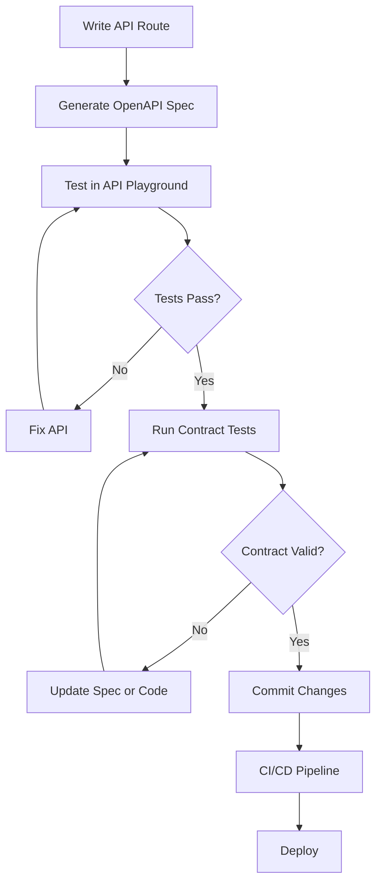

# Swagger API Testing Skill

## Purpose
Provide interactive API testing, contract validation, and documentation generation for SahayakAI APIs using OpenAPI 3.0 specifications. This skill replaces the need for external Swagger UI installations with a custom, integrated solution.

---

## When to Use This Skill

Use this skill when:
- Testing new API endpoints during development
- Validating API request/response contracts
- Generating API documentation
- Debugging API issues
- Verifying API changes don't break existing contracts
- Onboarding new developers to understand API structure

---

## Core Capabilities

### 1. **OpenAPI Spec Generation**
Automatically generate OpenAPI 3.0 specs from Next.js API routes.

### 2. **Interactive API Testing**
Built-in API testing UI similar to Swagger UI, but customized for SahayakAI.

### 3. **Contract Validation**
Validate API requests/responses against OpenAPI schemas.

### 4. **Automated Testing**
Generate and run API tests from OpenAPI specs.

### 5. **Documentation Generation**
Create human-readable API docs from specs.

---

## Directory Structure

```
sahayakai-main/
├── api-specs/                    # OpenAPI specifications
│   ├── quiz-generator.yaml
│   ├── lesson-plan.yaml
│   ├── voice-to-text.yaml
│   └── ... (one per API endpoint)
│
├── scripts/
│   ├── generate-api-specs.ts    # Auto-generate specs from code
│   ├── validate-api-specs.ts    # Validate specs against schemas
│   └── test-apis.ts              # Run API tests
│
├── src/app/api-playground/       # Interactive API testing UI
│   ├── page.tsx                  # Main playground interface
│   ├── components/
│   │   ├── endpoint-selector.tsx
│   │   ├── request-builder.tsx
│   │   ├── response-viewer.tsx
│   │   └── spec-viewer.tsx
│   └── lib/
│       ├── spec-loader.ts
│       ├── request-executor.ts
│       └── contract-validator.ts
│
└── src/__tests__/api/            # API contract tests
    ├── quiz.contract.test.ts
    ├── lesson-plan.contract.test.ts
    └── ... (one per API)
```

---

## Workflow Integration

### Development Workflow



### Continuous Testing

Every time you write or modify an API:
1. **Generate Spec**: `npm run api:generate-spec`
2. **Test Manually**: Open `/api-playground`
3. **Run Tests**: `npm run api:test`
4. **Validate Contract**: `npm run api:validate`

---

## Tools & Scripts

### 1. Generate OpenAPI Specs

**File:** `scripts/generate-api-specs.ts`

Scans `src/app/api/**` and generates OpenAPI specs based on:
- Route parameters
- Request body schemas (Zod)
- Response types
- JSDoc comments

```bash
npm run api:generate-spec -- --endpoint /api/ai/quiz
```

---

### 2. Interactive API Playground

**URL:** `http://localhost:3000/api-playground`

Features:
- Select endpoint from dropdown
- Build request (headers, params, body)
- Execute request with auth
- View formatted response
- See request/response validation
- Copy as cURL command

---

### 3. Contract Validation

**File:** `scripts/validate-api-specs.ts`

Validates:
- OpenAPI spec is valid
- Request/response match Zod schemas
- Required fields are present
- Data types are correct

```bash
npm run api:validate
```

---

### 4. Automated API Testing

**File:** `scripts/test-apis.ts`

Generates and runs tests for:
- Happy path scenarios
- Error cases (400, 401, 500)
- Edge cases
- Schema validation

```bash
npm run api:test -- --spec api-specs/quiz-generator.yaml
```

---

## Example: Quiz Generator API Spec

**File:** `api-specs/quiz-generator.yaml`

```yaml
openapi: 3.0.0
info:
  title: SahayakAI Quiz Generator API
  version: 1.0.0
  
paths:
  /api/ai/quiz:
    post:
      summary: Generate quiz from topic
      operationId: generateQuiz
      tags:
        - AI Tools
      
      requestBody:
        required: true
        content:
          application/json:
            schema:
              $ref: '#/components/schemas/QuizRequest'
      
      responses:
        '200':
          description: Quiz generated successfully
          content:
            application/json:
              schema:
                $ref: '#/components/schemas/QuizResponse'
        '401':
          $ref: '#/components/responses/Unauthorized'
        '500':
          $ref: '#/components/responses/ServerError'
      
      security:
        - bearerAuth: []

components:
  schemas:
    QuizRequest:
      type: object
      required:
        - topic
      properties:
        topic:
          type: string
          minLength: 3
          example: "Generate quiz for grade five, chapter two of science"
        numQuestions:
          type: integer
          minimum: 1
          maximum: 20
          default: 5
        questionTypes:
          type: array
          items:
            type: string
            enum: [multiple_choice, fill_in_the_blanks, short_answer, true_false]
        gradeLevel:
          type: string
          example: "5th Grade"
        language:
          type: string
          default: "en"
    
    QuizResponse:
      type: object
      properties:
        easy:
          $ref: '#/components/schemas/QuizVariant'
        medium:
          $ref: '#/components/schemas/QuizVariant'
        hard:
          $ref: '#/components/schemas/QuizVariant'
    
    QuizVariant:
      type: object
      properties:
        questions:
          type: array
          items:
            $ref: '#/components/schemas/Question'
```

---

## Quick Start

### Step 1: Generate Spec for Existing API

```bash
cd sahayakai-main
npm run api:generate-spec -- --endpoint /api/ai/quiz
```

This creates `api-specs/quiz-generator.yaml`

---

### Step 2: Test API in Playground

1. Navigate to `http://localhost:3000/api-playground`
2. Select "Quiz Generator" from dropdown
3. Fill in request body (or use example)
4. Click "Send Request"
5. View response and validation results

---

### Step 3: Run Automated Tests

```bash
npm run api:test -- --spec api-specs/quiz-generator.yaml
```

Tests will:
- ✅ Validate request schema
- ✅ Send test request
- ✅ Validate response schema
- ✅ Check status codes
- ✅ Verify error handling

---

### Step 4: Add to CI/CD

**File:** `.github/workflows/api-tests.yml`

```yaml
name: API Contract Tests

on: [push, pull_request]

jobs:
  api-tests:
    runs-on: ubuntu-latest
    steps:
      - uses: actions/checkout@v3
      - uses: actions/setup-node@v3
      - run: npm ci
      - run: npm run api:validate
      - run: npm run api:test
```

---

## Roadmap

### Phase 1: Foundation (Week 1)
- [ ] Create `api-specs/` directory structure
- [ ] Implement `generate-api-specs.ts` script
- [ ] Write OpenAPI spec for 1 endpoint (Quiz Generator)
- [ ] Test spec manually with Postman/cURL

### Phase 2: Interactive Playground (Week 2)
- [ ] Build `/api-playground` UI page
- [ ] Implement endpoint selector
- [ ] Create request builder component
- [ ] Add response viewer with syntax highlighting
- [ ] Integrate Firebase auth for testing authenticated endpoints

### Phase 3: Automated Testing (Week 3)
- [ ] Write `validate-api-specs.ts` script
- [ ] Implement `test-apis.ts` with Jest
- [ ] Generate contract tests from specs
- [ ] Add npm scripts to package.json
- [ ] Document testing workflow

### Phase 4: Documentation (Week 4)
- [ ] Generate Markdown docs from specs
- [ ] Create `/api-docs` page
- [ ] Add spec coverage visualization
- [ ] Integrate with existing docs

### Phase 5: CI/CD Integration (Week 5)
- [ ] Add API tests to GitHub Actions
- [ ] Set up pre-commit hooks for spec validation
- [ ] Create deployment checks
- [ ] Add spec versioning

---

## Benefits

1. **No External Dependencies**: Self-hosted, integrated into SahayakAI
2. **Developer Velocity**: Test APIs instantly without Postman
3. **Contract Safety**: Catch breaking changes before deployment
4. **Documentation**: Auto-generated, always up-to-date
5. **Onboarding**: New devs understand API surface quickly
6. **Quality**: Automated testing of all API endpoints

---

## Best Practices

### 1. One Spec Per API Endpoint
Each API route gets its own OpenAPI spec file.

### 2. Version Your Specs
Use semantic versioning in spec files.

### 3. Test Before Committing
Run `npm run api:validate && npm run api:test` before every commit.

### 4. Document Edge Cases
Include error responses (400, 401, 500) in specs.

### 5. Use $ref for Reusability
Share common schemas across specs.

---

## Example Usage

```bash
# Generate spec for new API
$ npm run api:generate-spec -- --endpoint /api/ai/lesson-plan

# Open playground and test
$ open http://localhost:3000/api-playground

# Run validations
$ npm run api:validate

# Run all API tests
$ npm run api:test

# Generate documentation
$ npm run api:docs
```

---

## Troubleshooting

### Issue: Spec generation fails
**Solution:** Ensure API route has Zod schemas and JSDoc comments

### Issue: Playground shows auth errors
**Solution:** Sign in at `/sign-in` first, then return to playground

### Issue: Tests timeout
**Solution:** Increase timeout in `jest.config.ts` or check API performance

---

## Future Enhancements

- [ ] GraphQL schema support
- [ ] Mock server generation from specs
- [ ] API performance benchmarking
- [ ] Request/response diffing
- [ ] Load testing integration
- [ ] API versioning support
- [ ] Multi-environment testing (dev, staging, prod)

---

*Skill created: 2026-02-13*  
*For: SahayakAI API Development & Testing*
