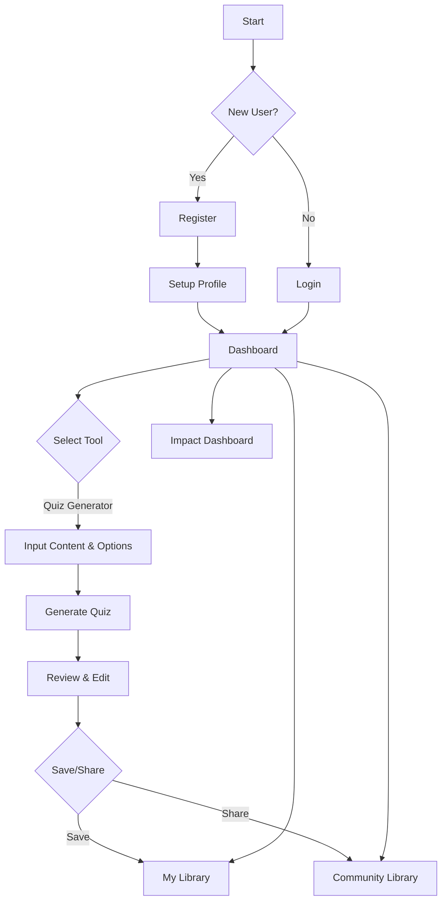

# User Experience Flow

This document describes the user experience flow of the Sahayakai platform, from initial login to content creation and community interaction.

## 1. Onboarding and Login

- **New User Registration:** A new user arrives at the platform and is prompted to create an account using their email address or a social login (Google, etc.).
- **Login:** Returning users can log in with their credentials.
- **Profile Setup:** Upon first login, the user is guided through a brief profile setup process, where they can provide information about their role (teacher, student, etc.), subjects of interest, and grade levels.

## 2. The Dashboard

- After logging in, the user is taken to their personal dashboard.
- The dashboard provides a quick overview of their recent activity, saved content, and notifications.
- A prominent sidebar allows the user to easily navigate to the different features of the platform.

## 3. Content Creation

The core of the Sahayakai experience is the content creation process. The user can choose from a variety of tools to create educational materials.

### Example Flow: Creating a Quiz

1.  **Select Tool:** The user selects the "Quiz Generator" from the sidebar.
2.  **Input Content:** The user is presented with a form where they can input the source material for the quiz. This can be a block of text, a URL, or a topic.
3.  **Customize Options:** The user can customize the quiz by specifying the number of questions, question types (multiple choice, true/false, etc.), and difficulty level.
4.  **Generate Quiz:** The user clicks the "Generate" button. The platform sends a request to the Genkit backend, which uses an AI model to generate the quiz.
5.  **Review and Edit:** The generated quiz is displayed to the user. They can review the questions and answers, and make any necessary edits.
6.  **Save and Share:** Once the user is satisfied with the quiz, they can save it to their personal library. They also have the option to share it with the community library.

## 4. My Library

- The "My Library" page is where the user can access all of their saved content.
- They can organize their content into folders, search for specific items, and view or edit their creations.

## 5. Community Library

- The "Community Library" is a public repository of educational resources created by other users.
- Users can browse the library by subject, grade level, or content type.
- They can view, clone, and adapt content shared by others.
- Users can also rate and comment on community content, fostering a collaborative environment.

## 6. Impact Dashboard

- The "Impact Dashboard" provides educators with insights into student engagement and performance.
- They can track which content is being used the most, how students are performing on quizzes, and other key metrics.
- This data can be used to inform teaching strategies and improve learning outcomes.

## 7. Visual Flow

### ASCII Flowchart

```ascii
[ Start ]
    |
    v
[ User visits Sahayakai ]
    |
    +-----> [ New User? ] --(Yes)--> [ Register ] -> [ Setup Profile ]
    |           |
    |         (No)
    |           |
    v           v
[ Login ] <-----+
    |
    v
[ Dashboard ]
    |
    +-----> [ Select Content Creation Tool (e.g., Quiz Generator) ]
    |           |
    |           v
    |       [ Input Content & Options ]
    |           |
    |           v
    |       [ Generate Content (AI) ]
    |           |
    |           v
    |       [ Review & Edit ]
    |           |
    |           v
    |       [ Save to "My Library" ] -> [ "My Library" Page ]
    |           |
    |           +-> [ Share to "Community Library" ] -> [ "Community Library" Page ]
    |
    +-----> [ View "My Library" ]
    |
    +-----> [ View "Community Library" ]
    |
    +-----> [ View "Impact Dashboard" ]
    |
    v
[ End ]
```

### Mermaid Flowchart

