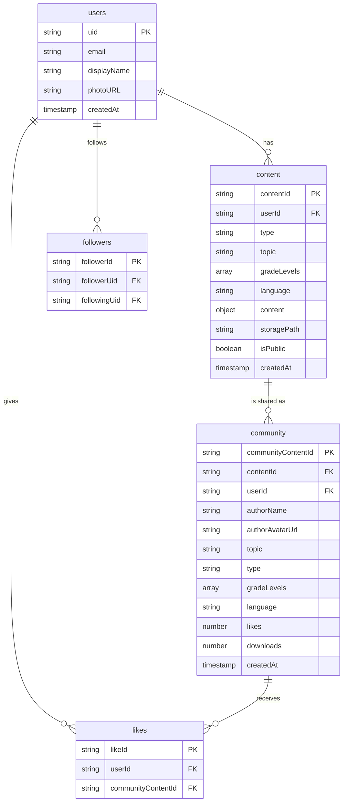
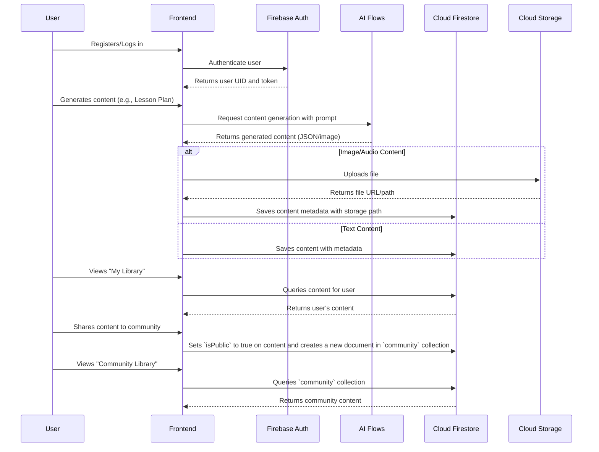

# Database Design

This document outlines the database design for the SahayakAI application. It covers the data requirements, technology choices, schema design, and diagrams.

## 1. Data Requirements

Based on the application's features, the following data needs to be stored:

*   **Users:** Teacher information, including authentication details, profile information (name, avatar), and preferences (language).
*   **Generated Content:** All content created by the AI flows needs to be saved for users to access later. This includes:
    *   Lesson Plans
    *   Quizzes
    *   Rubrics
    *   Visual Aids (images)
    *   Virtual Field Trips
    *   Worksheets
    *   Instant Answers
    *   Teacher Training Advice
*   **User Library:** A personal space for each teacher to store and organize their generated content. This implies a relationship between users and their content.
*   **Community Library:** A public space where teachers can share their content with others. This requires a mechanism to "publish" content and track community engagement (likes, downloads, etc.).
*   **Content Metadata:**  Information about the generated content, such as the topic, grade level, language, and creation date.
*   **Relationships:**
    *   A **user** can have many pieces of **generated content**.
    *   A piece of **generated content** can be shared with the **community**.
    *   **Users** can follow other **users**.
    *   **Users** can like and download **community content**.

## 2. Technology Choices

Given the nature of the data and the application's features, a combination of database technologies is recommended:

*   **Firebase Authentication:** For user authentication and management. It's a fully managed service that integrates well with other Firebase products and handles the complexities of user authentication securely.
*   **Cloud Firestore (NoSQL):** For storing user data, content metadata, and relationships. Firestore is a flexible, scalable NoSQL database that is well-suited for storing semi-structured data like our generated content. Its real-time capabilities can also be leveraged for features like live updates in the community library.
*   **Cloud Storage for Firebase (Object Storage):** For storing large binary files, such as the images generated by the Visual Aid Designer and the audio files from the voice-to-text feature. Storing these files in an object store is more cost-effective and efficient than storing them in a NoSQL database.

## 3. Schema Design

### 3.1. Cloud Firestore

#### Collections:

*   **`users`**: Stores user profile information.
    *   `{userId}` (document ID)
        *   `uid`: string (Firebase Auth UID)
        *   `email`: string
        *   `displayName`: string
        *   `photoURL`: string (URL to avatar image in Cloud Storage)
        *   `createdAt`: timestamp
*   **`content`**: Stores all generated content.
    *   `{contentId}` (document ID)
        *   `userId`: string (foreign key to `users` collection)
        *   `type`: string ('lesson-plan', 'quiz', 'rubric', etc.)
        *   `topic`: string
        *   `gradeLevels`: array of strings
        *   `language`: string
        *   `content`: object (the generated content itself)
        *   `storagePath`: string (path to the file in Cloud Storage, for images/audio)
        *   `isPublic`: boolean
        *   `createdAt`: timestamp
*   **`community`**: Stores content that has been shared publicly.
    *   `{communityContentId}` (document ID)
        *   `contentId`: string (foreign key to `content` collection)
        *   `userId`: string (foreign key to `users` collection)
        *   `authorName`: string
        *   `authorAvatarUrl`: string
        *   `topic`: string
        *   `type`: string
        *   `gradeLevels`: array of strings
        *   `language`: string
        *   `likes`: number
        *   `downloads`: number
        *   `createdAt`: timestamp
*   **`likes`**: Stores user likes for community content.
    *   `{likeId}` (document ID)
        *   `userId`: string (foreign key to `users` collection)
        *   `communityContentId`: string (foreign key to `community` collection)
*   **`followers`**: Stores user following relationships.
    *   `{followerId}` (document ID)
        *   `followerUid`: string (the user who is following)
        *   `followingUid`: string (the user who is being followed)

### 3.2. Cloud Storage

*   **`avatars/{userId}/{fileName}`**: Stores user profile avatars.
*   **`content/{userId}/{contentId}/{fileName}`**: Stores generated content files (images, audio, etc.).

## 4. Diagrams

### 4.1. Firestore Data Model

### 4.2. Application Flow

