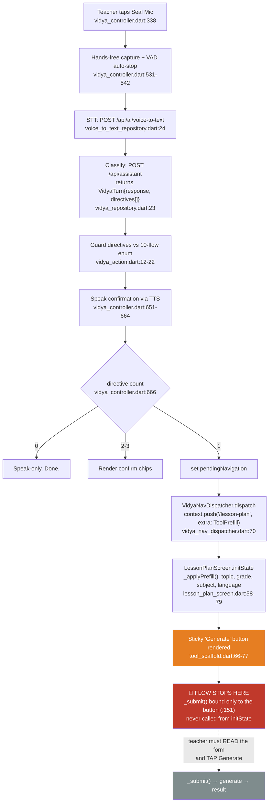
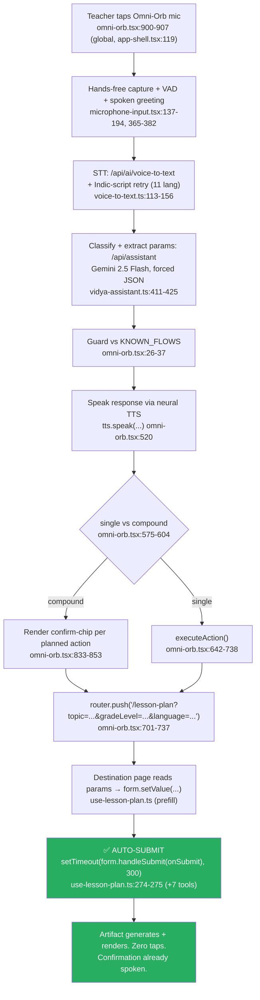

# VOICE_FIRST_GAP.md

**SahayakAI Flutter app — the voice-first gap, root-caused**
Forensic report, central document. Status: current as of 2026-07-28. Scope: `lib/features/vidya/*` (mobile) vs. `src/components/omni-orb.tsx` + tool pages (production web).

---

## 0. The verdict, up front

The founder's instinct — *"it's a form/tap app with a voice launcher bolted on"* — is **half wrong and half exactly right, and the line between the halves is one function call.**

- **Wrong about the launcher.** VIDYA on mobile is not bolted on. The home tab *is* a voice canvas, hands-free capture (VAD auto-stop) works, STT works in 11 languages, the intent classifier works, TTS speak-back works, the closed-flow guard works, compound-intent chips work. The entire *front* of the voice pipe is at parity with web or better.
- **Right where it counts.** At the moment the teacher's spoken sentence should turn into a finished lesson plan, the mobile app stops, renders a pre-filled form, and waits for a finger to tap **Generate**. The web, at that same moment, calls `form.handleSubmit(onSubmit)()` on a 300 ms timer and the artifact generates itself.

So the honest framing is not "voice launcher on a form app." It is: **the voice pipe is fully built and capped one inch from the outlet.** Web's contract is `NAVIGATE_AND_FILL_AND_RUN`. Mobile implemented `NAVIGATE_AND_FILL` and declared victory. That single missing verb — *RUN* — is the whole gap.

This document defines the standard, traces both flows, isolates the gap to specific lines, and scopes the fix (roughly one day across ~10 files).

---

## 1. What "voice-first" means for this product

The yardstick is the production web's **Omni-Orb** (`src/components/omni-orb.tsx`, 924 lines), mounted globally at `src/app/app-shell.tsx:119`. It is not a chatbot and not a search box. It is a **mic-only control plane** that implements a closed loop:

> **speak → understand → act → generate → hear.**

Concretely, to be voice-first by this product's own definition, a surface must do all of:

1. **Be omnipresent and mic-first.** A globally-mounted control reachable on every screen, whose primary (web: *only*) affordance is a microphone — not a page you navigate to. Web: `omni-orb.tsx:900-907` (mic-only; the text-input `VoiceAssistant` was deliberately *unmounted* — `teacher-training/page.tsx:31`, "the global OmniOrb already provides voice… mounting both created the 'two voice surfaces' UX bug").
2. **Capture hands-free.** VAD auto-stop on trailing silence, a spoken greeting, no "press stop." Web: `microphone-input.tsx:137-194, 365-382`.
3. **Transcribe in 11 languages, in-script.** Indic-script retry so Bengali comes back in Bengali, not Latin transliteration. Web: `voice-to-text.ts:113-156, 278-291`. Hindi is explicitly *not* privileged (`soul.ts:133-149`).
4. **Classify intent + extract params** from a free-form utterance and route it to one of 10 teacher tools. Web: `/api/assistant` → `vidya-assistant.ts:411-425` (Gemini 2.5 Flash, temp 0.1, forced JSON).
5. **Act without a form.** Navigate to the tool, pre-fill it, **and auto-run the generation** so the teacher touches nothing. Web: `omni-orb.tsx:701-737` (`router.push(?query)`) → destination page `setTimeout(() => form.handleSubmit(onSubmit)(), 300)`. The soul prompt makes this a written contract (`soul.ts:65-73`: "Auto-trigger content generation — the teacher does NOT need to click anything").
6. **Hear the result.** Speak a confirmation back through a real neural TTS stack (Sarvam → Bhashini → Google Neural2), not `speechSynthesis` tokenism. Web: `omni-orb.tsx:520`, `api/tts/route.ts:54-89`.

Voice-first is therefore an **end-to-end inversion of the form paradigm**: the form still exists under every tool, but on the happy path the teacher never interacts with it — voice fills it and fires it. That is the standard mobile is judged against. (Full-duplex streaming voice — `omni-orb-live.tsx`, Gemini Live — is a labelled non-production spike, imported nowhere; it is *not* the standard. Production web is the same turn-based typed pipeline mobile ships.)

---

## 2. The CURRENT mobile voice flow

Trace one utterance — *"make a Class 10 science lesson on photosynthesis"* — through `lib/features/vidya/*`:

1. **Tap the Seal Mic.** `VidyaController.onMicTap()` (`vidya_controller.dart:338-354`) → `_begin()`: mic-permission gate, start recorder, enter `listening`. VAD auto-stops on 2.5 s trailing silence (`vidya_controller.dart:33`, `_onAmplitude` :531-542). Genuinely hands-free.
2. **Speak → STT.** `_stopAndProcess()` (`vidya_controller.dart:551-593`) uploads audio to `POST /api/ai/voice-to-text` (`voice_to_text_repository.dart:24`); silence/refusal guards reject mis-taps before paying for STT.
3. **VIDYA classifies.** `_converse()` (`vidya_controller.dart:597-674`) inks the utterance as a document block, then `POST /api/assistant` (`vidya_repository.dart:23`) returns `VidyaTurn { response, directives[] }` (`assistant_response.dart:15-19`). Directives are validated against a closed 10-flow enum (`vidya_action.dart:12-22`) so a hallucinated tool is dropped, not 404'd.
4. **Speak the reply.** `turn.response` → `POST /api/tts` (`tts_repository.dart:21`), played via `audio_player_service.dart:96-108` (`vidya_controller.dart:651-664`). This is a *spoken confirmation* ("Opening your lesson plan now"), **not the lesson plan itself.**
5. **Route by directive count** (`vidya_controller.dart:666-671`): 0 → speak-only; **1 → set `pendingNavigation`**; 2-3 → confirm chips. Single-intent case sets `pendingNavigation`.
6. **Navigate + prefill.** Home's `ref.listen` (`vidya_home_screen.dart:68-79`) calls `VidyaNavDispatcher.dispatch` (`vidya_nav_dispatcher.dart:66-72`) → `context.push('/lesson-plan', extra: ToolPrefill(...))`.
7. **The form fills — and stops.** `LessonPlanScreen.initState` → `_applyPrefill(widget.prefill)` (`lesson_plan_screen.dart:58-79`) writes the topic, ticks the grade chip, sets subject/language. **Then nothing runs.** The teacher faces a filled form with a sticky **Generate** button (`tool_scaffold.dart:66-77`) they must read and tap. `_submit()` (`lesson_plan_screen.dart:87-100`) is bound *only* to that button (:151) — never called from `initState`.

**Net mobile flow:** speak → hear a confirmation → land on a pre-filled form → **read it and tap Generate** → result. Voice carried the teacher to the doorstep and handed them a keyboard-era form to finish the job.



**In mobile's favour (do not understate this):** everywhere-reachability is real on the surfaces that use `ToolScaffold` — every such tool screen mounts a VIDYA co-teacher action by default (`tool_scaffold.dart:42-43` → `vidya_sheet.dart`), and the home is a genuine voice canvas (`vidya_home_screen.dart:26-35`), not the form-first dashboard web boots to. Mobile is *more* voice-first than web at the entry. It is the **last step** that breaks.

---

## 3. The TARGET voice-first flow (what web already ships)

Same seven steps, different ending. When the Omni-Orb classifies a single intent it does `router.push('/lesson-plan?topic=photosynthesis&gradeLevel=Class 10&subject=Science&language=en')` (`omni-orb.tsx:701-737`). The destination page reads the params, prefills, **and auto-submits on a 300 ms timer**:

```js
// src/features/lesson-planner/hooks/use-lesson-plan.ts:274-275
setTimeout(() => { form.handleSubmit(onSubmit)(); }, 300);
```

This is **the pattern on every generative tool**, not a one-off:
`quiz-generator/page.tsx:230-232`, `instant-answer/page.tsx:323-325`, `worksheet-wizard/page.tsx:349`, `rubric-generator/page.tsx:161`, `visual-aid-designer/page.tsx:334`, `virtual-field-trip/page.tsx:318`, `teacher-training/page.tsx:221`.

**Net web flow (the target):** speak → hear a spoken confirmation → the finished artifact generates and renders, **zero taps.** That is voice-first end-to-end.



(Web also ships a second, chat-style `VoiceAssistant` where each intent renders an ActionCard you tap "Go" on — but that surface is **not mounted in production** and is tap-gated *by design*. The Omni-Orb path is the hands-free standard, and it is what mobile must match.)

---

## 4. The architectural gap

**One verb.** Web's `NAVIGATE_AND_FILL` is really `NAVIGATE_AND_FILL_AND_RUN`. Mobile implemented the first two and stopped.

| Stage | Web (standard) | Mobile (current) | Status |
|---|---|---|---|
| Omnipresent mic surface | Global orb, `app-shell.tsx:119` | Home tab + per-tool sheet (`tool_scaffold.dart:42`) | ⚠ Partial (per-surface, not omnipresent) |
| Hands-free capture / VAD | `microphone-input.tsx:137-194` | `vidya_controller.dart:531-542` | ✅ Parity |
| 11-language STT | `voice-to-text.ts` | `voice_to_text_repository.dart` (same endpoint) | ✅ Parity |
| Intent classify + params | `/api/assistant` | `/api/assistant` (same endpoint) | ✅ Parity |
| Closed-flow guard | `KNOWN_FLOWS` `omni-orb.tsx:26-37` | 10-flow enum `vidya_action.dart:12-22` | ✅ Parity |
| Speak confirmation (TTS) | `omni-orb.tsx:520` | `vidya_controller.dart:651-664` | ✅ Parity |
| Compound-intent chips | `omni-orb.tsx:833-853` | `pendingNavigation` chips `vidya_controller.dart:368-381` | ✅ Parity |
| **Carry intent to tool** | `router.push(?query)` `omni-orb.tsx:737` | `context.push(extra: ToolPrefill)` `vidya_nav_dispatcher.dart:70` | ✅ Parity |
| **Prefill fields** | `form.setValue(...)` | `_applyPrefill()` `lesson_plan_screen.dart:68-79` | ✅ Parity |
| **AUTO-GENERATE** | **`form.handleSubmit(onSubmit)()`** `use-lesson-plan.ts:275` (+7 tools) | **ABSENT — sticky Generate button waits** `tool_scaffold.dart:66` | ❌ **THE GAP** |

Everything upstream is at parity or better on mobile. The teacher's spoken sentence already contains everything the form needs — topic, grade, subject, language are all inside the `ToolPrefill` object. **The mobile app has the data and chooses not to act on it.** That is precisely why the founder's instinct is correct even though the voice plumbing is genuinely sophisticated: the pipe is built, pressurized, and capped one inch from the nozzle.

### Two secondary gaps, downstream of the same root

These do not cause the primary complaint but they widen its blast radius:

1. **The classifier's ceiling is 10 flows on both platforms.** Neither the mobile 10-flow enum (`vidya_action.dart:12-22`) nor web's `KNOWN_FLOWS` (`omni-orb.tsx:26-37`) can reach the parent phone-call (`parent_hotline`) or either grader. So *"the AI calls Ravi's mother because I asked it to"* is not voice-reachable on **either** platform — a shared ceiling, but a real limit on the thesis.
2. **In-form dictation (`InlineFieldMic`) covers only 5 of 13 tools on mobile.** This bites *harder* than on web, because the un-submitted form is exactly where the mobile teacher gets stranded — and when stranded, 8 of 13 tools can't even be finished by voice.

### The corroborating findings from the rest of the report

The gap is not cosmetic — three sibling teardowns land on the same fault line:

- **Hear-back is capped too, not just act.** TTS on mobile has exactly one caller — VIDYA's chat sentence (`vidya_controller.dart:651-659`). No tool result view and neither grader has a listen control. Web reads the *generated deliverable* aloud (grader Play button, `assessment-result.tsx:83-118`). So even the "hear the result" half of the loop is confined to chatter, never the lesson plan/worksheet/grade. The founder's "hear/act" critique is dead-on for the payoff.
- **Onboarding is a silent form.** Grep `mic|voice|speech|InlineFieldMic` across `lib/features/onboarding` returns nothing. The corridor between login and the voice-first home neither uses nor teaches voice, and dead-ends on a read-back of what the teacher typed (`onboarding_screen.dart:577-645`) — versus web generating and saving a first lesson the teacher can speak (`page.tsx:488-536`). The app trains the teacher in the old form paradigm right before dropping them on a voice canvas with no bridge.
- **The destination form renders in English for 10 of 11 languages.** 465 of 960 mobile strings (48%) are untranslated on every non-English locale (`app_bn/hi/ta/...arb` each define only 495 keys), and `nullable-getter: false` (`l10n.yaml:6`) makes the fallback silent English. Home + tile names are localized; the tool bodies are not. So a Bengali teacher can speak Bengali on home, be routed into a tool, and every word of the destination form — the exact form the auto-submit gap already strands them on — is English. The two failures compound.
- **The glass lands on chrome, never the work surface.** Design teardown: `ToolScaffold` is "a scrolling form capped at 640dp" (`tool_scaffold.dart:8`); Lesson Plan is 7 stacked fields with a mic on one. Voice-first at the entry, form-and-tap at the desk — visually confirming the same diagnosis.

---

## 5. What it takes to close it

The primary fix is **small and localized** but has three correctness traps the web already solved. Copy web's guards; do not reinvent them. Steps 1-4 answer the founder's complaint directly and are roughly **one day across ~10 files, with existing tests to extend.**

1. **Thread an `autoSubmit` intent through the dispatch.** Add a boolean to `ToolPrefill` (`tool_prefill.dart`) or carry it alongside the push in `VidyaNavDispatcher.dispatch` (`vidya_nav_dispatcher.dart:66-72`). Set it `true` for the voice path; leave it `false` for a manual tool-grid open. (A user who tapped the tool tile did not ask for auto-generation.)

2. **Auto-run in each tool's `initState`, guarded.** After `_applyPrefill`, if `autoSubmit && required field present`, schedule `_submit()` in a `addPostFrameCallback` (the tools already use this for `_scrollToResult`). **Guard trap #1 — only fire when the required field exists.** Web only auto-submits when `topicParam`/`questionParam` is present (`quiz-generator/page.tsx:210`, `instant-answer/page.tsx:312`); a partial utterance ("make a quiz") must *land on the form and wait*, not submit an empty topic. `_submit()` already validates (`_formKey.currentState.validate()`, `lesson_plan_screen.dart:88-89`), so a missing topic self-blocks — but gate it explicitly to avoid a validation-error flash on arrival.

3. **Reuse the language-normalization guard. — trap #2.** Web pairs auto-submit with `SET_OPTS` + `normaliseVidyaLanguage`/`normaliseVidyaGradeLevel` (`quiz-generator/page.tsx:221-228`) to avoid the "form shows English, output Hindi" race. Mobile already normalizes in `prefillLocale` (`tool_prefill.dart:65-71`) and `normaliseVidyaLanguage` (`vidya_controller.dart:85-92`). Ensure `_applyPrefill` **fully commits** `_language`/grade/subject state *before* the post-frame submit fires. It runs in `initState`, so state is settled by first frame — safe — but assert it rather than assume it.

4. **Cover the compound path too. — trap #3.** The confirm-chip branch (`dispatchDirective` → `pendingNavigation`, `vidya_controller.dart:368-381`) routes through the *same* dispatcher, so a chip tap must also carry `autoSubmit=true` — otherwise *"make a quiz AND a worksheet"* still strands the teacher on two un-submitted forms. Do not fix the single path and forget the compound one.

**These four convert "speak → filled form → tap Generate" into "speak → result." That is the entire thesis, closed.**

Beyond the primary fix (do these next, in order):

5. **Extend `InlineFieldMic` to the remaining 8 tools** as the graceful-degradation path for partial utterances that legitimately land on a form (worksheet, rubric, exam_paper, teacher_training first). This is the safety net for every case step 2 deliberately *doesn't* auto-submit.

6. **Finish the hear-back half.** Add a listen/read-aloud control on tool result views and both graders (mirror `assessment-result.tsx:83-118`). The TTS engine already exists (`tts_repository.dart`, `audio_player_service.dart`); it has one caller. Wire it to the deliverable, not just VIDYA's chatter. Without this, "speak → generate → **hear**" is still only two-thirds done.

7. **Finish the 465-string localization pass** (or the auto-submit lands a Bengali teacher on an English form — the compounding failure in §4). No completeness gate exists on mobile; add one so this can't silently regress. Translated home + English tool body is the arbitrary split that makes the in-language experience feel broken.

8. **(Larger, optional) Raise the classifier ceiling.** Add `parentHotline`/`parentMessage` to `VidyaFlow` + the `routeForFlow` switch so *"call Ravi's mother about his attendance"* becomes a voice action. The routes already exist; only the enum and switch need entries. This is the one place mobile could **lead** web (web has the same 10-flow ceiling), and it's the difference between a voice launcher and a voice *agent*.

---

## 6. One-paragraph summary for the founder

The mobile app is not a form app with a voice toy stapled on. It is a genuine, sophisticated voice pipeline — capture, VAD, 11-language STT, intent classification, param extraction, TTS speak-back, closed-flow guarding, compound-intent handling — that is at parity with or ahead of production web on every stage **except the last one.** Web's voice action is *navigate, fill, and run*; mobile's is *navigate, fill, and stop.* The teacher's spoken sentence already contains everything the form needs; the app has the data in a `ToolPrefill` object and simply never calls `_submit()`. Fixing that is an `autoSubmit` boolean threaded through the dispatcher plus a guarded post-frame call in each tool's `initState` — about a day of work — and it converts "speak → filled form → tap Generate" into "speak → result." Your instinct was right about *where* the app fails and wrong only about *how much* is broken to get there: almost nothing is, which is why this is a fix and not a rebuild.