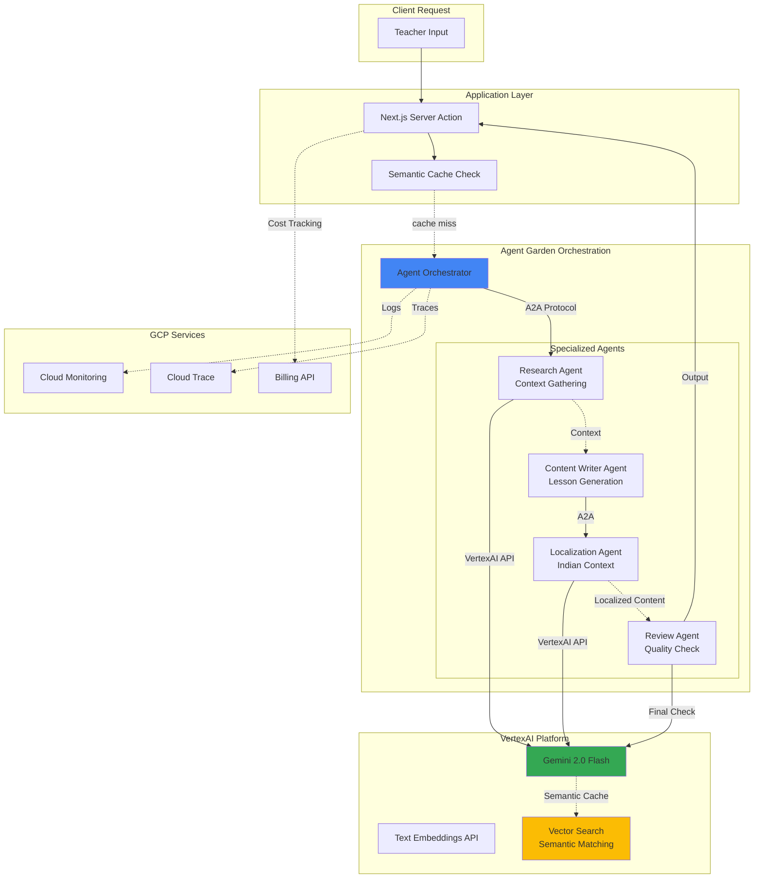

# Architecture Review Addendum: AI Infrastructure

**Date:** 2026-01-27  
**Topic:** VertexAI + Agent Garden + A2A Protocol Stack

---

## Key Architectural Shift: Genkit → VertexAI Ecosystem

The architecture review previously assumed **Genkit** as the AI orchestration layer. The actual implementation uses a **more sophisticated multi-agent system** with:

1. **VertexAI** - Google's enterprise AI platform
2. **Agent Garden** - Multi-agent orchestration framework
3. **Agent-to-Agent (A2A) Protocol** - For agent communication
4. **Native GCP Services** - Tighter integration with Google Cloud

This is a **significant upgrade** that changes several architectural considerations.

---

## What This Means for the Architecture

### ✅ Improvements Over Genkit

| Aspect | Genkit (Old Assumption) | VertexAI + Agent Garden (Actual) |
|--------|------------------------|----------------------------------|
| **Scalability** | Limited to single-agent flows | Multi-agent orchestration at scale |
| **Model Selection** | Manual model switching | Agent Garden can route to optimal model |
| **Enterprise Features** | Basic | Audit logs, VPC-SC, CMEK support |
| **Cost Controls** | Basic quotas | Project-level quotas + Billing API |
| **Observability** | Limited | Cloud Trace, Monitoring fully integrated |

### 🟠 New Concerns Introduced

#### 1. **Agent Orchestration Complexity**
With multiple agents communicating via A2A protocol:
- How are agent failures handled?
- What's the retry strategy when Agent A → Agent B call times out?
- Is there a circuit breaker for cascading agent failures?

**Recommendation:**
```typescript
// Agent orchestration with fallback
interface AgentOrchestrator {
  async executeFlow(task: Task, retries: number = 3): Promise<Result> {
    const agents = this.selectAgents(task); // Agent Garden routing
    
    try {
      return await this.executeWithTimeout(agents, 30000); // 30s timeout
    } catch (error) {
      if (retries > 0) {
        // Exponential backoff
        await sleep(Math.pow(2, 3 - retries) * 1000);
        return this.executeFlow(task, retries - 1);
      }
      
      // Fallback: Use simpler single-agent or template
      return this.fallbackStrategy(task);
    }
  }
}
```

---

#### 2. **A2A Protocol Overhead**
Inter-agent communication adds latency:
- Agent 1 (Research) → Agent 2 (Writing) → Agent 3 (Formatting)
- Each hop adds network + serialization overhead

**Question:** What's the average latency for a multi-agent lesson plan generation?
- Target: < 10 seconds for 90th percentile
- Acceptable: < 15 seconds

**Recommendation:**
- Profile agent chains using Cloud Trace
- Consider agent fusion for common sequences (e.g., Research + Writing as one call)

---

#### 3. **Agent Garden Cost Model**
**Unknown from code review:**
- Does Agent Garden charge per agent invocation?
- Are there baseline fees for agent hosting?

**Action Required:**
- Document Agent Garden pricing in architecture docs
- Add cost tracking per agent type (Research vs Writing vs Formatting)

---

## Updated Architecture Diagram (AI Layer)



---

## Updated Recommendations

### Priority 1: Agent Monitoring 🔴
Since you're using Agent Garden with A2A:
1. **Implement per-agent telemetry**
   - Track: Agent invocation count, latency, error rate
   - Metric: `agent_<type>_duration_ms`
   
2. **Add agent health checks**
   ```typescript
   // Before invoking agent chain
   const healthStatus = await agentGarden.healthCheck();
   if (!healthStatus.allHealthy) {
     // Fallback to simpler flow
   }
   ```

### Priority 2: Cost Attribution 🟠
With multiple agents per request:
1. **Tag each VertexAI call with:**
   - `agent_type`: "research" | "writer" | "reviewer"
   - `user_id`: For cost per teacher
   - `request_id`: For tracing end-to-end cost

2. **Create cost breakdown dashboard:**
   ```sql
   -- BigQuery query for cost analysis
   SELECT 
     agent_type,
     COUNT(*) as invocations,
     SUM(cost_usd) as total_cost
   FROM vertex_ai_usage_logs
   WHERE timestamp >= TIMESTAMP_SUB(CURRENT_TIMESTAMP(), INTERVAL 30 DAY)
   GROUP BY agent_type
   ORDER BY total_cost DESC;
   ```

### Priority 3: Agent Chain Optimization 🟡
**Question:** Can agents run in parallel?
- If Research + Localization are independent → Parallel execution saves 40% latency

```typescript
// Sequential (current assumption)
const context = await researchAgent.execute(input);
const localized = await localizerAgent.execute(context);
// Total: 3s + 2s = 5s

// Parallel (optimized)
const [context, localContext] = await Promise.all([
  researchAgent.execute(input),
  localizerAgent.execute(input)
]);
// Total: max(3s, 2s) = 3s ✅
```

---

## Security Considerations with A2A

**New Attack Surface:** Agent-to-Agent communication introduces:
1. **Agent impersonation** - Can malicious code invoke agents directly?
2. **Data leakage** - Are A2A messages encrypted?
3. **Privilege escalation** - Does each agent have scoped permissions?

**Recommendation:**
```typescript
// Agent authentication via service accounts
interface A2AConfig {
  sourceAgent: {
    serviceAccount: 'research-agent@project.iam',
    permissions: ['vertexai.predict']
  },
  targetAgent: {
    serviceAccount: 'writer-agent@project.iam',
    permissions: ['vertexai.predict', 'firestore.write']
  },
  encryption: 'TLS_1_3',
  authentication: 'HMAC_SHA256'
}
```

---

## Questions for Clarification

To complete the architecture review, I need to understand:

1. **Agent Garden Setup:**
   - How many agents are in your garden?
   - What's the agent selection logic? (Rule-based? ML-based routing?)

2. **A2A Protocol:**
   - Is this using Google's Alpha A2A or custom implementation?
   - How are agent responses validated?

3. **VertexAI Configuration:**
   - Which Gemini variants are used per agent? (Flash vs Pro)
   - Are you using VertexAI's Reasoning Engine?

4. **Fallback Strategy:**
   - If Agent Garden is down, what happens to user requests?

---

## Conclusion

The **VertexAI + Agent Garden + A2A** stack is a **major architectural advantage** over basic Genkit:
- ✅ Better scalability for complex workflows
- ✅ Enterprise-grade observability
- ✅ More sophisticated content generation

**However, it also introduces:**
- 🟠 Higher complexity → Need robust monitoring
- 🟠 Multi-agent cost tracking required
- 🟡 A2A latency optimization needed

**Updated Grade: A- (Advanced architecture, but needs operational maturity)**

---
**Next Steps:**
1. Share Agent Garden configuration for detailed review
2. Provide sample A2A message flow for lesson generation
3. Review VertexAI quota settings in GCP Console
