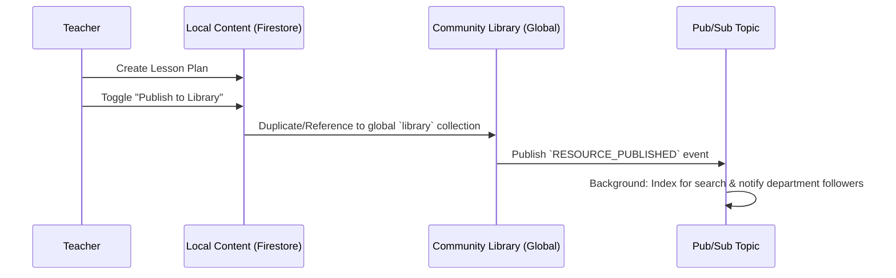

# Architecture: Community Library Integration

## 1. Overview
The Community Library is the "Marketplace of Ideas" within TeacherConnect. While the Feed (Phase 15) handles ephemeral conversations, the Library handles persistent, discoverable educational assets (Lesson Plans, Quizzes, Visual Aids).

## 2. Data Flow & Integration

### A. Publishing Workflow

### B. Firestore Schema Extensions
- **`library_resources` (Collection)**:
  - `originalId` (string): Reference to the teacher's private copy.
  - `authorId` (uid): Reference to `profiles`.
  - `title`, `description`, `type` (icon mapping).
  - `tags` (array): For filtering.
  - `stats`: `{ downloads: 0, likes: 0, views: 0 }`.
  - `searchVector`: For semantic search (if using Vertex AI Search).

## 3. Component Architecture (React/shadcn)

Designed to match the provided high-fidelity mockup:

| Component | Responsibility | Props/State |
| :--- | :--- | :--- |
| `LibrarySearch` | Styled input with search icon and language dropdown. | `onSearch`, `languageFilter` |
| `LibraryTabs` | Segmented control for Trending/Following/My Content. | `activeTab` |
| `ResourceCard` | Visual card with type icon, author avatar, stats, and download. | `resource: Resource` |
| `LibraryGrid` | Responsive grid for `ResourceCard` instances. | `resources: Resource[]` |

## 4. Integration with Social Engine
- **Likes**: Shared between the "Library Card" and the "Social Post" that announced it.
- **Author Identity**: Clicking an author on a Library Card navigates to their **TeacherConnect Profile**.
- **Download Tracking**: Pub/Sub event `RESOURCE_DOWNLOADED` used to boost "Trending" ranking.

## 5. UI/UX Aesthetics
- **Color Palette**: Use the "Sahayak Orange" (#f97316) for primary actions/tabs to match the logo in the mockup.
- **Glassmorphism**: Apply `backdrop-blur-lg` to the search container as suggested in the design.
- **Micro-animations**: Hover state on cards should include a subtle scale-up and shadow deepen effect.
