# SahayakAI: Complete Solution Architecture

**Version:** 2.0  
**Date:** 2026-01-27  
**Coverage:** Web (Main + Replica) + Mobile  

---

## Overview

SahayakAI is deployed across **three platforms** to maximize reach and accessibility:

1. **sahayak-main** - Production web app (Next.js 15, Firebase Hosting)
2. **sahayak-replica** - Feature development web app (Next.js 15, more comprehensive features)
3. **sahayak-mobile** - Cross-platform mobile app (Flutter, Offline-First)

---

## 1. High-Level System Architecture

```mermaid
graph TB
    subgraph "User Layer"
        WEB_USER[👩‍🏫 Web Users<br/>Desktop/Tablet]
        MOBILE_USER[👨‍🏫 Mobile Users<br/>Android/iOS]
    end

    subgraph "Client Applications"
        WEB_MAIN[🌐 sahayakai-main<br/>Next.js 15<br/>Production Web]
        WEB_REPLICA[🌐 sahayakai-replica<br/>Next.js 15<br/>Feature Development]
        MOBILE_APP[📱 sahayakai_mobile<br/>Flutter<br/>Cross-Platform]
    end

    subgraph "Backend Services - Google Cloud Platform"
        subgraph "Firebase Services"
            HOSTING[Firebase Hosting<br/>Global CDN]
            AUTH[Firebase Auth<br/>OTP + OAuth]
            FIRESTORE[Cloud Firestore<br/>NoSQL Database]
            STORAGE[Cloud Storage<br/>Files/Media]
            FUNCTIONS[Cloud Functions<br/>Serverless API]
        end
        
        subgraph "AI/ML Services - Agent Garden"
            AGENT_GARDEN[Agent Garden<br/>Multi-Agent Orchestration]
            VERTEX_AI[Vertex AI<br/>Enterprise ML Platform]
            GEMINI_FLASH[Gemini 2.0 Flash<br/>Text/Voice Agents]
            GEMINI_IMG[Gemini Image Gen<br/>Visual Agents]
            A2A[A2A Protocol<br/>Agent Communication]
        end
    end

    subgraph "External Services"
        SECRETS[Secret Manager<br/>Credentials]
        ANALYTICS[Analytics<br/>User Insights]
    end

    WEB_USER --> WEB_MAIN
    WEB_USER --> WEB_REPLICA
    MOBILE_USER --> MOBILE_APP

    WEB_MAIN --> HOSTING
    WEB_REPLICA --> HOSTING
    MOBILE_APP --> FUNCTIONS
    
    WEB_MAIN --> AUTH
    WEB_REPLICA --> AUTH
    MOBILE_APP --> AUTH

    WEB_MAIN --> AGENT_GARDEN
    WEB_REPLICA --> AGENT_GARDEN
    FUNCTIONS --> AGENT_GARDEN

    AGENT_GARDEN --> VERTEX_AI
    AGENT_GARDEN --> GEMINI_FLASH
    AGENT_GARDEN --> GEMINI_IMG
    AGENT_GARDEN --> A2A
    
    VERTEX_AI --> GEMINI_FLASH
    VERTEX_AI --> GEMINI_IMG
    
    WEB_MAIN --> FIRESTORE
    WEB_REPLICA --> FIRESTORE
    MOBILE_APP --> FIRESTORE
    
    FUNCTIONS --> SECRETS
    AGENT_GARDEN --> SECRETS

    style WEB_MAIN fill:#a7d1e8
    style WEB_REPLICA fill:#a7d1e8
    style MOBILE_APP fill:#ffb347
    style AGENT_GARDEN fill:#8b5cf6
    style GEMINI_FLASH fill:#4285f4
    style GEMINI_IMG fill:#34a853
```

---

## 2. Web Application Architecture (sahayakai-main & sahayakai-replica)

---

## 3. Mobile Application Architecture (sahayakai_mobile - Flutter)

### **Studio-Based Design System**

```mermaid
graph TB
    subgraph "Studio Layer - 9 Themed Workspaces"
        WIZARD[🧙 The Wizard<br/>Lesson Planning<br/>Saffron/Orange]
        GAME[🎮 Game Master<br/>Quiz Generator<br/>Green]
        DIRECTOR[🎬 Director's Cut<br/>Video Scripts<br/>Dark Purple]
        ART[🎨 Art Studio<br/>Visual Aids<br/>Violet/Pink]
        NOTEBOOK[📓 The Notebook<br/>Worksheets<br/>Paper Grey]
        GRID[📐 The Grid<br/>Rubrics<br/>Indigo]
        EDITOR[✍️ Editor's Desk<br/>Content Creation<br/>Slate]
        ACADEMY[🎓 The Academy<br/>Training<br/>Royal Blue]
        COMMUNITY[🤝 Community Hub<br/>Social<br/>Warm Gradient]
    end

    subgraph "Presentation Layer"
        SCREENS[Screens/Pages<br/>Material 3 UI]
        WIDGETS[Custom Widgets<br/>Glassmorphism + Studios]
    end

    subgraph "Business Logic Layer"
        PROVIDERS[Riverpod Providers<br/>State Management]
        REPOS[Repositories<br/>Data Abstraction]
    end

    subgraph "Data Layer"
        subgraph "Local Storage"
            ISAR[Isar Database<br/>NoSQL Offline DB]
            PREFS[Shared Preferences<br/>Settings]
        end
        
        subgraph "Remote Data"
            API[REST API Client<br/>Dio]
            FIREBASE_SDK[Firebase SDK<br/>Auth + Firestore]
        end
    end

    subgraph "Services"
        AUDIO[Audio Service<br/>flutter_sound]
        SYNC[Sync Service<br/>Background Worker]
        CONNECTIVITY[Connectivity Manager<br/>Network Monitor]
        THEME[Theme Service<br/>6-Layer Token System]
    end

    subgraph "Backend APIs"
        CLOUD_FUNC[Cloud Functions<br/>HTTP Endpoints]
        AGENT_API[Agent Garden API<br/>13 Specialized Agents]
    end

    WIZARD --> SCREENS
    GAME --> SCREENS
    DIRECTOR --> SCREENS
    ART --> SCREENS
    NOTEBOOK --> SCREENS
    GRID --> SCREENS
    EDITOR --> SCREENS
    ACADEMY --> SCREENS
    COMMUNITY --> SCREENS
    
    SCREENS --> WIDGETS
    SCREENS --> PROVIDERS
    PROVIDERS --> REPOS
    
    REPOS --> ISAR
    REPOS --> API
    REPOS --> FIREBASE_SDK
    
    WIDGETS --> AUDIO
    WIDGETS --> THEME
    PROVIDERS --> SYNC
    SYNC --> CONNECTIVITY
    
    API --> CLOUD_FUNC
    CLOUD_FUNC --> AGENT_API
    
    CONNECTIVITY -.Offline.-> ISAR
    CONNECTIVITY -.Online.-> API

    style WIZARD fill:#FFB347
    style GAME fill:#4caf50
    style DIRECTOR fill:#8b5cf6
    style ART fill:#ec4899
    style ISAR fill:#4caf50
    style SYNC fill:#ff9800
    style CONNECTIVITY fill:#ff5722
    style THEME fill:#8b5cf6
```

---

## 4. Data Flow Diagrams

### 4.1 Lesson Plan Generation Flow (Web)

```mermaid
sequenceDiagram
    participant User as 👩‍🏫 Teacher
    participant UI as Web UI
    participant Action as Server Action
    participant Genkit as Genkit Flow
    participant Gemini as Gemini API
    participant DB as Firestore

    User->>UI: Enters topic "Photosynthesis"
    User->>UI: Selects language (Hindi)
    User->>UI: Clicks "Generate"
    
    UI->>Action: generateLessonPlan()
    Action->>Genkit: lessonPlanFlow(input)
    
    Note over Genkit: Apply Indian Context<br/>Rural Resources Filter
    
    Genkit->>Gemini: Prompt with context
    Gemini-->>Genkit: Generated content (MD)
    
    Genkit-->>Action: LessonPlanOutput
    Action->>DB: Save to my_library/
    Action-->>UI: Return content
    
    UI->>User: Display Lesson Plan
```

### 4.2 Offline-First Flow (Mobile)

```mermaid
sequenceDiagram
    participant User as 👨‍🏫 Teacher
    participant App as Flutter App
    participant Connectivity as Network Check
    participant Isar as Local DB
    participant API as Backend API
    participant Sync as Sync Service

    User->>App: Request lesson plan
    App->>Connectivity: Check connection
    
    alt No Internet
        Connectivity-->>App: Offline
        App->>Isar: Query local templates
        Isar-->>App: Return cached data
        App->>User: Show "Offline Draft"
        App->>Sync: Queue for later sync
    else Internet Available
        Connectivity-->>App: Online
        App->>API: HTTP request
        API-->>App: Generated content
        App->>Isar: Cache response
        App->>User: Display content
    end
    
    Note over Sync: When connection restored
    Sync->>API: Push queued requests
    API-->>Sync: Acknowledgment
    Sync->>Isar: Update sync status
```

---

## 5. Technology Stack Comparison

| Component | Web (Main/Replica) | Mobile (Flutter) |
|-----------|-------------------|------------------|
| **Framework** | Next.js 15 | Flutter 3.x |
| **Language** | TypeScript | Dart |
| **UI Library** | Shadcn/UI + Radix | Material 3 + Studio System |
| **State Management** | React Server Components | Riverpod 2.0 |
| **Routing** | App Router | Named Routes (Flutter) |
| **Local DB** | IndexedDB (via idb) | Isar (NoSQL) |
| **Networking** | Fetch API | Dio |
| **AI Orchestration** | Agent Router + VertexAI | Cloud Functions → Agent Garden |
| **AI Models** | Gemini 2.0 Flash + Image Gen | Same (via API) |
| **Agent Count** | 13 specialized agents | Same agents via REST API |
| **Auth** | Firebase Auth (Web SDK) | Firebase Auth (Flutter SDK) |
| **Styling** | Tailwind CSS | 6-Layer Token System (JSON) |
| **Offline** | Service Worker (PWA) + IndexedDB | Native Offline-First + Isar |
| **Voice** | MediaRecorder API | flutter_sound |
| **Design System** | Glassmorphism (static) | Studio-Based (9 themes) |
| **Unique Features** | NCERT Mapping, Resource Selector | Community Hub, Academy, 6 Studios |

---

## 6. Deployment Architecture

---

## 7. Security Architecture

---

## 8. Key Architectural Decisions

### 8.1 Why Three Separate Codebases?

| Aspect | Rationale |
|--------|-----------|
| **sahayakai-main** | Stable production version with proven features |
| **sahayakai-replica** | Feature experimentation without affecting prod |
| **sahayakai_mobile** | Native mobile UX, offline-first requirements |

### 8.2 Offline Strategy

**Web (PWA):**
- Service Workers cache UI assets
- IndexedDB stores generated content
- Background Sync queues API requests

**Mobile (Native):**
- Isar provides full NoSQL database
- Template-based fallback for offline generation
- Workmanager syncs when connection restored

### 8.3 AI Cost Optimization

1. **Semantic Caching:** Reuse similar lesson plans across teachers
2. **Template Library:** Pre-generated common topics
3. **Model Selection:** Gemini Flash (speed + cost balance)
4. **Request Batching:** Group quiz + rubric generation

---

## 9. Scalability Considerations

---

## 10. Integration Points

| Integration | Purpose | Implementation |
|-------------|---------|----------------|
| **Web ↔ Mobile** | Shared user accounts | Firebase Auth sync |
| **Web ↔ Firestore** | Real-time data sync | Firebase SDK |
| **Mobile ↔ Cloud Functions** | AI generation API | REST endpoints |
| **Genkit ↔ Gemini** | LLM inference | Vertex AI SDK |
| **All ↔ Secret Manager** | API key management | GCP SDK |

---

**Document Status:** ✅ Complete  
**Last Updated:** 2026-01-27  
**Maintained By:** Engineering Team
