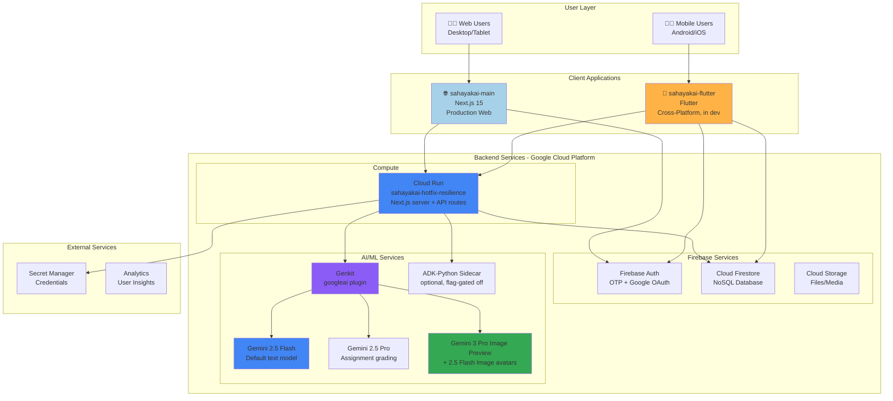
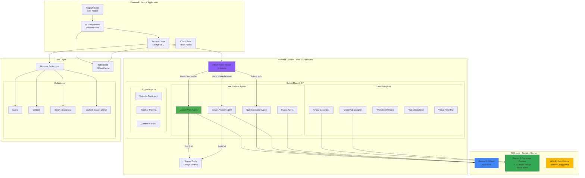
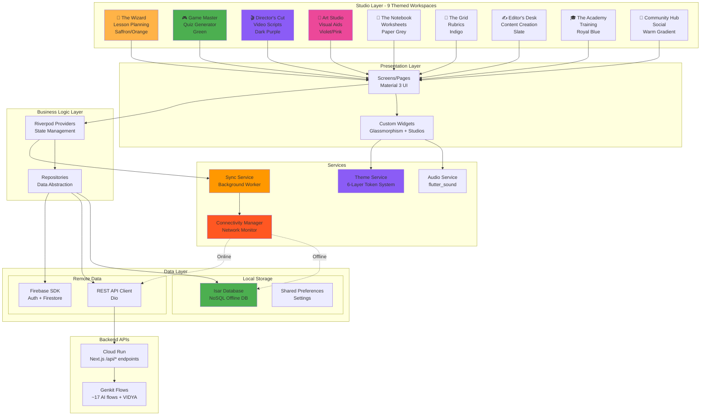
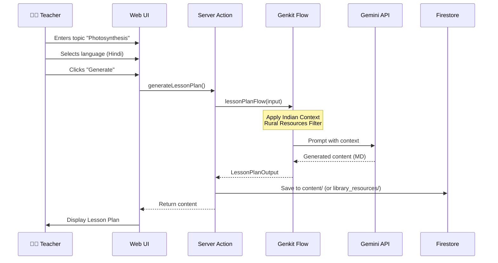
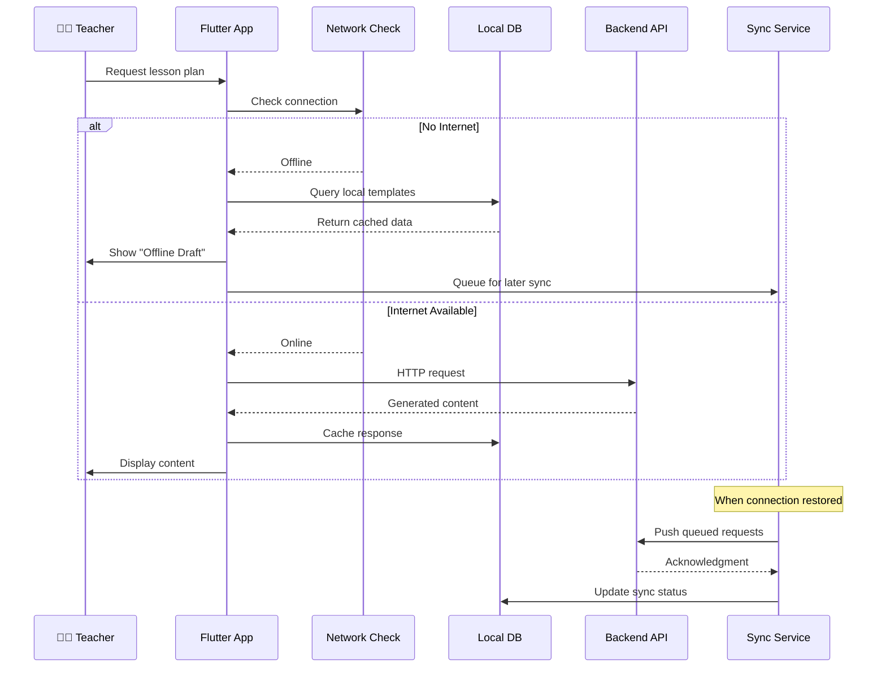
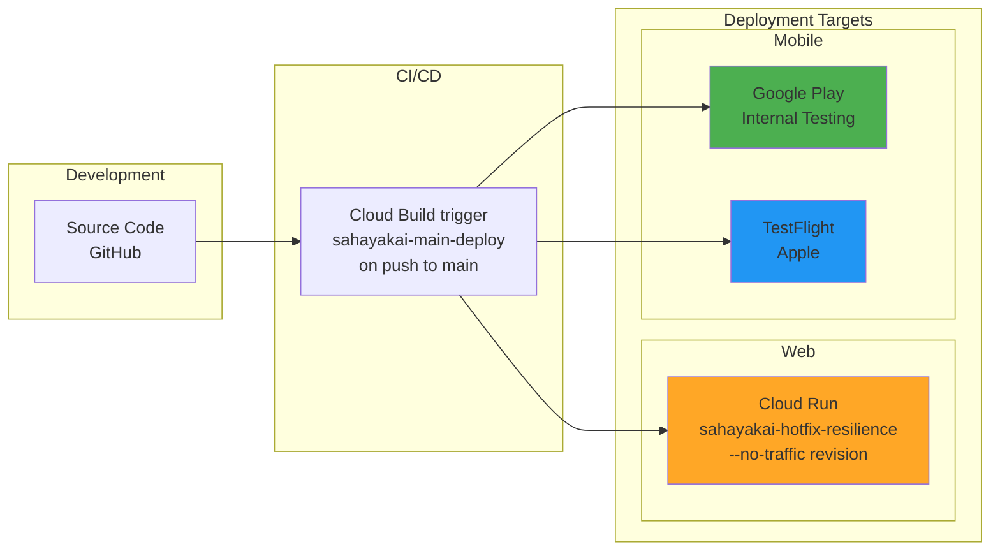
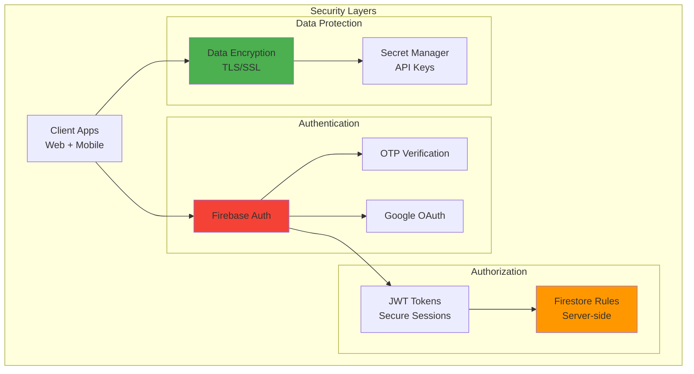
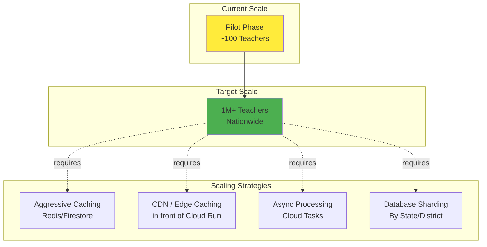

# SahayakAI: Complete Solution Architecture

**Version:** 2.1  
**Last Updated:** 2026-06-10  
**Coverage:** Web (Main) + Mobile (scaffolded)  

---

## Overview

SahayakAI's production surface is a single web app, with a Flutter mobile client in development:

1. **sahayakai-main** - Production web app (Next.js 15, Cloud Run). This is the live system.
2. **sahayakai-flutter** - Cross-platform mobile app (Flutter), offline path scaffolded; not yet GA.

> The production web app runs as a single Next.js service on **Cloud Run** (`sahayakai-hotfix-resilience`, region `asia-southeast1`, project `sahayakai-b4248`), not on Firebase Hosting / Cloud Functions. AI runs server-side via **Genkit** (`googleai` plugin) calling **Google Gemini** (default `gemini-2.5-flash`); there is no Vertex AI "Agent Garden" / A2A protocol in the live code. An optional external **ADK-Python sidecar** exists for select agents, gated off by default via Firestore feature flags.

---

## 1. High-Level System Architecture

---

## 2. Web Application Architecture (sahayakai-main)

> The "agents" below are Genkit flows in `src/ai/flows/*.ts` invoked through `/api/ai/*` route handlers, plus the VIDYA voice assistant (`/api/assistant`) whose router classifies 11 intents. They are not Vertex AI Agent-Garden agents and do not use an A2A protocol.

---

## 3. Mobile Application Architecture (sahayakai_mobile - Flutter)

### **Studio-Based Design System**

---

## 4. Data Flow Diagrams

### 4.1 Lesson Plan Generation Flow (Web)

### 4.2 Offline-First Flow (Mobile)

---

## 5. Technology Stack Comparison

| Component | Web (Main) | Mobile (Flutter, in dev) |
|-----------|-------------------|------------------|
| **Framework** | Next.js 15 | Flutter 3.x |
| **Language** | TypeScript | Dart |
| **UI Library** | Shadcn/UI + Radix | Material 3 + Studio System |
| **State Management** | React Server Components + hooks | Riverpod 2.0 |
| **Routing** | App Router | Named Routes (Flutter) |
| **Local DB** | IndexedDB (via idb) | Isar (NoSQL) |
| **Networking** | Fetch API | Dio |
| **AI Orchestration** | Genkit flows via `/api/ai/*` (+ optional ADK-Python sidecar) | Calls same web API endpoints |
| **AI Models** | Gemini 2.5 Flash (default); 2.5 Pro grading; 3 Pro Image Preview + 2.5 Flash Image | Same (via API) |
| **Agent Count** | ~17 Genkit flows + VIDYA voice assistant | Same flows via REST API |
| **Auth** | Firebase Auth (ID token verified in middleware) | Firebase Auth (Flutter SDK) |
| **Styling** | Tailwind CSS | 6-Layer Token System (JSON) |
| **Offline** | Service Worker (PWA) + IndexedDB | Native Offline-First + Isar |
| **Voice** | MediaRecorder API | flutter_sound |
| **Design System** | Glassmorphism (static) | Studio-Based (9 themes) |
| **Unique Features** | NCERT Mapping, Resource Selector | Community Hub, Academy, 6 Studios |

---

## 6. Deployment Architecture

> New Cloud Run revisions are built with `--no-traffic`; an operator flips traffic via `gcloud run services update-traffic ... --to-latest` after `./scripts/audit-deployments.sh` passes. There is no auto-route on deploy.

---

## 7. Security Architecture

---

## 8. Key Architectural Decisions

### 8.1 Why Separate Codebases?

| Aspect | Rationale |
|--------|-----------|
| **sahayakai-main** | The live production web app (Next.js on Cloud Run) |
| **sahayakai-flutter** | Native mobile UX and offline-first requirements (in development) |
| **sahayakai-voice-call** | Standalone streaming voicebot service for the Exotel parent-call path |
| **sahayakai-agents** | External ADK-Python sidecar for select agents (flag-gated off by default) |

### 8.2 Offline Strategy

**Web (PWA):**
- Service Workers cache UI assets
- IndexedDB stores generated content
- Background Sync queues API requests

**Mobile (Native):**
- Isar provides full NoSQL database
- Template-based fallback for offline generation
- Workmanager syncs when connection restored

### 8.3 AI Cost Optimization

1. **Semantic Caching:** Reuse similar lesson plans across teachers
2. **Template Library:** Pre-generated common topics
3. **Model Selection:** Gemini Flash (speed + cost balance)
4. **Request Batching:** Group quiz + rubric generation

---

## 9. Scalability Considerations

---

## 10. Integration Points

| Integration | Purpose | Implementation |
|-------------|---------|----------------|
| **Web ↔ Mobile** | Shared user accounts | Firebase Auth sync |
| **Web ↔ Firestore** | Real-time data sync | Firebase SDK |
| **Mobile ↔ Web API** | AI generation API | `/api/ai/*` REST endpoints on Cloud Run |
| **Genkit ↔ Gemini** | LLM inference | `@genkit-ai/googleai` plugin (Gemini API key pool) |
| **App ↔ ADK-Python sidecar** | Optional agent dispatch | App Check + HMAC-signed calls (flag-gated) |
| **App ↔ Telephony** | Parent calls | Twilio REST (default) / Exotel (opt-in) |
| **All ↔ Secret Manager** | API key management | GCP SDK |

---

**Document Status:** ✅ Current  
**Last Updated:** 2026-06-10  
**Maintained By:** Engineering Team
