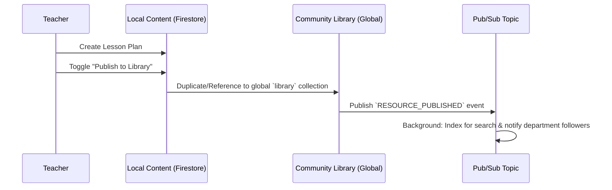

# Architecture: Community Library Integration

> **Last updated: 2026-06-10.** Status annotations added after verifying against
> `src/app/community-library/page.tsx`, `src/app/community/page.tsx`,
> `src/app/actions/community.ts`, and `src/lib/pubsub.ts`. This was originally an
> aspirational design doc. Several parts described below are NOT how the shipped
> code works. Status flags: **[SHIPPED]**, **[PARTIAL]**, **[NOT BUILT]**.

## 1. Overview
The Community Library surfaces persistent, discoverable educational assets
(Lesson Plans, Quizzes, Visual Aids) shared by teachers.

> **STATUS [PARTIAL].** Two surfaces exist and they diverge:
> - **`/community-library` (`src/app/community-library/page.tsx`) is a STATIC
>   MOCKUP** — it renders a hardcoded `mockResources` array, has only
>   **Trending / Following** tabs (no "My Content"), and performs **no Firestore
>   reads**. Treat it as a design placeholder, not the live library.
> - The **real** library logic lives in the `/community` unified feed
>   (`src/app/community/page.tsx`, `src/components/community/unified-feed.tsx`)
>   and the `library_resources` server actions in `src/app/actions/community.ts`
>   (`getLibraryResources`, `publishContentToLibraryAction`,
>   `saveResourceToLibraryAction`, `likeResourceAction`).
>
> The "TeacherConnect" / "Phase 15 Feed" framing predates the community redesign
> (see `COMMUNITY_REDESIGN_PLAN.md`, now largely shipped as a groups-based
> unified feed). TODO(verify: decide whether `/community-library` should be wired
> to `library_resources` or removed in favour of the `/community` feed).

## 2. Data Flow & Integration

> **STATUS [PARTIAL / NOT BUILT].** The publishing workflow below shows a Pub/Sub
> event pipeline (`RESOURCE_PUBLISHED`, `RESOURCE_DOWNLOADED`) and background
> indexing. **This is not how publishing works today.** `publishContentToLibraryAction`
> (`src/app/actions/community.ts`) writes directly to the `library_resources`
> collection via the Admin SDK; there is **no `RESOURCE_PUBLISHED` Pub/Sub topic**.
> `src/lib/pubsub.ts` exists but its only topic is GCS **storage-cleanup**
> (see `TOPICS` in that file). Download counts are incremented inline via a
> Firestore transaction on `stats.downloads`, not via a `RESOURCE_DOWNLOADED`
> event. The mermaid diagram below is retained as the original design intent only.

### A. Publishing Workflow (design intent — NOT the shipped flow)

### B. Firestore Schema Extensions
- **`library_resources` (Collection)** — **[SHIPPED]**, with corrections:
  - `authorId` (uid): references the **`users`** collection (there is no
    `profiles` collection in this codebase).
  - `stats`: `{ downloads, likes, ... }` — verified used by `getLibraryResources`
    (`orderBy('stats.likes')`) and `incrementDownload` (`stats.downloads`).
  - `type` (icon mapping) and a `language` filter field are used by
    `getLibraryResources`.
  - `originalId` — TODO(verify: confirm field name on the live `library_resources`
    docs; not asserted in `getLibraryResources`).
  - `searchVector` / Vertex AI Search — **[NOT BUILT]**. No semantic-search vector
    field or Vertex AI Search integration exists. Library search in the live feed
    is filter-based (type/language/author).

## 3. Component Architecture (React/shadcn)

> **STATUS [NOT BUILT as named].** The `LibrarySearch` / `LibraryTabs` /
> `ResourceCard` / `LibraryGrid` components below do not exist as discrete files.
> `/community-library/page.tsx` inlines a search `Input`, a `Tabs` control, and
> card markup directly. The live library cards render inside
> `src/components/community/unified-feed.tsx` and the resource feed
> (`src/components/community/resource-feed.tsx`). Author identity links to
> `/profile/[uid]` (the user profile route), as the doc's section 4 intends.

Original mockup-driven component table (aspirational):

| Component | Responsibility | Props/State |
| :--- | :--- | :--- |
| `LibrarySearch` | Styled input with search icon and language dropdown. | `onSearch`, `languageFilter` |
| `LibraryTabs` | Segmented control for Trending/Following/My Content. | `activeTab` |
| `ResourceCard` | Visual card with type icon, author avatar, stats, and download. | `resource: Resource` |
| `LibraryGrid` | Responsive grid for `ResourceCard` instances. | `resources: Resource[]` |

## 4. Integration with Social Engine
- **Likes**: `likeResourceAction` writes a `uid`-stamped doc to a `likes`
  collection group and updates `stats.likes`. **[SHIPPED]**
- **Author Identity**: Clicking an author navigates to `/profile/[uid]`. **[SHIPPED]**
- **Download Tracking**: incremented inline via Firestore transaction on
  `stats.downloads`. **There is no `RESOURCE_DOWNLOADED` Pub/Sub event.** Trending
  is ranked by `orderBy('stats.likes', 'desc')` in `getLibraryResources`, not by a
  download-boost pipeline. **[PARTIAL]**

## 5. UI/UX Aesthetics
- **Color Palette**: Use the "Sahayak Orange" (#f97316) for primary actions/tabs to match the logo in the mockup.
- **Glassmorphism**: Apply `backdrop-blur-lg` to the search container as suggested in the design.
- **Micro-animations**: Hover state on cards should include a subtle scale-up and shadow deepen effect.
