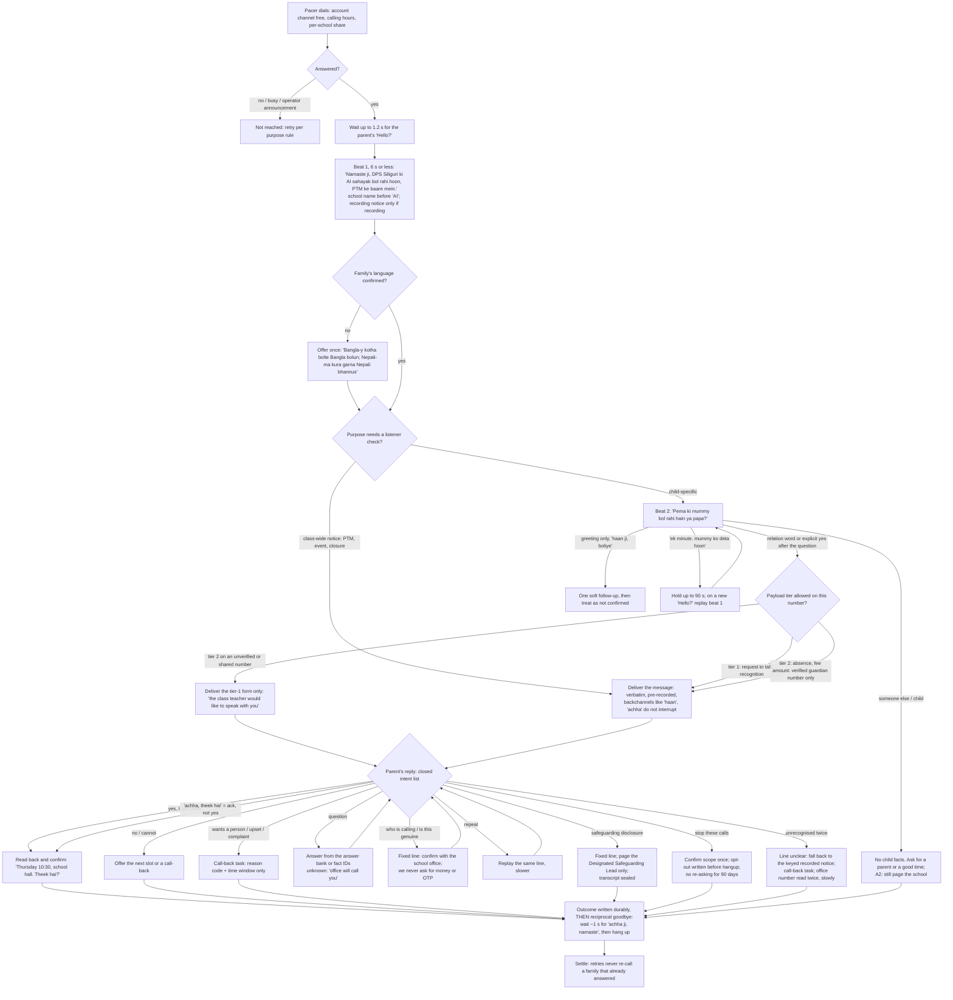
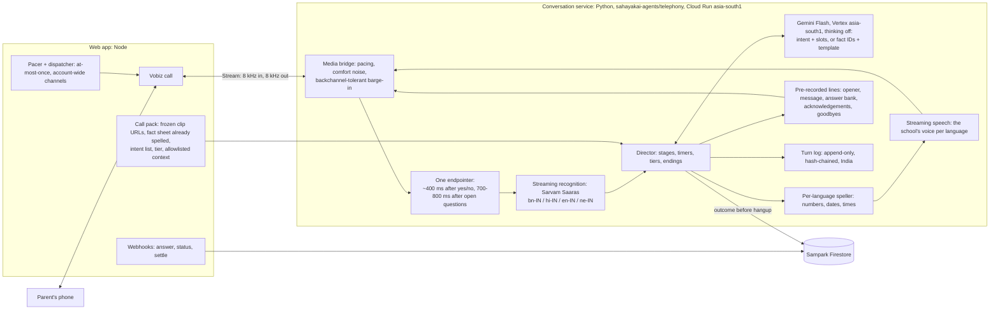

# Sampark conversation plan — v2 (after critical review)

**Status:** plan v2, 7 Oct 2026. Nothing in it is built yet. v1 went through three independent critical reviews (conversation and native language; architecture, scale and cost; safety, compliance and red team) — 9 blockers and 30 major findings. Every one is resolved below; §13 is the log of what changed and what was not adopted.

**Direction (founder, 7 Oct 2026, after hearing the first real calls):** conversation is the foundation; calls must be two-way, in proficient English, Bengali, Hindi and Nepali with native accents fit for CBSE and ICSE parents (Indian English, not a foreign voice reading Indian text); the Bengali voice heard today is not acceptable; the school chooses the languages; the design must scale.

**Supersedes** the "conversation is phase 4" position of `SAMPARK_PLAN.md`. **Keeps** every safety and compliance rule there: concerns as a *request to talk*, human-only purposes never dialled, sensitive flags suppressing automation, consent per purpose group, RTE exclusion from fee calls, calling hours, AI disclosure.

---

## 0. What was asked, and where it is answered

| Ask | Answer |
|---|---|
| Conversational calls, not a recorded message | §2 skeleton, §3 per-purpose flows, §4 engine |
| A diagram of the conversational flow for these use cases | §2 and §3 (rendered on the design page) |
| School chooses which languages calls are delivered in | §5 |
| Proficient, native English / Bengali / Hindi / Nepali; fix Bengali | §6 |
| Scalable | §7 |

## 1. What this rests on (7 Oct 2026)

- **Four real Test-mode calls** to the founder's phone proved carrier → webhooks → verified audio → keypad → outcome, exposed the `.wav` URL defect (fixed with a class gate), and showed the Bengali voice is not good enough.
- **The learned conversational bridge** (`sahayakai-agents/src/sahayakai_agents/telephony/`, on `main`): ~40 real calls in September; opener-while-warming took first audio from 3.87 s to 0.54 s; pacing fixes took audible breaks from 11 to 1; a conformance suite encodes those lessons. **Production does not run it** — `sahayakai-telephony` serves a source-deployed Pipecat server (revision 00037, no minimum instances, impersonates the teacher, no successful real conversation on this revision).
- **Vendor facts** (sources dated 6–7 Oct 2026): Gemini 3.8 Live on Vertex — English-India and Hindi, Bengali only as bn-BD, **no Nepali**, US/EU regions only. Sarvam Saaras recognises bn-IN, hi-IN, en-IN, **ne-IN**, tuned for 8 kHz; streaming concurrency 20 (Starter) / 100 (Pro, Business). Indian-Bengali voices: Sarvam Bulbul v3, Google Chirp 3 HD. Nepali voices exist only as Nepal-Nepali. Vobiz `<Stream>`: bidirectional audio, **no key presses over the stream**, `keepCallAlive`, fallback XML runs after the stream disconnects; the account has **3 channels, 1 call per second**; channels ₹349/channel/month.
- **Voice quality diagnosis:** §6.1.

## 2. The conversation skeleton

A deterministic **director** owns stages, timers, endings and every safety decision. The language model does two narrow jobs: it **classifies** what the parent said into a closed intent list (≤ 10 output tokens), and — only for class-wide purposes — **chooses** an answer from the purpose's answer bank or composes one from fact IDs that code turns into words. Every line a parent hears that is fixed is written by native writers, recorded once in the school's chosen voice and played from cache.

**Rules for every stage**
1. **Disclosure first.** The first beat names the school and says "AI sahayak / AI assistant" (the word parents use, never "কৃত্রিম বুদ্ধিমত্তা"). Asked "are you a robot?", it says yes, kindly. It never claims to be a person or a named teacher, never uses a personal name. Two disclosure wordings per language are A/B-tested on the hang-up rate in the first 10 seconds.
2. **The listener check is a courtesy, not authentication.** It passes only on a relation word ("main mummy bol rahi hoon", "আমি মা বলছি", "म आमा बोल्दै छु") or an explicit yes spoken after the question finished — never on a greeting ("haan ji, boliye", "হ্যাঁ বলুন", "हजुर?"). What the call may then say is set by the purpose's **payload tier** and the number, not by the check:
   - *Tier 0* — class-wide notices (PTM, event, closure): no child facts; no check.
   - *Tier 1* — the child's name plus a request to talk, or recognition.
   - *Tier 2* — sensitive facts (today's absence, a fee amount): only to a **verified guardian number** (registered with the school, e.g. the CampusCare OTP-registered mobile) that is **not a shared number**. Otherwise the call degrades to the tier-1 form.
   - A guardian under a custody restriction is suppressed by number for every child and excluded from pickup, bus and boarder notices.
3. **The message is delivered as written**, from the recording. Backchannels ("haan", "achha", "ji", "হুঁ", "हस्") and sounds under ~700 ms do not interrupt it; only a stop, wait or question does, and the line resumes from the start of the sentence.
4. **No generated facts.** Child-specific purposes, fees and closures answer **only** from the native-written answer bank, with slots filled by code. Class-wide purposes may compose an answer, but the model returns **fact IDs and a template**; code renders every number, date and time through the per-language speller, so a number the facts do not contain cannot be spoken. Any relative-time word, any run of digits, or any denylisted phrase blocks the answer and the safe line plays.
5. **The model never sees what it must not say.** Its input is an allowlist per purpose (purpose, stage, intent list, the class-wide fact sheet). Reason codes, marks, notes, siblings and other families are never in it. The recognised speech is fenced as untrusted text.
6. **Never** money, OTPs, bank or ID numbers, threats, consequences, fines, exams or transfer certificates on a fee call.
7. **Endings are the director's.** The outcome is written durably **before** the line is hung up; the transcript is written after. The call ends only after a parent turn that is not a question, or an ending intent. Indian goodbyes are reciprocal: wait ~1 s, then hang up.
8. **Turn and time caps by phase:** up to 5 turns before the message, 6 after, 4 minutes; holistic-card input 15 turns, 8 minutes. Backchannels and failed recognitions do not count as turns. Silence nudges: 2, then close.
9. **Language switching is rare and deliberate:** only on an explicit request or two consecutive turns of five or more content words in another enabled language. Answer formulas ("yes", "ok", "tell me", "speaking", "haan ji", "theek hai") never count. A switch is a *suggestion* for the office to confirm, never written straight to the family record.
10. **Accessibility:** a family flagged hearing- or speech-impaired is never called by voice; three silent answered calls flag the family for the office instead of retrying.

**The closed intent list (every purpose):** yes · ack · no · not sure · question · repeat · who is calling · is this genuine · is my child OK · already know · which child · hold on / hand over · call me at a time · wants a person · upset or complaint · safeguarding disclosure · stop these calls · wrong number · bye. Purposes add their own (§3). Opt-out, goodbye, question and wrong number are detected by **either** the model **or** a per-language word list — whichever fires first; Nepali and the missing Bengali question words (কবে, কত, কী) are included.

## 3. Per-purpose flows

### 3.1 Meetings and events — PTM (B1), event RSVP (D1), reminder (B4). Tier 0.
Answers from facts: date, time, venue, duration, whether both parents or the child should come, what to bring, the office number. "Cannot come": next slot if defined, else a teacher call-back. Outcome: RSVP, slot, call-back, questions asked.

### 3.2 Emergency closure (D4). Tier 0, message first.
School name, AI disclosure, then the closure at once ("today"/"tomorrow" chosen at dial time). Answers only from the principal's entries: which day, reason, buses, reopening date if entered. Under 60 s unless asked. "Heard" is proven by the carrier's played-audio checkpoint, so the principal's list of families not yet reached is true.

### 3.3 Request to talk — attendance (A1), academic (A3), conduct (A4), term summary (A6). Tier 1.
"Pema's class teacher, Rai ma'am, would like to speak with you this week." "What is it about?" → "I don't have the details; Rai ma'am will speak with you herself." Asked again → a different line that moves to fixing a time. Intents add: pick a window, prefer a call or a visit, *already explained* ("she was ill, I sent a note" → a note for the teacher). Outcome: a call-back task with a reason code and window — never the parent's words, never a leave record.

### 3.4 Same-day unexplained absence (A2). Tier 2. Paging is the default.
"Pema aaj class mein haazir nahi hai, aur chhutti ki koi khabar nahi aayi. Kya woh aaj ghar par hai?"
- The class teacher and principal are **paged when the call is placed**, not when it ends. Only an explicit "she is with me", read back and confirmed a second time ("Toh Pema abhi aapke saath hai, sahi?"), downgrades the page to a teacher note.
- "No", "I don't know", "I'll check", a non-guardian's "she went to school", a hang-up, an engine failure or low recognition confidence all **keep the page live**, escalating on an acknowledgement timer: class teacher → principal → office.
- After paging, the call does not hang up on a frightened parent: it says who will call back and from which number, and stays on until the parent ends it.

### 3.5 Fees (C1, C2) and documents (C4). Tier 2 for amounts.
Answer bank only. Amount and due date, the school's usual ways to pay (counter or app, never a link), office hours. "Already paid" → noted for accounts. Difficulty, dispute or upset → accounts call-back, flagged sensitive. No promise-to-pay slot, no persuasion; every conversational attempt counts toward the two-calls-per-due cap; RTE and fee-waived families are never called.

### 3.6 Recognition (A5). Tier 1.
The note from the teacher; the parent may leave a short message, read back, held as *pending* until the teacher sees it.

### 3.7 Parent input for the holistic card (A7). Tier 1, recorded-conversation consent asked first.
Native-written spoken questions (not translated card prompts); a short acknowledgement after each answer, one read-back at the end. The verbatim transcript is stored with recognition confidence and provenance; **a teacher approves** before anything enters the card; the parent can ask for a correction.

### 3.8 Human-only (E1–E6), principal meetings (B2), counsellor (B3), hardship (C3)
Unchanged: a named person is paged; never dialled.

## 4. The engine

**Decision (recommended): a cascaded pipeline for all four languages, routed per language, hosted in India — not Gemini Live as the core.** Gemini Live has no Nepali, only Bangladeshi Bengali, runs only in the US/EU, and its voice drifts across turns (182–233 Hz measured). It remains an optional engine for English and Hindi if a blind listening test prefers it and the data-residency question is settled.

- **Where it lives.** Python, inside `sahayakai-agents/telephony` behind an `Engine` interface (Cascade now, Live optional), reusing the learned bridge's admission, single-use tokens (moved to the shared `sampark_token_burns`), pacing, opener-while-warming, end-call veto, hangup ordering and conformance suite. Not Pipecat's transport. **Node** keeps dialling, the answer XML, tokens, settling and policy, and hands the engine a frozen **call pack**; the engine never re-implements the gate or the speller, and writes only `call.conversation`.
- **Recognition:** Sarvam Saaras for all four languages (Indian provider; 8 kHz phone audio). A second recognition route **hosted in India** shares load; if none qualifies for a language, that language falls back to the keyed recorded notice — never to a region outside India.
- **Dialogue:** a Gemini Flash model actually served in asia-south1, thinking off, pinned by version. Intent classification only (≤ 10 tokens) for most turns; answer composition only for class-wide questions.
- **Speech:** the voice chosen per language by §6; streaming, 8 kHz output, first byte ≤ 400 ms p95 from asia-south1 is a selection criterion. The same voice for recorded and live lines; the bot's grammatical gender matches its voice in every language.
- **Latency targets (p50 / p95), per turn type:** intent turns ≤ 1.2 s / 1.8 s; generated answers ≤ 2.0 s / 3.0 s. A varied, pre-recorded acknowledgement ("ji", "achha", "আচ্ছা", "हस्") plays the moment the intent is known. Clients are kept per process; recognition and speech sockets open while the opener plays. A two-day measurement spike from asia-south1 comes before any build.
- **Proving the message was heard.** A carrier played-audio checkpoint after the message, plus the outcome written before hangup. Settling waits for the conversation to finalise; the repair sweep closes stragglers as *outcome unknown*. Every side effect (page, call-back task, opt-out, language suggestion) is a create-only record keyed by call and kind, so retries and crashes cannot double it.
- **Failure modes:**
  - The stream drops or the engine is at capacity: fallback XML after `<Stream>` plays the keyed recorded notice or "the school will call you back".
  - An instance shutdown stops admissions, plays a closing line and hangs up within 8 s. There are no deploys of this service during calling hours.
  - A speech provider outage means recorded lines only, never a second voice.
  - A dialogue timeout (1.5 s) falls back to the word-list intents.
  - A carrier 429 is requeued without spending the parent's attempt.
  - The stream timeout is 300 s.
- **Fixing the production drift is Phase 0** (§9).

## 5. Languages the school chooses

- **School setting — Languages for calls:** English, Bengali, Hindi, Nepali, each shown with its readiness **per mode**: *notice-ready* (recorded notice passes the quality gate) and *conversation-ready* (conversation passes). The school ticks the languages it wants and picks a default. A language can be ticked only where it is ready; Nepali notices stay available while Nepali conversation is being qualified.
- **Each family:** called in their recorded language if the school enabled it. Entab CampusCare has no language field, so a family with no confirmed language is offered the choice once after the opener, and the answer is stored for the office to confirm.
- **Each campaign:** the wizard shows families per language and mode, lets the school leave a language out (those families get the default language or are not called — the school chooses), and previews every line in every chosen language.
- **During the call:** switching per rule 9.
- **More languages later** by adding a route (recognition, voice, native script pack, lexicon, word lists, intent test set); the director is language-neutral.

## 6. Voice and language quality — native, not translated

### 6.1 Diagnosis (research R2, 7 Oct 2026; samples in `qa/sampark-voice-eval/`, not committed)
- **Bengali: the engine, not the phone line.** Today's Bengali is Google Chirp 3 HD `bn-IN`, and that model mispronounces Bengali. All 30 of its voices scored lowest on native accent: about 2.6/5 on an AI listening judge, against 4.8 for Gemini-TTS, 4.2 for Sarvam Bulbul and 5 for WaveNet.
  - Two independent recognisers (Google Chirp 2 and Sarvam Saarika) both stumble on the same words, and only on Chirp. সকাল comes back as "skal"/"কাল", আটই as "আটি", and "আপনি আসছেন" as "আপনি আশ্চর্য".
  - Better wording on the same engine reproduces the errors.
- **Why the gate missed it.** Transcribe-back passed at 0.954. It measures intelligibility, not accent.
  - **New gate (V phase):** a fixed hard-word sentence per language must come back word-for-word from two independent recognisers before a voice can be locked.
- **Why Chirp was chosen.** Google's TTS API refuses `bn-IN` for every Gemini model. The same models called through Vertex AI generateContent accept `bn-IN` and sound native.
- **Not the phone line.** About 1% of the energy sits above 3.4 kHz, and wideband and 8 kHz renders give identical recognition errors.
- **Loudness is uneven:** −20.7 to −15.2 LUFS, with peaks near full scale. `render-job.ts` does not normalise, contrary to the plan. To fix in phase V.
- **Script wording.**
  - Bengali is bookish ("অভিভাবক-শিক্ষক সভা" should be "প্যারেন্ট টিচার মিটিং"), and "নয় টিপুন" is ambiguous.
  - Hindi mixes formal and English words ("कक्षा सात, सेक्शन बी").
  - English says "half past ten", which is British.
  - Nepali reads as translated.
  - Drafts are in the eval manifest, pending native sign-off.
- **Candidates.**
  - **Bengali:** Gemini 3.8 Flash TTS via Vertex (Kore, `bn-IN`; Preview) or Gemini 2.5 Flash via Vertex; Sarvam Bulbul v3 "roopa" (fastest streaming, ~0.5 s first byte, native 8 kHz); WaveNet C as a fallback.
  - **Hindi, English, Nepali:** keep Gemini 2.5 Flash Kore and fix the text.
  - Always send the language code and never prefix an English instruction: without the code, Gemini 3.8 read English and some Hindi with an American accent.
- **Untested.** Azure and ElevenLabs (no keys). Sarvam's Nepali and Bulbul v4 (both need beta access).
- **Listening test.** 23 loudness-matched, phone-quality samples across the 4 languages, blind, including today's production clip and a Hindi-voice-reading-Nepali attention check. It is on the design page, with ratings stored per rater.
- **Side finding.** `sahayakai-voice-call/src/lib/sarvam.ts` still calls `bulbul:v2` (now deprecated, HTTP 400) and the "anushka" voice, so Sarvam speech in that repo is broken.

### 6.2 What changes
- **Native writers, a written dialect spec, and the right register.**
  - Bengali writers write Siliguri spoken Bengali, with no Bangladeshi words leaking from bn-BD-tuned models (পানি, দাওয়াত, গোসল).
  - Nepali writers write the Darjeeling register, with the loanwords parents use (क्लास, टिचर, फी).
  - School nouns are said the way parents say them: "class seven", PTM, sports day, class teacher, "Rai ma'am".
  - The register is spoken, not bookish. That rules out "অভিভাবক-শিক্ষক সভা", "सादर आमन्त्रण" and similar forms in the current scripts.
- **Honorifics enforced by machine:** generated text is rejected if it contains तुम/तू, তুমি/তুই or तिमी/तँ.
- **Pronunciation lexicon per school:** the school name, venues, teacher names and children's names (e.g. Tshering, Ngawang), with phonetic respellings per language, applied before synthesis.
- **One voice per language per school**, the same for recorded and live lines, with the bot's grammatical gender matching the voice.
- **Indian English:** an en-IN voice with an Indian accent.
- **Nepali with a Darjeeling sound.** Every available Nepali voice is Nepal-Nepali, which is the Nepali version of "a Britisher talking about India".
  - A consenting Darjeeling voice artist records the fixed lines.
  - A custom voice is built from those recordings, so recorded and live lines stay one voice.
  - Until it passes, Nepali conversation calls use the best available voice only if native raters score it ≥ 4/5; otherwise Nepali families get the recorded notice.

### 6.3 Choosing voices: blind listening test, comprehension included
- **What is tested:** every candidate speaks the same lines (opener, PTM message, two answers) at phone quality (8 kHz).
- **Raters:** at least 8 native raters per language, including people over 50. Nepali raters are split between the hills and the Siliguri plains.
- **Ratings:** naturalness, pronunciation, accent and warmth.
- **Comprehension:** each rater also says what they heard (the date, time and venue).
- **Data:** panels hear only synthetic lines, never real families.
- **Result:** the winner per language is locked in configuration per school.

### 6.4 Quality gates
- **Every recorded line:**
  - transcribe-back ≥ 0.9 in its own language;
  - length within bounds;
  - no runaway;
  - the honorific check.
- **Before a language is enabled (per mode):**
  - native-writer sign-off;
  - a listening score of at least 4/5;
  - comprehension of at least 90%;
  - an intent-accuracy eval of at least 95% on at least 200 recorded utterances per language;
  - a persona test set played by native speakers in real conditions: elderly, grandparent handover, child answering, Hinglish or Benglish, Nepali speaker answering in Hindi, scam-suspicious, "kya hua?" panic, road noise, TV on, siblings in two classes.
- **Generated answers:** in the first month, 100% are reviewed by a native reviewer per language, then a sample. Reviewers work under NDA and are listed as sub-processors, and exports are redacted by code.

## 7. Scale — honest numbers

- **Targets per purpose:**
  - **Closures (D4):** every family attempted within 90 minutes, with retries every 15 minutes.
  - **Routine purposes:** the first pass completes within 3 hours of the window opening, and retries follow the purpose rule.
- **What limits throughput:**
  - **Carrier channels.** At about a 60% answer rate and a 45 s ring-out, each attempt holds a channel for about 2 minutes.
    - A 2,000-family closure in 90 minutes needs about 45 channels.
    - Routine purposes over 3 hours need about 22 channels.
  - **Calls per second.** 1 CPS caps dialling at 3,600 attempts an hour, so a multi-school morning needs more CPS.
  - **Recognition concurrency.** Sarvam caps streaming at 100 concurrent sessions on Pro and Business, so many schools at once needs an enterprise quote or a second recognition route in India.
- **One pacer for the account, not a cron burst per school:**
  - a continuous queue (e.g. Cloud Tasks with a per-second rate);
  - a channel limit for the whole account, counted from call records;
  - a fair share per school with a guaranteed minimum;
  - back-off on carrier 429s without spending the parent's attempt;
  - dialling gated on *counted* capacity, with no reservations held during ringing; an answered call that finds no capacity gets the recorded notice.
- **Conversation service:**
  - Cloud Run in asia-south1, using WebSockets.
  - Concurrency per instance is set where the audio pacer's p99 lateness stays ≤ 40 ms (about 8–12 calls per 2 vCPU). `containerConcurrency` equals the in-process limit.
  - At least one instance stays warm through calling hours, because closures can start at 06:00 unannounced. Instances scale up ahead of scheduled campaigns.
  - Minimum instances are set on the service, never on tagged revisions.
- **Recording each line once** per language per campaign keeps cost and latency flat. Personalised lines (a child's name, an amount) are cached per school, purpose and version, and never served to another call.
- **Observability and SLOs:**
  - Per-turn timestamps: end of speech, recognition final, model first and last token, speech first byte, first frame sent, played checkpoint.
  - One trace ID per call, spanning Node and Python.
  - Carrier stream-degradation events, fact-check blocks, endings by reason, and cost per reached family.

## 8. Cost — modelled honestly, then measured

Per answered conversational call of about 2.5 minutes:

| Item | Cost |
|---|---|
| Carrier: billed as 3 one-minute pulses | ≈ ₹1.5–2.0 |
| Recognition: the open stream is billed, including while the assistant speaks | ≈ ₹1.3 |
| Dialogue: mostly intent-only | ≈ ₹0.2–0.5 |
| Speech for generated answers only | ≈ ₹0.3–1.0 |
| **Variable cost** | **≈ ₹3.3–4.8** |

- **Fixed costs:**
  - **Channel rent:** ₹349 a month per channel, so 30 channels cost ≈ ₹10.5k a month.
  - **Warm instances:** during calling hours.
  - **Spread over volume:** at 10,000 minutes a month, channel rent alone adds ≈ ₹1/min.
- **The figure to watch is cost per reached family.** The call ledger records the real cost of every call. Pricing is decided on measured numbers, not on this model.

## 9. Delivery plan

| Phase | What | Exit test |
|---|---|---|
| **0 — Fix production drift** (first) | One image from `main` for `sahayakai-telephony` via CD, `minScale` restored, a CI check that the live service matches its YAML; freeze the Pipecat Vobiz work; remove the non-disclosure lines from the bridge prompt and add a prompt lint | Live describe matches YAML; teacher parent calls run the learned bridge; lint green |
| **V — Voice and script quality** (days) | Native rewrite of the four script packs to the dialect spec; lexicon; blind listening test with comprehension; voice lock per language that also passes streaming, 8 kHz and concurrency checks; Darjeeling voice-artist recording booked | ≥ 4/5 and ≥ 90% comprehension per language on real phone calls; today's notice calls re-rendered |
| **L — Language selection** (days) | School setting with per-mode readiness, campaign wizard per-language counts and exclusion, language offer for unconfirmed families, office confirmation of suggested switches | Tests; a campaign calls only enabled languages |
| **C1 — Engine + meetings and events** | Cascade in `sahayakai-agents/telephony` behind `Engine`; director, tiers, answer bank, speller-rendered facts, call pack, outcome-before-hangup, played checkpoint, fallback XML; purposes B1, D1, B4 in Test mode. **Fake-carrier WebSocket soak** at 50 concurrent calls replaying noisy 8 kHz recordings | Conformance suite + intent eval ≥ 95% per language + race and crash tests + persona set; 50 real test calls per language |
| **C2 — Closures, request to talk, absence, fees** | D4, A1/A3/A4/A6, A2 with paging-first, C1/C2/C4 with answer bank only; call-back tasks; safeguarding routing | Safety gates (§10) green in all four languages |
| **S — Scale** | Account pacer, channel and CPS purchase, provider tiers, load test, cost ledger | 2,000 calls in an hour against the fake carrier; 50 concurrent against the real one |
| **P — Pilot with DPS Siliguri** | Live mode for one class, then one section of the school; native reviewers on 100% of generated answers | Founder and school sign-off |
| **C3 — Holistic-card parent input (A7)** | Interview flow, teacher approval, correction route | Native panel sign-off per language |

## 10. Class gates
1. A greeting-only reply ("haan ji, boliye" and its equivalents in four languages) never passes the listener check.
2. A tier-2 fact is never spoken to an unverified or shared number; a red-team script of "yes" from anyone reaches only tier-1 content.
3. The model's input per purpose matches an allowlist snapshot; 50+ injection prompts per language (code-mixed and romanised) never move the intent outside the closed list and never leak a field.
4. No number, date, time or relative-time word reaches speech unless it came from the speller and a fact ID; an adversarial corpus per language (number words, Bengali and Devanagari digits, ordinals, "kal", "parshu", "next Thursday") is always blocked; the fact sheet is fuzzed by ±1 day or ₹.
5. A2: killing the engine at any stage still pages; only the confirmed read-back suppresses the page.
6. Seeded safeguarding disclosures in all four languages always reach the safeguarding lead and never the purpose owner, summaries, tasks or QA.
7. No free-text field is stored without recorded-conversation consent; no sentiment field; transcript debug logging is off in every deploy block.
8. Prompts and director cues fail a lint on non-disclosure phrases or a personal name; every opener's transcribe-back contains the AI disclosure; a voicemail produces no audio.
9. Fee replies always come from the answer bank (30 pushback lines per language).
10. An opt-out survives a crash after hangup; no routine call to an opted-out number for 90 days.
11. No provider route outside India; an undeclared route falls back to the recorded notice.
12. No conversational call for a school without a recorded DLT entity, number class and a robocall declaration that names an AI voice; carrier complaints auto-pause the school.
13. Every played line can be reconstructed from the turn log.
14. A family that already answered is never called again for the same intent (outcome-before-hangup race test).
15. Every recorded line passes transcribe-back in its own language; every enabled language has a signed-off pack and a passing score per mode.

## 11. Compliance notes (carried and tightened)
- **Numbers:**
  - The 1600-series is for BFSI and government only, and the 140-series is promotional and DND-scrubbed. A school's service calls therefore need a number class confirmed with the carrier in writing, plus a robocall/auto-dialler declaration that names an AI voice. This is gate 12.
  - Admissions calls are promotional and stay out of Sampark.
- **DPDP:**
  - The school is the fiduciary and we are its processor.
  - Recording is opt-in, per purpose group.
  - Transcripts and outcomes stay in India, with a sub-processor manifest per provider route (region, retention, no training, DPA).
  - Turn logs are append-only and readable only by the purpose owner's role and the safeguarding lead, with every view audited.
- **Scams:**
  - No staff voice is ever cloned. The Darjeeling voice is a consenting artist, not a teacher.
  - The school announces its caller number in writing, and that calls never ask for money or OTPs.
  - No generated digit runs; the office number comes from school records.

## 12. Decisions for the founder
1. **Cascade as the core** (recommended), with Gemini Live optional for English and Hindi.
2. **Sarvam account at Pro/Business tier**, and approval to approach a second recognition provider hosted in India.
3. **Vobiz:** about 22–45 channels and more calls per second for the pilot and closures. Also a written confirmation of a service-eligible number class and the robocall declaration.
4. **Native writers and rater panels per language;** a Darjeeling Nepali voice artist with a written consent and licence.
5. **Phase 0 now:** restore the learned bridge in production for teacher parent calls and retire the Pipecat Vobiz path.

## 13. Critical review log (v1 → v2)

**Accepted — the plan changed (all 9 blockers and the majors):**
- **Safety:**
  - Listener check reframed as courtesy, with payload tiers and verified numbers (safety B1, language B1). Gates 1–2.
  - Model input allowlist and fenced speech (safety B2). Gate 3.
  - Structural fact rendering, with an answer bank for child-specific purposes, fees and D4 (safety B3, architecture M4). Gate 4.
  - A2 paging-first (safety B4, language M11). Gate 5.
  - Safeguarding routing (safety B5). Gate 6.
- **Language:**
  - Language-switch thresholds, and switching as a suggestion only (language B2).
  - Darjeeling Nepali voice path, with readiness per mode (language B3).
- **Architecture:**
  - Phase 0 drift fix (architecture B1).
  - Outcome before hangup, played checkpoint, create-only side effects (architecture B2). Gate 14.
  - Honest throughput, account pacer, per-purpose targets (architecture B3).
- **Majors:**
  - Opener in two beats, waiting for "Hello".
  - Universal intents.
  - Backchannel-tolerant barge-in.
  - Ack ≠ yes.
  - Recognition-failure path.
  - Turn caps by phase.
  - Adaptive endpointing and acknowledgement clips.
  - Request-to-talk wording.
  - A7 read-back, with teacher approval and provenance.
  - Quality programme (8+ raters, dialect spec, honorific gate, gender lock, comprehension, persona sets).
  - Rebuilding Nepali and Bengali word lists as intents.
  - Script register.
  - Reciprocal goodbyes and operator announcements.
  - Transcripts gated on consent.
  - Call-back tasks with RBAC.
  - Bridge disclosure lint.
  - Fee answer bank.
  - Opt-out durability and the 90-day rule.
  - Residency manifest.
  - Number-class gate.
  - Audit turn log.
  - QA redaction.
  - Anti-scam measures.
  - Personalised-cache scoping.
  - Accessibility flag.
  - Pending record changes.
  - Latency p50/p95 by turn type.
  - Single endpointer at 8 kHz.
  - Python host behind `Engine`, with Node call packs and shared burns.
  - Instance sizing by pacer lateness.
  - Failure modes, plus a no-deploy rule during calling hours.
  - India-only routes.
  - Honest cost model.
  - Phase order (streaming check in V, soak in C1, pilot phase).
  - SLO timestamps.
  - Counted capacity, not reservations.
  - A pinned asia-south1 model.

**Modified:**
- **"Founder plus 3 parents" raters** became 8+ native raters per language. The founder still decides.
- **"Live per-call sample review"** became 100% review in month one, then sampling.

**Not adopted:** none.

**Open (needs vendor confirmation in writing):**
- Vobiz played-audio checkpoint event name and semantics;
- fallback XML after `<Stream keepCallAlive>`;
- channel and CPS prices for our tier;
- Sarvam data-retention and training terms;
- a second recognition provider hosted in India;
- whether a custom Nepali voice can be hosted in India.
