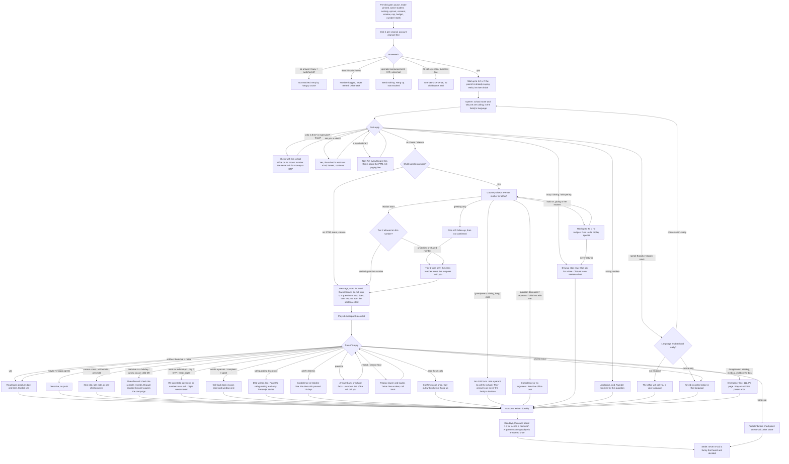
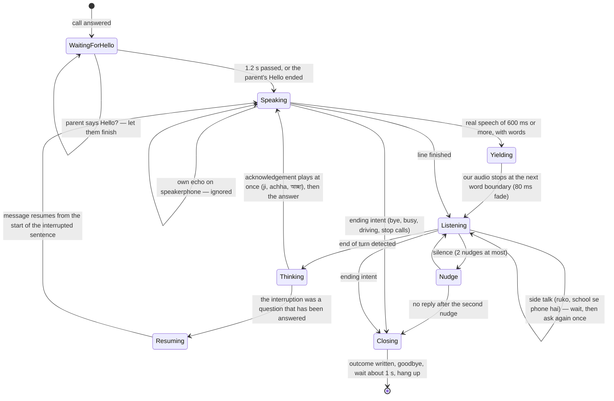
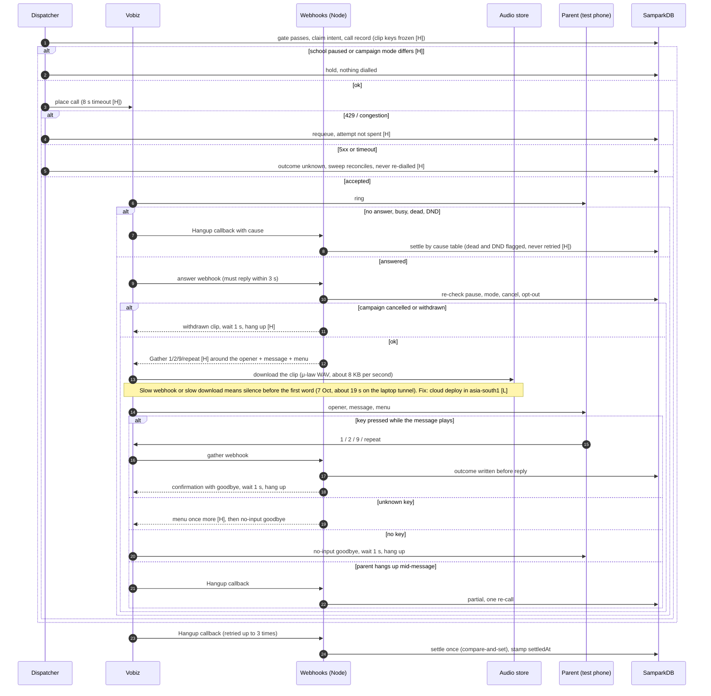
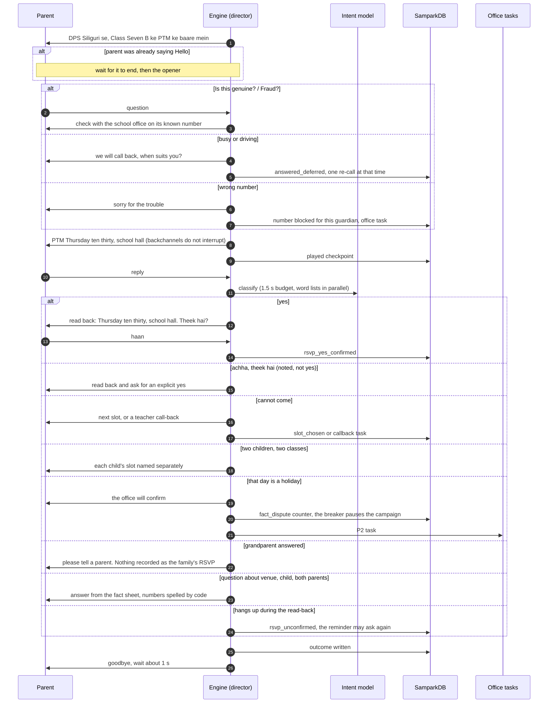
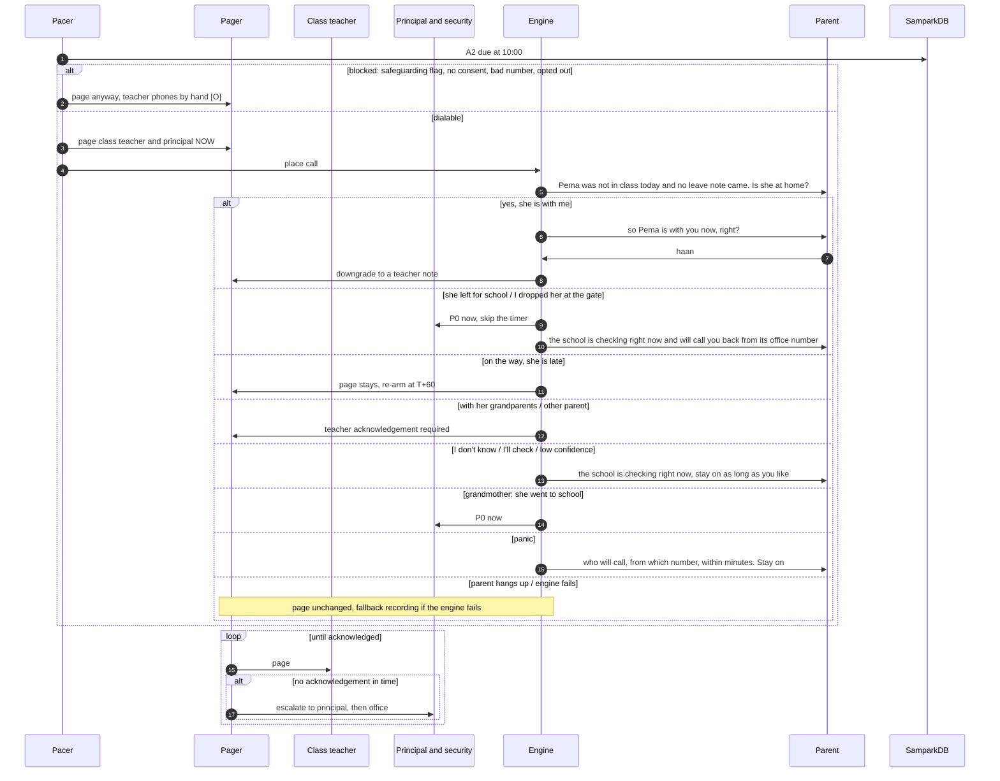

# Sampark edge cases: index, ownership and diagrams (7 Oct 2026)

On 7 Oct 2026 the founder asked for the edge cases a real school call will meet to be found, handled, and shown in the flow and sequence diagrams. They also asked that the call sound like the school office, not a recorded message, and that it cope with parents who talk over it or start speaking first. Three independent reviews produced **446 edge cases**. Each catalogue gives the stage, the detection signal, exactly what the parent hears, what is recorded, the retry or escalation rule, and the test or class gate that keeps it fixed:

| Catalogue | Rows | Covers |
|---|---|---|
| [`edge-cases/parent-behaviour-and-language.md`](edge-cases/parent-behaviour-and-language.md) | 227 | who answers, the parent's state, speech and interruptions, language, intent ambiguity, impossible requests, safety routing, endings, accessibility, and each school purpose (PTM, closure, transport, request to talk, A2, recognition, holistic card, fees, documents, re-enrolment, inbound) |
| [`edge-cases/telephony-and-system.md`](edge-cases/telephony-and-system.md) | 118 | dialling, the hangup cause table, answer and media, the stream and its fallback, the engine, settling and retries, carrier capacity, webhook security |
| [`edge-cases/school-ops-data-safety.md`](edge-cases/school-ops-data-safety.md) | 101 | campaign lifecycle, CRM data, identity and custody, consent and regulation, safety, staff operations |

This file does not repeat the rows. It merges the three "most dangerous" lists into one ranked list without duplicates, and gives every case group an owning phase. It also draws the diagrams the founder asked for, with the edge-case branches in them.

## 1. Who fixes what

Every case belongs to exactly one of four owners. The owner decides when it is fixed and which gate proves it.

- **H, hardening sprint (now).** These are bugs in today's notice runtime: Practice and Test mode, keyed recorded notices. They are fixed before any school relies on Sampark, because they already apply to the code that rings the founder's phone.
- **C1, conversation engine.** Barge-in and interruptions, the director, the closed intent list (plus the §4 additions in the parent catalogue), spoken opt-out, safeguarding routing, and the after-stream fallback. These cases need the two-way engine to exist; until then a keyed notice cannot hear speech at all.
- **L, live readiness.** These must be true before the first real parent's number is dialled: webhook signatures, shared-number detection, the cost cap, warm capacity at 06:00, and a cloud staging deploy.
- **O, operations.** The console, paging and call-back tasks: correction and postponement of campaigns, the pager with acknowledgement and escalation, the opt-out register and the office's task list.

## 2. The most dangerous gaps, merged and ranked

The three reviews overlap; the list below counts each defect once and names its sources. "Verified" means a reviewer traced the code path.

| # | Gap | Sources | Owner | Gate that proves the fix |
|---|---|---|---|---|
| 1 | **Practice changes real records** (verified). The simulated carrier presses 9 on about 8% of answered calls, and those become real opt-outs against real guardians. Simulated calls also count toward the 30-day cap. | ops 1 | H | g:practice-writes-nothing-real |
| 2 | **A campaign has no fixed mode** (verified). Flipping the school from Practice to Test or Live mid-campaign starts real calls; flipping back marks families done without ringing them. | ops 2 | H | g:mode-pinned-at-approval |
| 3 | **Silence after an edit** (verified). The clip key is re-rendered from the current campaign and school settings when the parent answers, so any edit makes the call fail `audio_unavailable` and settle as not retryable. | ops 7, tel 8 | H | g:clip-keys-frozen |
| 4 | **Cancel means silence, and nothing can be corrected.** A call answered after a cancel hears nothing; a wrong date can only be cancelled, never corrected. | ops 8, CL04 | H (withdrawn clip, hang up ringing calls) · O (correct, postpone) | g:cancel-never-silent |
| 5 | **Invitations ring after the event has started** (verified). Expiry is 23:59 on the event day. | ops 12 | H | g:invite-expires-before-start |
| 6 | **Children who left are still called; families are called 2–4 times** (verified). The dispatcher never checks that a student is active, and Entab repeats the parent's mobile under a new guardian ID for every child. | ops 9, 10 | H | g:inactive-never-dialled, g:one-call-per-number-per-campaign |
| 7 | **Dead, DND and recycled numbers are dialled again.** UNALLOCATED and CALL_REJECTED settle as retryable, and Vobiz's DND reason is thrown away. | tel 4 | H | CT: every hangup cause maps to (state, retryable, number flag) |
| 8 | **Carrier refusals spend attempts, and a 5xx can ring a family twice.** A 429 counts as an attempt; a 502/504 may already have placed the call; `fetch` has no timeout. | tel 2, 7 | H | g:carrier-busy-requeues-free, g:unknown-outcome-never-redialled |
| 9 | **No school-level pause.** The only stop is a global flag behind a deploy. | ops 3 | H | g:school-pause-stops-new-and-ringing |
| 10 | **A custody-restricted guardian gets school-wide calls** (verified). The gate ignores student flags for class-wide purposes. | ops 6 | H | g:custody-guardian-never-dialled |
| 11 | **Test-mode closures look delivered.** The overview mixes Practice, Test and Live counts, so a closure that rang one staff phone shows families as "heard". A Test campaign of 400 families would also ring the test phone 400 times. | ops 4 | H | g:overview-by-mode, g:test-mode-samples |
| 12 | **A REST import wipes the school's holidays** (verified). | ops 13 | H | g:import-keeps-school-holidays |
| 13 | **A spoken "stop calling me" is never saved** in the learned bridge: it is logged and the parent is told it is noted. | tel 1 | C1 | gate 10 + engine conformance test |
| 14 | **Safeguarding routing depends on the LLM**, whose safety filter blocks exactly these sentences. | tel 5, parent SF01 | C1 | G6: word list always runs, independent of the model |
| 15 | **Settling can run before the conversation's outcome is written**, so a parent who already heard the message is called again. Node and Python can also overwrite each other's version of the same call record. | tel 6 | C1 | NG1 + race test |
| 16 | **No time cap and a broken fallback after `<Stream>`**: the notice replays after a goodbye, or the line stays open and billing. | tel 3 | C1 | ASR redirect tests, K01 |
| 17 | **Interruptions**: the parent speaks first, talks over the message, backchannels, or goes quiet to think. A keyed notice cannot hear any of it. | parent SP01–SP12 | C1 (H: repeat key) | barge-in gate, PER |
| 18 | **Proxy answers and spoken digits.** A grandparent's "yes" is written as the family's RSVP; a spoken card number is stored in the transcript. | parent NG3, NG12 | C1 | NG3, NG12 |
| 19 | **Webhooks are slow and weakly authenticated.** The founder heard about 19 s of silence because the laptop tunnel answered webhooks in 3.7–6.5 s against Vobiz's 3 s limit and the clip downloaded slowly. Vobiz signatures are not checked, tokens are written to request logs, and burning the single-use token first breaks Vobiz's own retry. | tel 10, test calls 7 Oct | L | answer p95 under 1 s from asia-south1; signature test |
| 20 | **A2 is blocked silently and paging does not exist.** A child with an open safeguarding flag, missing consent or a bad number gets no call and no page; paging has no channel, acknowledgement or escalation. | ops 5, 14 | O (L before A2 is enabled) | g:a2-always-pages |
| 21 | **Shared numbers are not detected**, so one press of 9 silences several families. | ops 11 | L | NG9 |
| 22 | **Closures depend on live synthesis at 06:00, with no cold-start capacity and no cost cap.** | ops 15, tel 9 | L | closure clips pre-rendered per school; budget gate |

## 3. The hardening sprint (H), in order

**Done 7 Oct 2026** (commit f8c6eff33, contract `HARDENING_CONTRACT.md`): all eleven, each with a class gate that fails when its fix is reverted. Item 11 shipped in its interim form: an unknown key replays the message once, and the announced repeat key waits for decision 4. Integration found and fixed one more bug of the same family: a held campaign's intents sat at the front of the due list and starved every newer campaign (`gate-h2-hold-never-starves`).

These were the cases, each shipped with its gate (repo law 2). Their order puts the defects that could touch a real family first:

1. Practice rehearsals write nothing real: no opt-outs, and no count toward the frequency cap (gap 1).
2. The mode is pinned on the campaign at approval. The dispatcher dials only when the campaign's mode equals the school's current mode, and pauses the campaign with a reason when they differ (gap 2).
3. School-level pause: no new calls, and ringing calls are hung up, recorded in the audit log (gap 9).
4. Clip keys are frozen on the call when it is placed, so an edit can no longer silence an answered call. A call answered after a cancel plays a withdrawn clip, never silence (gaps 3, 4).
5. Invitations expire two hours before the event starts (gap 5).
6. Inactive students are never dialled. One call per phone number per campaign, naming every child it covers (gap 6).
7. A hangup cause table: dead and invalid numbers are flagged and never retried; carrier refusals (429, congestion) are requeued without spending the family's attempt; an unknown outcome is never re-dialled (gaps 7, 8).
8. A custody-restricted guardian is never dialled for class-wide notices (gap 10).
9. The overview separates Practice, Test and Live. Test mode rings the test phone only for one sample per language and audience variant, and simulates the rest (gap 11).
10. A REST import merges the CRM's holidays with the school's own instead of replacing them (gap 12).
11. In the keyed notice, an unknown key replays the menu once instead of ending the call. A **repeat key** lets a parent who spoke over the start hear the message again (gap 17, interim). This adds one recorded line per language, which needs native sign-off.

**Follow-ups found while building it** (not yet done):
- If the primary guardian is blocked (for example, no consent), the other guardian of record is not called, so the family gets no call. A fallback to the next guardian at dial time belongs to live readiness (L).
- In Live mode, carrier-requeued calls would count toward a family's 30-day cap. This needs a `requeued` flag on the call record before Live mode (L).
- The approval dialog's audience count does not yet show the Test-mode sample.
- A CSV import that would mark more than 5% of the school inactive should ask staff to confirm first (O).
- The pause banner names "you" or "another administrator", because the pause stores a user id and no name (O).
- A custody restriction now blocks emergency closures too, and the office calls that family by hand. This is a policy choice for the founder.
- The withdrawn line needs native sign-off in four languages.

## 4. Diagrams

Seven diagrams cover the call end to end. The four below are new. The other three are in the catalogues and are rendered on the design page alongside these: a conversational call with every failure branch (`telephony-and-system.md`, diagram 1), retry and settle across attempts (diagram 2 there), and the campaign lifecycle and pre-dial checks (`school-ops-data-safety.md`, diagrams 1 and 2).

### 4.1 Every call, with its edge-case branches

The universal flow from plan v2 §2, extended with the cases a real parent brings: someone other than the guardian, a busy or driving parent, a scam worry, a language request, a record that is wrong, an emergency, a call that drops. Each node names the case IDs it handles.

### 4.2 Interruptions and turn-taking

This answers the founder's point that parents interrupt, or start talking before the call does. The director owns these rules, not the language model, and they are tested with recorded parent audio in all four languages.

Noise changes the thresholds rather than the rules. On a line with television, traffic or children, the barge-in threshold rises and every answer is confirmed as an explicit yes or no. Until the conversation engine exists, the keyed notice can only hear keys: a key pressed during the message stops it and is acted on at once. The repeat key in the hardening sprint covers the parent who spoke over the opening.

### 4.3 Today's keyed notice (Test mode) with its failure branches

This is what rang the founder's phone on 7 Oct, and what the hardening sprint changes. The founder's long silence and the slow response to key 2 are both on the path between Vobiz and the webhooks.

### 4.4 PTM call (B1) with edge cases

### 4.5 Same-day absence (A2), paging first

## 5. Decisions for the founder that come out of this

1. **AI disclosure on the opener.** You asked that calls never say they are recorded. They no longer do, and every opener now sounds like the school office. Plan v2 also put "AI assistant" in the first sentence. The scripts now answer honestly when asked ("are you a robot?" → yes, the school's assistant) but no longer say it unprompted. Recommendation: keep honest-on-ask as the floor, and decide before Live mode whether conversational calls say "the school's assistant" in the first sentence. Saying it costs little, and protects the school if a parent later feels misled.
2. **Paging channel for A2 and urgent cases.** How the teacher, principal and security are reached (app push, SMS or WhatsApp), and who is on the chain. A2 cannot go live without it.
3. **Shared numbers.** Should a number linked to several families get one routine call a day naming no child (NG9), or should the office be asked to fix the record first?
4. **The repeat key in the keyed notice.** It adds one recorded line per language, which needs native sign-off.
5. **Cloud staging.** The silence you heard comes from serving webhooks from a laptop. The next real call should come from Cloud Run in asia-south1 against the non-production database.
