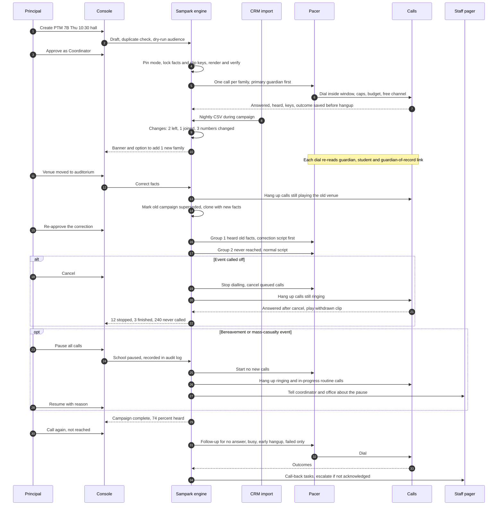
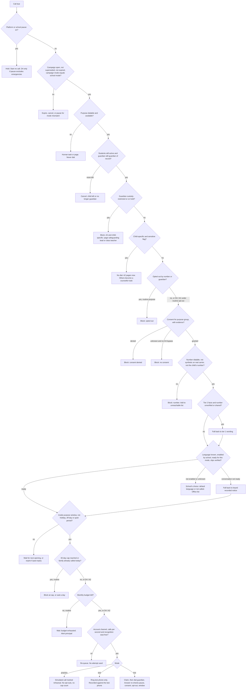

# Edge cases: school operations, data, identity, consent and safety (review, 7 Oct 2026)

Sources read: CONVERSATION_PLAN v2, SAMPARK_PLAN (§2, §3, §4, §6, §17), SLICE1_CONTRACT, PHASE2A_CONTRACT, VOICE_PHASE_CONTRACT, and the code under `src/lib/sampark/` and `src/server/sampark/` on branch `feature/school-parent-calling` in `/Users/sargupta/SahayakAIV2/wt-school-calls/sahayakai-main`. I edited nothing.

**Legend**
- **[NEW]**: the v2 plans don't handle this, or handle it wrongly.
- **[CODE]**: the plan covers it but the code doesn't do it yet.
- **verified**: I traced the code path myself.
- Gate references: **S-gN** is a gate in SAMPARK_PLAN §13, **V-gN** is a gate in CONVERSATION_PLAN §10, and **g:slug** is a new gate I'm proposing.

---

## The 15 most dangerous gaps

1. **Practice mode changes real parents' records (verified).** The simulated carrier presses "9" or "99" on about 8% of the calls it answers. The settle step records those as real opt-outs against the guardian's real phone hash, because only test-phone calls are exempt (`settle.ts:69`). Simulated calls also count toward the real 30-day frequency cap (`repo/firestore.ts:394`). So a principal rehearsing on the DPS import silently opts out about 6% of families and uses up everyone's cap before Live mode exists.
2. **A campaign has no fixed mode (verified).** The carrier is picked on every dispatch tick from the school's current mode (`carrier.ts:91`). If someone flips a rehearsal from Practice to Test or Live, it starts making real calls. If someone flips Live back to Practice to "pause", every remaining family gets a simulated call and is marked done without ever being rung.
3. **No school-level pause.** The only kill switch is the global `SAMPARK_LIVE_DIAL_ENABLED` setting, and changing it needs a reviewed PR and a deploy. After a mass-casualty event, a bereavement or a carrier complaint, routine calls keep going.
4. **A closure sent in Test mode reaches only one staff phone.** The counts still show families as "heard" (`overview.ts:48` mixes all modes together). The principal believes parents were told; none were.
5. **A2 (same-day absence) can be blocked silently.** A child with `safeguarding_open`, missing consent, an invalid number or an unknown language gets `blocked`: no call and no page. The plan's "page first" rule only covers calls that are actually dialled. The children most at risk get no follow-up at all.
6. **A custody-restricted guardian still gets school-wide calls (verified).** Custody is a flag on the student, and the gate ignores student flags for class-wide purposes (`gate.ts:139`). That guardian is still called about the PTM, closures and, later, early-dismissal and pickup notices (D6).
7. **Editing settings mid-campaign makes calls go silent (verified).** Clips are looked up by re-rendering the current text (`voice.ts:170`). Rename a venue or the school's spoken name, and every call answered afterwards fails as `audio_unavailable`: the parent picks up to silence, which feels like a scam call, and the family is never retried.
8. **No way to correct a campaign.** There is no correction, postponement or reopening path. Cancelling leaves calls already dialling to finish (`campaigns.ts:423`); a call answered after the cancel hears silence. Families who heard the wrong date are never told the right one.
9. **Children who have left the school keep getting calls (verified).** The dispatcher never checks whether a student is still active (`dispatcher.ts:243`). Entab's CSV is a full list with no deletion markers, so a child missing from the new export stays active forever. There is no way to mark a child as deceased or put the family on hold.
10. **Families get duplicate calls.** Entab repeats the parent's mobile on every child's row under a different guardian ID, and the `isPrimary` field is imported but never used. Every school-wide notice costs 2 to 4 calls per family, which doubles the cost and the risk of TRAI complaints.
11. **Shared numbers aren't detected.** When a school-bus driver's or tutor's number is on file for several families, one press of 9 silences all of them without anyone knowing. The 30-day cap blocks the fifth real family. v2's "a tier-2 fact goes only to a number that isn't shared" rule has no detector to tell it which numbers are shared.
12. **Invitations keep dialling after the event has started (verified).** A campaign expires at 23:59 on the event day (`campaigns.ts:107`), so at 15:00 parents still hear "PTM today at 10".
13. **A REST import wipes holidays the school entered (verified).** `import.ts:310` replaces the school's list with the CRM's. A Durga Puja closure entered in Sampark disappears, and routine calls go out on the holiday.
14. **"Page" has no delivery channel, acknowledgement or fallback.** v2's A2 paging and its call-back tasks depend on a pager that doesn't exist yet. Call-back escalation is undefined beyond a one-day deadline.
15. **Closures depend on live speech synthesis and render jobs at 06:00, and nothing caps cost.** If the voice service is down, closure calls never start. There is no cost or minute cap (`costPaise` is always null). Teacher attendance calls share the same 3-channel Vobiz account, and a carrier refusal (`provider_rejected`) uses up one of the parent's attempts.

---

## A. Campaign lifecycle

| ID | area | use case(s) | edge case | detection | exact system behaviour | staff see in console | recorded / audited | test or class gate |
|---|---|---|---|---|---|---|---|---|
| CL01 [NEW] | lifecycle | B1 D1 B4 D4 | Date, time or venue moved after approval, before the first call | Staff edits a non-draft campaign. No edit exists today, so staff cancel and recreate it | Facts are locked once a campaign leaves draft (409 FACTS_LOCKED). "Correct facts" atomically cancels with reason wrong_facts, clones with new facts and a `supersedes` link, and needs re-approval. Old clips can never be played again | Old card says "Superseded by…"; old and new facts side by side | campaign.correct {old, new, actor, at} | g:facts-locked: any change to facts after draft returns 409; a superseded campaign's clips are refused at answer |
| CL02 [NEW] | lifecycle | B1 D1 D4 | Facts change mid-dispatch, after some families heard the old date | Correction on a campaign that already has heard > 0 | Calls still playing the old campaign are hung up through Vobiz. The correction uses a `correction` script ("Correction: the PTM is now on…"). Cohort 1 = families with completed or partial calls on the old campaign, called first. Cohort 2 = families never reached, who get the normal script. Dedupe key `correction:<old>:<guardian>` | "Heard old facts: 212, correction goes first. Not yet reached: 180" | Each guardian's old call is linked to the correction call | g:correction-covers-heard: every guardian with a completed call on a superseded campaign gets exactly one correction; no stale script plays after the supersede time |
| CL03 [NEW] | lifecycle | B1 D1 | Event postponed with no new date | Staff chooses "Postpone" | A `postponed` script goes only to families already reached; queued calls are cancelled; no date is spoken | "Postponed notice: 212 families" | campaign.postpone | g:postpone-audience-is-reached-set |
| CL04 [NEW][CODE] | lifecycle | all | Cancelled mid-dispatch. Verified: calls dialling are left to finish, and the answer hook then returns an empty hangup, so the parent hears silence | Cancel while some calls are dialling or ringing | Queued calls are cancelled (as today). Ringing calls are hung up through Vobiz by request ID. A call answered after the cancel plays a `withdrawn` clip ("This message from {school} has been withdrawn; please ignore it"), never silence. A call already playing finishes, unless the reason is wrong_facts, in which case it is hung up and CL02 runs | "Stopped: 12 ringing · 3 finished · 240 never called" | campaign.cancel {reason, in-flight call IDs, hangup results} | g:cancel-never-silent: no call answered after a cancel ends without a clip |
| CL05 [CODE] | lifecycle | all | Approved by the wrong role. Verified: any org admin approves anything, including their own campaign | Approver's role compared with the catalogue `approver` and section scope | 403 ROLE_CANNOT_APPROVE. D4: principal or a named D4 deputy. Whole-school routine campaigns: coordinator or above. Only the principal may approve their own campaign | Approve button disabled with "Needs Coordinator" | campaign.approve {uid, role, preview hash, family count} | g:approval-matrix covering purpose × role × section |
| CL06 [NEW] | lifecycle | all | A shared "office" login approves | Account flagged as shared | Shared accounts can draft but never approve | "Approval needs a personal login" | actor uid | g:shared-account-cannot-approve |
| CL07 [NEW] | lifecycle | B1 D1 D4 | Two staff create a campaign for the same event | On create: same purpose, same date, overlapping sections, not cancelled | 409 DUPLICATE_CAMPAIGN with a link. An override needs a reason. A second D4 for the same date is always refused. A cross-campaign key `purpose:date:guardian` means even an override never calls a family twice | "Already scheduled: PTM 7B, 10 Oct" | override reason | g:no-double-call-same-event |
| CL08 [CODE] | lifecycle | all routine | Two campaigns reach the same family on one day. Same-day bundling (plan §4⑦) isn't built | The family already had a routine call today | One routine call per family per day (IST). The later call waits for the next calling window; if that would pass its expiry, it goes at least 3 hours after the first. D4 and A2 are exempt | "Deferred: family already called today" | defer reason daily_family_cap | g:daily-family-cap |
| CL09 [NEW] | lifecycle | D4 + B1 D1 | A closure falls on the day of a routine campaign, e.g. the PTM day | Approving the D4 finds campaigns dated that day or dispatching today | Routine calls for that day pause automatically. The D4 approval screen makes staff choose postpone (CL03), cancel or keep for each one | Conflict panel on the D4 approval screen | decision per campaign | g:closure-pauses-same-day-routine |
| CL10 handled | lifecycle | all | Campaign for a past date or time | Verified checks DATE_IN_PAST and CAMPAIGN_EXPIRED | Refused | Error text | none | existing route tests |
| CL11 [NEW] | lifecycle | B1 D1 B4 | Calls continue after the event has started. Verified: expiry is 23:59 on the event day | Current time is past the start minus a lead time | Expiry = start − 2 h for B1 and D1, start − 1 h for B4 reminders; D4 unchanged | Card shows "Calls stop at 08:00" | intent expired, reason after_start | g:no-invite-after-start |
| CL12 [NEW] | lifecycle | ad-hoc notice (§8) | Principal rewrites the wording or types free text | Ad-hoc or edited text | Text goes through lint (honorifics; digits; relative-time words; money, OTP and link denylist; ≤ 28 s), then render, transcribe-back and the hard-word probe, then a native reviewer signs off per language before approval. D4, fees and child-specific purposes never take free text | "Waiting for reviewer: Nepali" | reviewer ID and text hash per language | g:no-unreviewed-text-to-tts (extends V-g4 and V-g8) |
| CL13 [NEW] | lifecycle | D4 | Closure reversed: the school reopens | Principal chooses "Withdraw closure" | Remaining closure calls are cancelled first. A `closure_withdrawn` notice (emergency rules: 06:00 start, exempt from the cap) goes to every family whose closure call completed: "School is open today; buses run as usual" | "Reopen notice: 812 who heard · 140 cancelled before calling" | linked to the closure | g:reopen-reaches-every-closure-listener |
| CL14 [NEW] | lifecycle | D4 D6 | Closure for one section only. Verified: the script says "the school will be closed", and a sibling in another class is bundled into the same call | Audience is not the whole school | A section script: "Class 10 B will not meet today; other classes run as usual". It names classes, never the child. Whole-school wording only for a whole-school audience | Preview shows the section wording | audience on the intent | g:partial-closure-wording |
| CL15 handled | lifecycle | D4 | A retry crosses midnight, so "tomorrow" becomes "today" | Variant chosen at dial time | Correct today/tomorrow variant; expires at the end of the closure day | — | variant on the call | S-g14 |
| CL16 [NEW] | lifecycle | D4 | Speech synthesis or the render job is down at 06:00 | Probe or render failure while a D4 is approved | Closure clips are pre-rendered every night for today and tomorrow × reasons × buses × languages (about 64 a day), plus a human-recorded fallback. Approving a D4 creates its calls immediately from that cache | "Closure audio ready (pre-recorded)" | which clip set was used | g:d4-without-tts: from approval to first dial ≤ 2 min with synthesis disabled |
| CL17 [NEW] | lifecycle | D4 | One language fails to render | Render failure in one language | D4: call the ready languages now; families in the failed language go onto the hand-call list straight away while it retries. Routine: the whole campaign fails (as today) | "Nepali audio failed: 160 families on the hand-call list" | failure reason | g:d4-partial-language-dispatch |
| CL18 [NEW] | lifecycle | all | Whole school chosen by accident. Verified: an empty section list means whole school | Section list is empty | Whole school must be chosen explicitly (`scope: 'school'`); an empty list is rejected. Above 500 families, the approver types the family count to confirm | Large family count on the approval screen | scope and count approved | g:no-implicit-whole-school |

## B. Data and CRM

| ID | area | use case(s) | edge case | detection | exact system behaviour | staff see in console | recorded / audited | test or class gate |
|---|---|---|---|---|---|---|---|---|
| DA01 [NEW] | data | all; transfer-ins | Import while a campaign is running, including children joining mid-campaign | An import while campaigns are scheduled or dispatching | Import is allowed. At each dial the guardian, students and guardian-of-record links are re-read (DA02, DA05). D4 adds new families automatically; other campaigns offer "Add N new families" | Banner: "Since approval: 3 left · 2 joined · 5 numbers changed" | import diff per campaign | g:dispatch-rechecks-snapshot |
| DA02 [NEW] | data | all | Child transfers out mid-campaign. Verified: the dispatcher never checks whether a student is active | Student marked "left", or a deletion marker | Children who left are dropped from the family's call at dial time; if none remain, the call is cancelled as student_left | "Cancelled: child left school (3)" | intent cancel reason | g:no-call-for-left-student |
| DA03 [NEW] | data | all (Entab) | A child who left simply disappears from the CSV; no deletion marker | ID was in the last import but not in this one | CSV = a full list. Missing children are marked inactive (`absent_from_snapshot`) after staff confirm. If more than 5% vanish, the import stops for confirmation | "37 students aren't in this export. Mark them as left?" | who confirmed | g:absence-is-deletion-with-confirm |
| DA05 [NEW] | data | all | Guardian changes, e.g. a custody change or a new guardian of record | At dial time, the guardian's children no longer match the call's children | Children no longer in this guardian's care are dropped; if none remain, cancelled as no_longer_guardian; the new guardian is added via DA01 | "Guardian changed: 1 call cancelled" | reason | g:of-record-rechecked-at-dispatch |
| DA06 [NEW] | data | all | Phone number changes after a dial or between attempts. Verified: the retry dials the new number, but the opt-out stays on the old number only | New number on a guardian since the last attempt | Opt-outs apply by number or by guardian. The frequency cap counts both. Each call stores the number actually dialled | "Number changed since attempt 1" | old and new last-4 | g:opt-out-survives-number-change |
| DA07 [NEW] | data | all | The telco has given an old parent number to a stranger | "Wrong number" said on a conversation call; number not OTP-verified in 12 months | Wrong number → that number is stopped for that guardian (scope all, source wrong_number) and the office gets a task. Tier-2 facts only go to numbers verified in the last 12 months | "Wrong number reported: update the CRM" | source wrong_number | g:wrong-number-stops-calls |
| DA08 [NEW] | data | all (Entab) | Same parent listed separately for each sibling: different guardian IDs, same mobile | At import: same number with the same name and relation, on students who share a surname, address or sibling link | Merged into one family contact: one call per campaign, with consent, opt-out and language shared | "212 duplicate parent records merged: review" | merge map | g:siblings-one-call |
| DA09 [NEW] | data | all class-wide | Both parents on record, so two calls per broadcast. Verified: `isPrimary` is never used | Family has more than one guardian of record | School-wide notices: the primary guardian first; the second only if the first isn't reached after all attempts. A "call both" setting for D4 only. Child-specific: the number required by the tier | "Primary contact: 1,040 · fallback contact: 96" | which guardian, and why | g:primary-first |
| DA10 [NEW] | data | all | One phone for several families (driver, tutor, hostel warden) | The same number on guardians of 2 or more unrelated families | Marked shared: tier 0 only, one call per campaign per number, naming classes not children. A 9 stops that number only and gives the office a task listing the families now without a channel. Never counted as a family's verified number | Flag: "Shared number · 4 families" | shared detection run | g:shared-number-tier0 (V-g2 depends on this detector) |
| DA11 [NEW] | data | all | Guardian with no phone, or every number invalid. Verified: the row is rejected and the child becomes unreachable without any notice | No dialable guardian for a child in the audience | The child is kept on record; every campaign shows an exportable list of unreachable children | "Can't reach: 14 children" | — | g:unreachable-listed |
| DA12 partial | data | all | Landline or foreign number (+977, +975, NRI) | Verified: foreign numbers and those not starting 6–9 are rejected; a Bengaluru 080 landline passes as a mobile | Foreign: rejected as "foreign number, can't be dialled" and added to the unreachable list. Likely landline (STD-prefix match): tier 0 only | Reason shown on the rejected row | reason | phone classifier fixtures |
| DA13 handled [CODE] | data | all (Entab) | No language field in the CRM | Language unknown | v2 §5: preferences registry, onboarding drive, one-time language offer on conversation calls. On notice calls today: blocked as language_unknown unless the school sets a default | "Language unknown: N" | — | existing gate tests |
| DA14 [NEW] | data | all | Wrong language recorded | Conversation: v2 rule 9. Notice: 2 hang-ups under 8 s across 2 campaigns | Recorded as a suggestion for the office, never written to the family record | "Language may be wrong (5)" | suggestion source | g:language-suggestion-not-write |
| DA15 [CODE] | data | all | School disables a language, or it isn't ready for this mode. There's no enabled-language check today | Language not enabled or not ready for the mode | Checked at dial time. Disabled → the school's choice for that campaign (default language, or not called), never silent | "Nepali disabled: 160 families not called" | — | V-g15 + g:disabled-language-not-dialled |
| DA16 [NEW] | data | all | Family's language changes after calls were created. Verified: the call plays the old language | Current language differs from the call's language at dial time | Use the new language if its clips are verified; otherwise re-render, or block as language_changed | "Language changed: re-rendering 3" | old and new language | g:language-reresolved-at-dial |
| DA17 [NEW] | data | child-specific | Children's spoken names missing (Entab has English names only) | No spoken first name for the call's language | Child-specific calls are blocked in that language (per the type rule), and a name-review queue opens per section | "Names not reviewed: Nepali 160" | reviewer per name | g:child-name-reviewed |
| DA18 [NEW] | data | child-specific | Names said wrongly (Tshering, Ngawang, Pema; আরভ said as আরব, "Arab") | Speech recognisers can't check proper names | Per-school pronunciation list (v2). The class teacher listens to each name clip before its first use. Never machine-transliterated. An unapproved name blocks the call; never fall back to "your child" | "Listen and approve: 40 names" | approval per clip | g:name-clip-approved |
| DA19 [NEW] | data | all | Sensitive notes typed into free-text fields: "Rahul (court order)", "Late Mr X", "DNC father" | Name fields checked for parentheses, digits and words like court, custody, late, expired, deceased, do not, DNC | Row quarantined with a reason; never reaches speech or the console. Unknown columns are already dropped (verified) | Rejected-rows reason | rule that fired | g:name-field-lint fixtures |
| DA20 [NEW] | data | all | Student or parent has died | "Late" or "deceased" in a field; principal sets a hold | The hold takes effect in Sampark immediately, without waiting for the CRM. Deceased student: no calls about them, and the family's school-wide calls held for 30 days. Deceased parent: guardian made inactive. No import can clear a hold | Hold with expiry date | who set or cleared the hold | g:hold-beats-import |
| DA21 [NEW] | data | all | Malformed CSV beyond single bad rows. Verified: an import with 95% of rows rejected still "succeeds", and the text encoding isn't checked | Rejection rate, vanish rate, garbled text, .xlsx files | The whole import fails and writes nothing if more than 10% of rows are rejected, more than 5% of students vanish, or garbled text is found. An .xlsx file is converted or refused with a message | "Import refused: 31% of rows unreadable" | thresholds that fired | g:import-threshold |
| DA22 [NEW] | data | all | An older export is uploaded after a newer one | Incoming record is older than the stored one | Older records are skipped. If the whole file is older than the last import: 409 STALE_EXPORT | "This export is older than the last import" | — | g:no-stale-overwrite |
| DA23 [NEW][CODE] | data | all (Entab) | Dates in DD/MM vs MM/DD; time zones. Verified: the importer needs ISO dates with an offset, so Entab rows are rejected | Saved column mapping per school | The mapping fixes the date format. Ambiguous dates are never guessed. A time is assumed to be IST only if the mapping says so | Format shown in the mapping | mapping version | g:mapping-date-format (fixture 03/04/2026 both ways) |
| DA24 [NEW] | data | all | REST import overwrites holidays the school entered (verified `import.ts:310`) | Import from a REST CRM | CRM and school holidays are merged; school-entered holidays are never removed by an import | Holiday shows its source | — | g:import-keeps-school-holidays |
| DA25 [NEW] | data | all | Two imports at once, or an import dies halfway | — | One import at a time per school; the new data is written as a new version and only switched on once complete | "Import already running" | — | g:import-atomic |
| DA26 [NEW] | data | all | CRM gives guardians new IDs (new academic year), and consent and language are lost because they're stored per guardian ID | No preferences for a guardian ID, but the same number and admission number match | Preferences carried over by matching number + admission number; opt-outs already survive (stored by number) | "Carried over consent for 980 re-keyed guardians" | match map | g:prefs-survive-rekey |
| DA27 handled | data | C1 C2, child-specific | Fee category or sensitive flag changes between creating and dialling a call | Verified: the dispatcher re-reads students | Re-checked at dial | — | — | S-g10, S-g12 |

## C. Identity and access

| ID | area | use case(s) | edge case | detection | exact system behaviour | staff see in console | recorded / audited | test or class gate |
|---|---|---|---|---|---|---|---|---|
| ID01 [CODE][NEW model] | identity | all; D5 D6 D9 | Custody restriction. Verified: it's a student flag, and school-wide purposes ignore it | Guardian-level restriction from the CRM or the office | A restriction on the guardian (by guardian and number) blocks every purpose except D4, which carries no time or place for the child. A2 and child-specific calls become a task for the class teacher or safeguarding lead | Restricted list, visible to principal and safeguarding lead only | restriction source | g:restricted-guardian-never-gets-pickup |
| ID02 [NEW] | identity | all | Divorced parents, both on record, no restriction | Family has 2 guardians of record | School-wide: DA09 rule (the school may set "call both" per family). Child-specific: the primary parent's verified number; call-back tasks note which parent asked | Which parent was called | — | g:primary-first |
| ID03 handled | identity | child-specific | Someone not on record answers (grandparent, maid) | v2 listener check | Tiers apply; on the no-guardian branch no child facts are said | — | turn log | V-g1, V-g2 |
| ID04 [NEW] | identity | A2 + child-specific | A child answers, or the child's own phone is recorded as the parent's | A child answered on 2 or more calls; CRM student mobile equals guardian phone | Number flagged child_number: tier 0 only; office verification task. A2 never calls it (it would ring the missing child) | "Probably the child's number (3)" | flag source | g:child-number-tier0 |
| ID05 [CODE] | identity | all | A child presses 9 to stop the school calling | Opt-out with office verification pending | Opt-out stands; the office gets a task due within 2 school days; reversing it needs the parent's own confirmation, logged. Verified: no reversal endpoint or task exists | "Verify opt-out by 9 Oct" | reversal evidence | g:opt-out-reversal-needs-parent |
| ID06 [NEW] | identity | Test mode | A staff member's phone is the test phone; they leave, or their own child is at the school | Test phone has an owner and an expiry; check whether it matches any guardian's number | Test phone expires after 30 days and the school drops back to Practice. A test phone that matches a guardian's number shows a warning | "Test phone ending 1234 (A. Rai), expires 6 Nov" | owner | g:test-phone-expiry |
| ID07 [NEW] | identity | D4 | Test mode still on during a real emergency | Approving a D4 when the school isn't Live | Modal "This will NOT reach parents" and typed CONFIRM. Counts read "test phone", never "families heard" | Red banner on the D4 card | mode at approval | g:d4-non-live-warning |
| ID08 [NEW] | identity | all | Practicing on real school data (verified: simulated 9 and 99 opt real parents out; simulated calls count toward the real cap and in the overview) | Simulated carrier + non-synthetic number | Simulated calls are marked `rehearsal: true`. They never write opt-outs, never count toward the cap, reports or proof of contact | "Practice: nothing here affects real families" | rehearsal flag | g:rehearsal-never-touches-real-state |
| ID09 [NEW] | identity | all | Mode flipped mid-campaign (verified: the carrier is chosen from the school's mode on every tick) | Campaign's mode differs from the school's | Mode is fixed at approval. On a mismatch the campaign pauses (paused_mode_mismatch) with its calls untouched; resuming needs re-approval in the new mode | "Paused: school is now in Test" | mode at approval and now | g:campaign-mode-pinned |
| ID10 handled | identity | all | Demo school | `isDemo` flag | A real carrier is refused except for the test phone | — | — | S-g4 |
| ID11 [CODE] | identity | A1–A6 | Staff acting outside their remit: the 7B teacher approves for 7A; accounts sees conduct evidence | Role and section grants | Grants scoped by section; evidence shown only to the role that owns the purpose | Evidence hidden from other roles | every evidence view | g:evidence-visibility |
| ID12 [NEW] | identity | A1 A3 A4 call-backs | A teacher who has left is still named ("Rai ma'am would like to speak") | Staff list synced from the CRM or Sampark roles | Teacher's name filled in at dial time from the active list. Departed → the section's current class teacher → else "the class teacher". Their open call-backs are reassigned | "Reassigned 7 call-backs from A. Rai" | reassignment | g:no-departed-staff-named |
| ID13 [NEW] | identity | approvals, call-backs | Staff on leave | Leave flag or delegate set | A delegate per role; tasks move to the delegate after the deadline | "Covered by S. Das" | delegation | g:delegate-routing |
| ID14 [NEW] | identity | call-backs | A parent who is also on staff (staff ward) | Staff ID linked to a guardian | Never the call-back owner for their own child; routed to the coordinator | — | — | g:no-self-owned-callback |
| ID15 [NEW] | identity | all | Same family at two schools in one group (DPS Siliguri and DPS Fulbari) | Phone hashes match across schools (the hashing key is shared platform-wide) | An optional group-level daily cap; preferences never shared across schools, since each school is a separate data fiduciary | — | — | g:cross-org-prefs-isolated |

## D. Consent and regulation

| ID | area | use case(s) | edge case | detection | exact system behaviour | staff see in console | recorded / audited | test or class gate |
|---|---|---|---|---|---|---|---|---|
| CO01 handled | consent | all | No consent on file (Entab has none) | Gate (verified) | Blocked as no_consent. D4 may reach families whose consent is merely unrecorded only if the school has turned that on (`emergencyBypassConsent`) after counsel signs off | "No consent: N" | — | S-g11 |
| CO02 [CODE] | consent | all | Consent withdrawn mid-campaign. Verified: dial time re-checks consent, but the answer hook only re-checks opt-outs | Office records "denied" while a call is ringing | The answer hook also re-checks consent, the CRM's do-not-contact flag, whether the guardian is active, and holds | "Withdrawn: 1 call hung up at answer" | refusal reason | g:answer-rechecks-consent |
| CO03 [NEW] | consent | all | Office marks consent "granted" with no evidence (verified: no notice version recorded) | Consent changed in the console | "Granted" needs a notice version, the method and an evidence reference; no bulk granting | Evidence field required | evidence reference | g:consent-needs-evidence |
| CO04 handled | consent | all | Opt-out by keypad, including a 9 pressed after hangup | Verified | Applied immediately | Opt-out list | suppression.add | S-g11, phase 2a gate (b) |
| CO05 handled | consent | all | Opt-out by voice | v2 "stop these calls" intent | Scope confirmed once and written before hangup. A notice call can't hear "band karo"; its menu says press 9 | — | turn log | V-g10 |
| CO06 [CODE] | consent | all | Opt-out through the office, WhatsApp or a letter. Verified: the opt-out list is read-only | Office entry | Office form: source office, scope chosen, effective immediately | Add-opt-out form | who entered it | g:office-opt-out |
| CO07 [NEW] | consent | all | Asking again after an opt-out (v2's "no re-asking for 90 days" implies asking after 90 days) | — | An opt-out never expires on its own. Consent comes back only when the parent starts it (office, app or form); consent-drive calls skip opted-out numbers | — | — | V-g10 tightened |
| CO08 [NEW] | consent | all | Carrier refuses the call: DND, scrubbing, or TRAI's 5-flagged-numbers rule. Verified: a refusal is retried and uses up an attempt | Carrier refusal codes | Mapped to blocked as carrier_refused (no retry) and the office is told. Number class and registration per V-g12 | "Carrier refused: 6" | refusal code | g:carrier-refusal-no-retry |
| CO09 [CODE] | consent | C1 C2, A1 A3 A4 | Calling hours differ by purpose. Verified: one routine window (10–20) for every purpose | Window per purpose | Window set per purpose in the catalogue: fees 10–19; concerns never Friday or Saturday; D4 06–21 | Window shown on the campaign | — | g:window-per-purpose |
| CO10 [NEW] | consent | all routine | Sundays, 2nd and 4th Saturdays, festival closures (Durga Puja, Dashain, Tihar, Losar), exam weeks | Calendar | Calendar supports date ranges, "nth weekday" rules and quiet periods (board exams: D4 and A2 only). After a long holiday, queued calls are released over 2 days, not all at 10:00 on day one | Calendar view | calendar version | g:calendar-ranges |
| CO11 [NEW] | consent | all | Placed at 20:59, answered at 21:00. Verified: the answer is refused, so the parent hears silence | Answer arrives after the window closes | Allowed if the call was placed inside the window and answered within 90 s | — | — | g:answer-grace |
| CO12 [CODE] | consent | D1 D8 | RTE and fee-waived families on paid activities. Verified: events have no "paid" field | Event facts | Events must say whether they are paid. Paid excludes RTE and fee-waived families; a family with one such child is blocked entirely | "RTE excluded: 22" | — | S-g12 extended |
| CO13 [NEW] | consent | A7, conversation | Recording consent given by a child or a non-guardian | Consent asked before the listener check passes | Recording consent counts only after a relation-word listener check; otherwise nothing is recorded and no free text is stored | — | consent turn | V-g7 extended |
| CO14 [NEW] | consent | all | Request to delete data vs keeping the opt-out | Data request | Personal data and transcripts deleted; the opt-out (number hash only) and the hashed call ledger kept, so the opt-out is still honoured | Data request closed | deletion recorded | g:erasure-keeps-suppression |
| CO15 [NEW] | consent | all conversation | "Who gave you my number?" | Closed-list intent | Fixed line: "{School} has this number from your child's admission record and uses it only for school messages. To stop these calls, say stop." | Tag on the call | intent | in the intent eval set |
| CO16 [NEW] | consent | all conversation | DPDP request made on the call: "delete my data", "my number is wrong" | Intent data_request | Never acted on during the call. A task goes to the school (the data fiduciary) with a timer; parent hears "the school office will contact you". Language and number changes are suggestions only | Data-request queue | task | g:no-on-call-data-action |
| CO17 handled [CODE] | consent | all | Sender registration (DLT), number class, robocall declaration; carrier complaints | V-g12 | No calls without them; complaints pause the school automatically (needs SF10's pause) | — | — | V-g12 |

## E. Safety

| ID | area | use case(s) | edge case | detection | exact system behaviour | staff see in console | recorded / audited | test or class gate |
|---|---|---|---|---|---|---|---|---|
| SF01 handled [CODE] | safety | A2 | Missing child: page first; a dead engine still pages | v2 §3.4 | Page sent when the call is placed; only a confirmed read-back stands it down | Page status | page log | V-g5 |
| SF02 [NEW] | safety | A2, all child-specific | A2 blocked silently by a sensitive flag, missing consent, an opt-out, an invalid number, an unknown language or the cap | Any A2 that won't be dialled | Immediate page to the class teacher and principal ("couldn't call: {reason}. Please call by hand"). A2 is exempt from routine opt-outs and the cap. Custody-restricted → page the safeguarding lead. Every blocked child-specific call becomes a human task (a counsellor task for domestic_issue) | "A2 not dialled: call by hand" | page with reason | g:a2-never-silent |
| SF03 [NEW] | safety | A2 | Flood of false A2s: closure day, bandh, register not marked | More than 30% of a section absent, or the section is closed or on holiday | No A2 for sections that are closed or on holiday; above 30% absent, no A2, and the coordinator is paged: "register looks unmarked" | "A2 held: 7B register looks unmarked" | — | g:a2-sanity |
| SF04 handled | safety | all conversation | Parent discloses a safeguarding concern | v2 | Fixed line; only the safeguarding lead is paged; transcript sealed | — | sealed log | V-g6 |
| SF05 [NEW] | safety | all conversation | Parent threatens a teacher | Intent threat_to_staff (word list or model) | Calm fixed line, then end the call. Page the principal, never the named teacher. Transcript sealed (principal and safeguarding lead only). Automated calls about that teacher's purposes to that family paused | Principal-only alert | sealed log | g:threat-routing |
| SF06 [NEW] | safety | all conversation | Emergency during the call: "she hasn't come home", an accident | Intent urgent_child_safety | "I am alerting the school now. If anyone is in danger, call 112." Page principal, transport desk and class teacher at once (the E5 path); stay on the line until the parent ends it | Live page | page acknowledgements | g:urgent-intent-pages |
| SF07 [NEW] | safety | all conversation | Parent in distress or talking about self-harm | Intent adult_distress | Fixed line with Tele-MANAS 14416 and 112; page the safeguarding lead; no automated calls to the family for 14 days | Safeguarding-lead alert | sealed log | g:distress-routing |
| SF08 [CODE] | safety | all | A call reaching an abuser in the household | Tiers, custody, E3 is human-only | v2 handles child-specific calls; school-wide notices that give a time or place (D6, D5) follow ID01 | — | — | V-g2 + ID01 gate |
| SF09 [NEW] | safety | D4 | Landslide closure while phone networks are down | 40% or more of the first wave unanswered or failed | Marked network_degraded: D4 keeps retrying every 20 min until 12:00, beyond its usual 3 attempts. The unreached list is exported for runners and WhatsApp groups. Reach shown by area | "Network degraded: 612 unreached" | flag and retry plan | g:d4-outage-retry |
| SF10 [NEW] | safety | all | Mass-casualty event, bereavement, carrier complaint: everything must stop. Verified: only the global setting exists, and it needs a deploy | One-tap pause (principal, coordinator, any admin) | The dispatcher stops starting calls. Ringing and in-progress routine calls are hung up through Vobiz. D4 continues unless "pause emergencies too" is chosen. Resuming needs the principal and a reason. The same switch handles complaint auto-pauses, and there is a platform-wide pause for operations | Red "Paused by {name} at {time}" | pause and resume with reasons | g:pause-stops-within-60s |
| SF11 [NEW] | safety | all | A family is bereaved | Hold | See DA20 | Hold badge | hold | g:hold-beats-import |
| SF12 handled | safety | all | Scam callers impersonating the school; families with hearing loss | Plan anti-scam rules; v2 rule 10 | As planned | — | — | V-g8 |

## F. Staff operations

| ID | area | use case(s) | edge case | detection | exact system behaviour | staff see in console | recorded / audited | test or class gate |
|---|---|---|---|---|---|---|---|---|
| OP01 [NEW] | ops | A1 A3 A4 B1, fees | Call-back task nobody picks up | Deadline passes | Owner → coordinator at the deadline → principal one school day later. A parent never waits more than 2 school days. The weekly digest lists overdue tasks | "Overdue: 6" | escalation steps | g:callback-escalates |
| OP02 [CODE] | ops | A2 | Escalation timers not set | Page not acknowledged | Class teacher 10 min → principal 20 min → office 30 min | Page timeline | acknowledgements | V-g5 timing |
| OP03 [NEW] | ops | A2, safeguarding, SF05–07 | Paging fails, or no channel exists | Delivery or acknowledgement missing | A page = a console notification plus a Vobiz voice call to the staff mobile with a recorded alert, acknowledged by pressing 1. No acknowledgement → next person in the chain | "Not acknowledged: escalated" | delivery and acknowledgement | g:page-delivered-or-escalated |
| OP04 [NEW] | ops | D4 B1 D1 | Office swamped by call-backs after a broadcast | Open call-backs exceed the office's capacity setting | Remaining routine calls slow down. School-wide questions are answered from the answer bank before a task is made; tasks grouped by question | "Call-backs: 82 open, pacing slowed" | — | g:callback-backpressure |
| OP05 [NEW] | ops | all | Parent asks for a call back after hours ("call me at 9 pm") | Requested time outside office hours | Call-back window = office hours within 10–20. Outside it, the parent hears "the office will call tomorrow between 10 and 1". Staff call back through Knowlarity's click-to-call from the school's own number, and it's logged | Due time | — | g:callback-window |
| OP06 handled [CODE] | ops | all | Reporting to the principal | Weekly digest, monthly report | As planned | — | — | — |
| OP07 [NEW] | ops | all | Audit or forensics: "you never called me", a police (POCSO) request, an RTI request | Proof-of-contact view | Per family: attempt times, carrier ID, how much was heard, keys. Signed export with every access logged. Turn logs released only with principal and safeguarding-lead approval | "Proof of contact" | every export | g:proof-of-contact |
| OP08 [NEW] | ops | all | School wants to re-call only families not reached | "Call again: not reached" on a completed campaign | A follow-up campaign with the same facts, for families that didn't answer, were busy, hung up early, failed or need review; families who heard, opted out or were blocked are excluded. Dedupe key `recall:<parent>:<guardian>`; only before expiry | Counts by group | link to the original campaign | g:recall-excludes-reached |
| OP09 [NEW][CODE] | ops | all | Calls lost while dialling (status "needs review") have no screen. Verified | Status needs_review | Review queue: mark reached, call by hand, or re-queue only after the carrier's record shows it never rang | "Needs review: 2" | resolution | g:needs-review-queue |
| OP10 [CODE] | ops | all | Cost cap per school per month. Verified: there is none, and `costPaise` is always null | Minute ledger from carrier records | Warn the principal at 80%. At 100%, routine calls wait (budget_exhausted); D4 and A2 continue but raise an alert | Budget bar | ledger | g:budget-defer |
| OP11 [CODE] | ops | all | Carrier capacity shared with teacher calls on one 3-channel account. Verified: only Sampark's own calls are counted, and a refusal uses an attempt | Count of every call on the Vobiz account | One pacer for the whole account (v2). A 429 or full channels re-queues the call without using an attempt. D4 goes ahead of routine calls | "Waiting for a free line" | requeue count | g:requeue-no-attempt |
| OP12 [NEW] | ops | D4 | Principal not reachable at 05:45 to approve a closure | — | Named D4 deputies; approval works from a phone; pre-recorded audio (CL16) | "Deputy approver: VP" | approver | g:d4-deputy |
| OP13 [NEW] | ops | Test mode | A test campaign rings one staff phone once per family, about 7 hours for 400 families | Test mode with a full audience | Test mode calls a sample (one per language × variant) unless "rehearse all" is confirmed | "Sample: 8 calls" | sample choice | g:test-sample |

---

## Diagram 1: campaign lifecycle

This covers facts changing after approval, cancelling mid-dispatch, the pause switch, and re-calling families not reached.

## Diagram 2: pre-dial checks

---

## Where the verified code gaps are

All under `/Users/sargupta/SahayakAIV2/wt-school-calls/sahayakai-main/src/`:

| Gap | Location |
|---|---|
| Simulated opt-outs become real ones (top gap 1) | `lib/sampark/dispatch/settle.ts:69` (only test-phone calls exempt) and `lib/sampark/dispatch/simulated-carrier.ts` (9 and 99 draws) |
| Simulated calls count toward the cap | `lib/sampark/repo/firestore.ts:394` |
| Mode not fixed per campaign | `server/sampark/carrier.ts:91`, `lib/sampark/dispatch/dispatcher.ts` (`dialPlanFor`) |
| Silent call after a settings edit | `server/sampark/voice.ts:170` (`verifiedClipKeys`) |
| Answer re-checks opt-outs only, not consent | `server/sampark/voice.ts:291` |
| Cancel leaves dialling calls running | `server/sampark/campaigns.ts:423` |
| Invitation expiry at end of event day | `server/sampark/campaigns.ts:107` |
| Approval by any org admin | `server/sampark/auth.ts`, `server/sampark/campaigns.ts` (`approveCampaign`) |
| Holidays overwritten by REST import | `lib/sampark/crm/import.ts:310` |
| Inactive students still called | `lib/sampark/dispatch/dispatcher.ts:243` |
| Empty section list means whole school | `lib/sampark/audience.ts:55` |
| `isPrimary` never used | `lib/sampark/audience.ts` (`bundleAudience`) |
| Sensitive flags ignored for school-wide audiences | `lib/sampark/policy/gate.ts:139` |
| Overview mixes practice, test and live calls | `server/sampark/overview.ts:48` |
| Opt-out list is read-only (no office entry or reversal) | `server/sampark/suppressions.ts` |

Gaps 1, 2, 6, 7 and 13 already apply to today's Practice and Test code, before Live mode or conversations exist.
