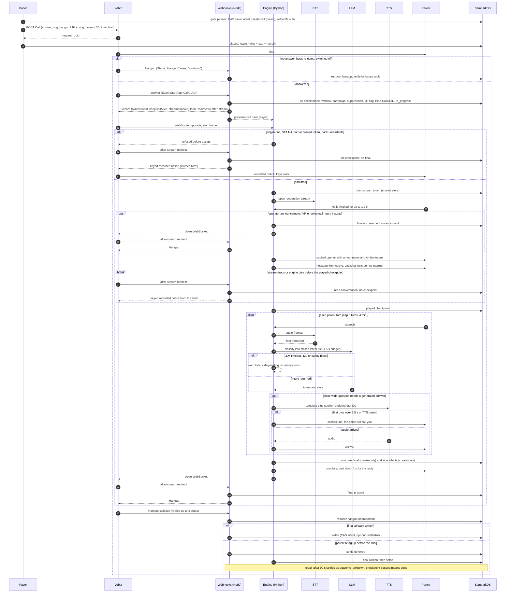
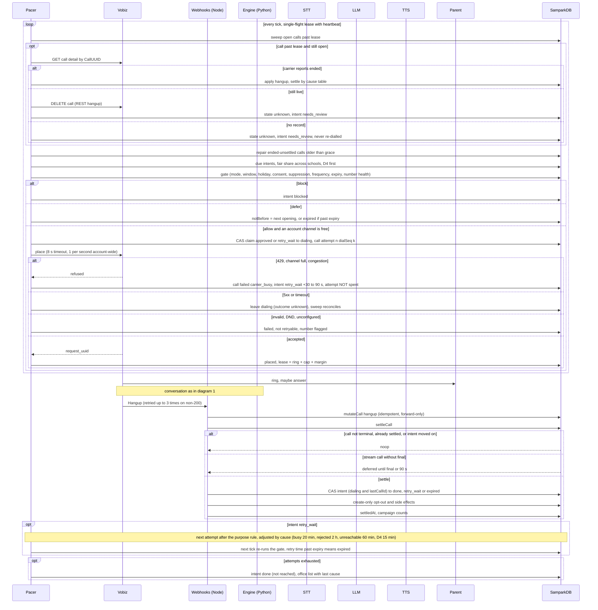

# Edge cases: telephony, carrier, media and system (review, 7 Oct 2026)

The code checks below are against the `wt-school-calls` worktree and the `sahayakai-agents` telephony bridge.

## The 10 most dangerous gaps (ranked)

1. **A spoken "stop calling me" is never saved.** In the bridge (`sahayakai-agents/src/sahayakai_agents/telephony/router.py`), `bridge.opted_out` is set (around lines 937 and 1009) and only ever logged. The parent is told it has been noted, but no suppression is written. This breaks class gate 10 and is a compliance exposure. → E21
2. **A Vobiz 5xx or a hung request can ring a family twice.** In `src/lib/vobiz/client.ts`, every non-200 except 401/403 becomes `provider_rejected`, and `vobiz-carrier.ts` marks that retryable. A 502/504 may mean the call was in fact placed. `fetch` also has no timeout, so a stuck request can outlive the 55 s dispatch lock. → S09, S10
3. **The fixed fallback after `<Stream>` misbehaves, and there is no time limit.**
   - When a conversation ends normally, failing to hang up through the API either plays the notice again after the goodbye or leaves an open, billing line.
   - The bridge's `_hangup` does nothing when `cuid` is missing, and only logs a failed hangup.
   - Nothing caps the call: no `streamTimeout`, no `time_limit`, and the sweep marks a stuck call but never hangs it up.
   - → M09–M11, K01. Fix: a dynamic after-stream redirect (ASR, defined below).
4. **Dead, recycled and DND numbers are dialled again.**
   - `vobiz-events.ts` maps UNALLOCATED, INVALID and CALL_REJECTED to `failed`, and the status webhook then settles them as retryable.
   - Vobiz's error body is thrown away, so a DND refusal is never recognised.
   - After "wrong number" nothing blocks the number itself, and nothing tracks numbers that keep failing.
   - → D01–D03, D10, K02
5. **A safeguarding disclosure depends on the LLM.** These are exactly the sentences Vertex safety filters block, and a block falls into "unrecognised". → E07
6. **Settling can run before the conversation's outcome is written.**
   - `settleCall` acts on the hangup alone.
   - The engine has no write location of its own, so Python and Node can overwrite each other's version of the same call record.
   - A parent who hangs up before the outcome is written gets re-called, although they heard the message.
   - → S04, S06
7. **Carrier refusals use up attempts, and the obvious fix would freeze intents.**
   - The dispatcher places up to 25 calls per school per tick with no 1-call-per-second spacing.
   - It counts calls in flight per school (cap 20), not against the account's 3 channels.
   - A 429 uses up one of the family's attempts.
   - A simple "don't count it" fix collides with `callIdFor(intent, attempt)`: the claim then refuses that intent on every tick until it expires.
   - → C01–C03, S23
8. **Editing a scheduled campaign silently kills it.** `verifiedClipKeys` re-renders the script when the parent answers. Any change to the campaign or school settings changes the clip key, so the call fails `audio_unavailable` and is settled as not retryable. The parent picks up to an instant hang-up and is never called back. → S22
9. **Engine capacity and timeouts don't match the calling pattern.**
   - One warm instance against a 06:00 closure burst means seconds of silence while new instances start.
   - Cloud Run's default request timeout (300 s) and the plan's 300 s stream timeout cut off 8-minute A7 calls.
   - The 300 s answer token expires if Vobiz queues the call.
   - → E16, C07, A11
10. **Webhook authentication and retries are weak.**
    - Vobiz signature headers are not checked.
    - Tokens sit in URLs that Cloud Run writes to its request logs; the status token is reusable for 30 minutes.
    - The carrier's CallUUID is never pinned to the call.
    - Because the single-use keypad token is burned first, Vobiz's own legitimate retry hangs up the call.
    - There is no overlap period when the signing key is rotated.
    - → X02, S24, X08

**Tags and terms used in the table**
- **[NEW]**: not in plan v2 or the 2a contract.
- **[CODE]**: the plan states the rule, but today's code or bridge breaks it.
- **KN**, keyed notice: the phase-2a document `<Gather 1/2/9><Play message/></Gather><Play no_input/><Hangup/>`.
- **ASR**, after-stream redirect (proposed): the answer XML becomes `<Stream bidirectional keepCallAlive streamTimeout=cap+60>…</Stream><Redirect>/after-stream?t=…</Redirect>`. Node then reads `sampark_conversations/{callId}` and returns one of three things:
  - KN, if the played checkpoint was not reached;
  - a closing clip plus `<Hangup/>`, if it was reached but no final record exists;
  - `<Hangup/>`, if the final record exists.

  If Vobiz has no `<Redirect>`, fall back to a static `<Play>` whose audio route picks the notice or 200 ms of silence from the database state.
- **final**: the create-only outcome document the engine writes (or the ASR writes when the engine is lost).
- **checkpoint**: the message has fully played.
- **CT**: the Q.850 hangup cause table.

## Edge-case table

| ID | stage | edge case | how it is detected (signal) | what the system does (incl. what the parent hears) | what is recorded | retry/escalation rule | test or class gate |
|---|---|---|---|---|---|---|---|
| D01 | dial | Unallocated / invalid / changed number | HangupCause UNALLOCATED_NUMBER, INVALID_NUMBER_FORMAT, NUMBER_CHANGED; place `invalid_destination` | Nothing heard. Settled as **not retryable**; number flagged `number_invalid`; every purpose to that hash blocked until the office edits it | call `failed: number_invalid`; intent `done` (not reached); audit `guardian.number_flagged` | None; office task "correct number" | CT test: every cause → (state, retryable, flag) [NEW] |
| D02 | dial/listen | Recycled number, now a stranger's | `wrong_number` intent (LLM or word list); "someone else" at the listener check | Tier 0 only: school name, AI disclosure, "Sorry for the trouble. Namaste." Never the child's name | `wrong_number`; number flag pending office | No call to that hash for any purpose (D4 included) until the office confirms | Gate: after `wrong_number`, the gate blocks all purposes on that hash [NEW] |
| D03 | dial | DND/NCPR, or number class not eligible for service calls | Vobiz refusal code in the error body (client discards it today) | Never rings | `failed: dnd_blocked`; compliance alert | Not retryable; school auto-paused if over 1% (gate 12) | Test: DND body → blocked, not retried [NEW] |
| D04 | dial | Landline that looks like a mobile | IVR/reception detection (A01); "this is the office" | Treated as a shared number: tier 2 drops to tier 1 | `numberClass: landline_suspected` | Normal; office asked for a mobile | Contract §7.4; gate 2 |
| D05 | dial | Switched off / out of coverage | Announcement before answer only; SUBSCRIBER_ABSENT, NO_ROUTE_DESTINATION, RECOVERY_ON_TIMER_EXPIRE | Nothing heard | `no_answer: unreachable` | Purpose rule, at least 60 min apart (D4: 15 min); counts toward K02 | CT [NEW mapping] |
| D06 | dial | Network busy / congestion | NORMAL_CIRCUIT_CONGESTION, SWITCH_CONGESTION, NETWORK_OUT_OF_ORDER | Nothing | `failed: network_congestion` | Attempt **not counted**; requeue in 5–10 min with jitter; after 3 such, it counts | CT + S23 [NEW] |
| D07 | answer | An operator announcement that "answers" (switched off / invalid) in en/hi/bn/ne | Over 2.5 s of continuous speech before our first frame; announcement word list ("switched off", "बंद है", "পরিষেবা", "उपलब्ध छैन") | **Nothing sent**; engine closes the socket; ASR returns `<Hangup/>` | final `not_reached: operator_announcement`; billed pulse kept | As D05; "does not exist" announcements → D01 | Gate 8 extended: 20 recorded announcements → zero bytes sent [NEW detection] |
| D08 | dial | Caller tune / ringback music | Played before answer; never reaches us | No effect; 30 s ring timeout applies | — | — | n/a (if answered with music → M08) |
| D09 | dial | Call waiting | Long ring then NO_ANSWER, or USER_BUSY | Nothing | busy / no_answer | Busy: retry after at least 20 min | CT |
| D10 | dial | Parent rejects the call | CALL_REJECTED, or USER_BUSY after less than 8 s of ringing | Nothing | `rejected` (new cause) | One retry after at least 2 h; a second rejection → `done` | CT; today it is `failed` and retryable [NEW] |
| D11 | inbound | Parent rejects, then calls our number back | Inbound call to `VOBIZ_FROM_NUMBER` (needs an inbound application) | Look up the newest call to that number's hash in 48 h and play its **tier-0** keyed notice (1/2/9 work). None found, or ambiguous across schools → "This number calls parents for schools; please contact your child's school office." | inbound record linked to the intent: `reached_via_callback` | Intent `done` if heard; pending retries cancelled | Gate: inbound never says a child's name or tier-2 fact (caller ID can be spoofed) [NEW] |
| D12 | answer | Forwarded to another person | Listener check fails | No child facts; ask for a parent or a good time | listener outcome | Call-back window, else purpose rule | Plan gates 1–2 |
| D13 | answer | Forwarded to voicemail | Greeting monologue + 1 kHz beep; voicemail words | No audio (gate 8); ASR `<Hangup/>` | `not_reached: voicemail` | Purpose rule; 3 in a row → office flag | Gate 8 corpus [NEW detection] |
| D14 | dial | International roaming (Nepal, Bhutan, Gulf) | Higher round-trip time and jitter; parent says they are abroad | Normal, short call; "call later" → call-back window | `roaming_reported` | No extra retries | Accept; no number lookup [NEW, low] |
| D15 | dial | Dual SIM, other SIM busy | USER_BUSY / unreachable | Nothing | busy / unreachable | As D05 / D09 | CT |
| D16 | dial | Recently ported number misroutes | Transient NO_ROUTE | Nothing | unreachable | As D05 | CT |
| D17 | dial | Ring timeout too short (caller tunes, slow paging) | Answers bunched at 25–30 s | 30 s now → 40 s if more than 5% of answers land in that band | ring seconds | — | Metric; plan's sums use 45 s, code uses 30 s [NEW] |
| A01 | answer | Answered by an IVR/PBX | Menu monologue before our opener | No audio; close | `not_reached: ivr` | One retry, then flag `number_is_ivr` | Gate 8 corpus [NEW] |
| A02 | answer | Answered then dropped in under 5 s, parent silent | Duration < 5 s, no inbound speech | At most part of the opener | `early_hangup_silent` | One retry after at least 60 min; then `done` | Gate 14 narrowed: "answered" = parent spoke or checkpoint passed [NEW] |
| A03 | answer | Parent spoke, then hung up before the message | Speech present, no checkpoint | — | `declined_early` | No retry for this intent; A2 page stays live | Gate 14 [NEW] |
| A04 | answer | On speaker in a noisy place | Noise floor during the 1.2 s wait above −35 dBFS; low recognition confidence | Barge-in needs noise floor + 12 dB and at least 300 ms of speech; endpointer +200 ms; yes/no read-backs; 2 unrecognised → close → ASR KN | `noisy_line` | Settled by the KN outcome | Persona set §6.4; adaptive thresholds [NEW] |
| A05 | answer | Parent answers before our stream connects | WS `start` more than 1.2 s after StartApp | Silence meanwhile; early inbound discarded; skip the "wait for Hello" and play the opener at once; over 4 s → treat as admission failure → ASR KN | `answerToFirstAudioMs` | — | SLO p95 ≤ 1.5 s [NEW] |
| A06 | answer | StartApp reaches us late | Carrier time vs our receipt | As A05 | lag | — | Monitor; vendor |
| A07 | answer | StartApp arrives twice | Same CallUUID; stored answer document exists | Return the byte-identical stored XML (same stream token); the shared token burn allows one session only | `call.answer_duplicate` | — | Test: 2 answers → 1 session [NEW] |
| A08 | answer | Answer webhook over 3 s | Internal deadline 2.2 s | If checks are incomplete → `<Hangup/>` (about 2 s of silence) | `failed: answer_deadline` | One retry after at least 15 min, attempt not counted | Webhook service warm (minScale ≥ 1) 06–21 h; `fallback_answer_url` to the other region [NEW] |
| A09 | answer | Answer after the hangup already arrived | Call already terminal | `<Hangup/>` | — | — | Exists |
| A10 | answer | Answered after cancel / mode switch / window closed / expiry | Answer re-checks | Today a silent hang-up, which reads like a scam. Change: a verified 3 s apology clip ("…sorry, this call is no longer needed"); `suppressed`, bad token or kill switch stay silent | `call.answer_refused` + reason | Cancelled / expired: none; window closed: next window, not counted | Gate: a refusal never plays the message [NEW] |
| A11 | answer | Answer token expired (Vobiz queued the call over 270 s) | `bad_token`; no call ids recoverable | Silent hang-up | Log with CallUUID only; sweep handles it | S12 | Timing gate: answer TTL ≥ queue + ring + 120 s (600 s); pacer never over-dials [NEW] |
| A12 | answer | Non-StartApp event posted to the answer URL | `Event` is something else | Empty `<Response/>`, no state change | audit | — | Vendor confirm [NEW] |
| M01 | media | Parent cannot hear us | "Hello?" 3 times in 8 s, or "awaaz nahi aa rahi" | Hang up (the notice would fail on the same path) | `one_way_outbound` | Retry once after 10 min, not counted | Fake carrier drops our outbound frames [NEW] |
| M02 | media | We cannot hear the parent (or the parent is silent) | No inbound frames, or below the noise floor, for the opener + 6 s | Play the tier-0 message (tier-1 form for others), the office number, goodbye | `delivered_no_response` | Tier 0 `done`; 3 such → office flag | Plan rule 10 |
| M03 | media | Echo on speakerphone | Inbound text matches our current line at ≥ 0.6, or energy correlates 50–400 ms behind ours | Ignore barge-in while echo-correlated; drop matching transcripts | `echo_suspected` | — | Feed our TTS back at −10 dB → zero self-interruptions [NEW] |
| M04 | media | Jitter | Inbound arrival gaps p95 > 60 ms | 60–100 ms inbound buffer; outbound pacing unchanged (no lead) | jitter p95 | — | Conformance + C1 soak |
| M05 | media | Packet loss | Sequence gaps; confidence drop | Read back every slot; 2 unrecognised → ASR KN | `lossPct` | KN outcome | Soak at 5% / 15% loss |
| M06 | media | Very low inbound volume | Speech-VAD with RMS < −45 dBFS | Gain up to +18 dB before recognition; adaptive floor; "zara zor se boliye" at most once | `low_volume` | — | Bridge's fixed level 400 misses quiet speakers [NEW] |
| M07 | media | Keys pressed during the stream | No key events over the stream; in-band tone detector | An in-band 9 → "stop these calls" → spoken confirmation; other keys ignored; stream lines never say "press" | `dtmf_inband` | — | [NEW] |
| M08 | media | Hold music from the parent's phone | Tonal, continuous, no words for over 3 s | Pause, no nudges, wait up to 90 s, resume from the sentence start; over 90 s → "we'll call back" | `held` | If not heard: retry after at least 30 min | Music detection [NEW] |
| M09 | media | Stream drops mid-message | Unexpected socket close, no checkpoint | ASR → KN from the start of the message | `stream_dropped: before_checkpoint` | KN outcome settles | ASR [NEW] |
| M10 | media | Stream drops mid-answer | Checkpoint passed, no final | ASR → "The school office will call you if needed. Namaste." + hang-up; call-back task if a question was open | final `dropped_after_message` (written by ASR) | `done` | [NEW] |
| M11 | media | Stream drops mid-goodbye | Final present | ASR → `<Hangup/>` | — | `done` | Static fallback would replay the notice [NEW] |
| M12 | media | Dead air | Our gaps over 700 ms | −65 dBFS comfort noise while thinking; acknowledgement clip at intent | — | — | Bridge sends digital silence [NEW, minor] |
| M13 | media | Our clips peak near full scale | True peak over −1 dBTP | Normalise to −16 LUFS / −1 dBTP at render | clip loudness | Re-render | Plan §6.1 + per-clip loudness gate |
| M14 | media | Inbound clipping / wind | Saturated inbound | Unrecognised path only | — | — | Accept |
| M15 | media | Carrier stops media without closing | No inbound frame for 5 s | Close → ASR | `media_timeout` | As M09 / M10 | Bridge idle 45 s → 5 s [NEW] |
| M16 | media | Unknown or invalid frames | `parse_inbound` | Ignore; never drop the call | count | — | Exists |
| E01 | engine | Recognition stalls | Speech ended over 2.5 s ago with no final | "ek second ji"; reconnect once and replay the last 2 s; second stall → ASR KN | `stt_stall` | — | Fault injection [NEW] |
| E02 | engine | Recognition outage | Connect error / 5xx | Before checkpoint → ASR KN; after → closing clip | `stt_down` | — | Plan |
| E03 | engine | Recognition concurrency cap at answer | 429 on open | Refuse before accepting the socket → ASR KN | `capacity_stt` | — | Plan |
| E04 | engine | Wrong language recognised | Language-ID / script mismatch on the first turn | Offer language once; never switch automatically (rule 9) | language suggestion for the office | — | First-turn language ID [NEW] |
| E05 | engine | LLM over 1.5 s | Timer | Word-list intents | `nlu_timeout` | — | Plan |
| E06 | engine | LLM 429 / quota | 429 | As E05 + 60 s per-instance circuit breaker | `nlu_429` | — | [NEW] |
| E07 | engine | LLM safety block on a disclosure | finishReason SAFETY / empty | Safeguarding word list runs on **every** final transcript regardless of the LLM; a hit → fixed line + page the safeguarding lead only; a block with no hit → `wants_person` (sensitive) | `nlu_blocked`; transcript sealed | Safeguarding lead paged | Gate 6: seeded disclosures with the LLM forced to block still reach the lead [NEW] |
| E08 | engine | Intent outside the closed list / injection | Schema check | Treated as unrecognised | — | — | Gate 3 |
| E09 | engine | Pinned model retired / region down | Startup 404 | Not ready → no admissions → ASR KN | alert | — | Startup probe [NEW] |
| E10 | engine | Slow TTS first byte | Over 1.5 s | Acknowledgement → "ek second" → at 3.5 s, cached "the office will call you" + call-back task | `tts_slow` | Call-back | [NEW] |
| E11 | engine | TTS outage | Errors | Recorded lines only | `tts_down` | — | Plan |
| E12 | engine | Different voice after failover | Voice id ≠ the school's locked voice | Forbidden | — | — | Plan; `one_voice_per_call` |
| E13 | engine | Instance shutdown (SIGTERM) | SIGTERM (10 s) | Not ready; flush turns; close every socket within 2 s; ASR finishes each call | `engine_shutdown` | As M09 / M10 | Chaos test; replaces plan's "goodbye + hang-up in 8 s" [NEW] |
| E14 | engine | Deploy mid-call | New revision | No deploys 06–21 h + a CD guard that refuses while any call is open | — | — | [NEW] guard |
| E15 | engine | Out-of-memory / crash | Socket drop | ASR finishes; at most 1 unsaved turn lost | `engine_lost` | As M09 / M10 | Kill test |
| E16 | engine | Cold start under a burst | Socket upgrade over 1 s | minInstances = ceil(account channels ÷ per-instance limit), 06–21 h | `upgradeMs` | — | [NEW] |
| E17 | engine | In-process capacity full | Semaphore | Refuse before accept → ASR KN | `capacity_engine` | — | Plan |
| E18 | engine | Clock skew | Token expiry / ordering | ±60 s token leeway; order by Firestore server time | — | — | [NEW, low] |
| E19 | engine | Call pack missing or stale | Read error / version mismatch | ASR KN — never the bridge's generic-prompt fallback, which would invent content | `pack_unavailable` | — | Test: zero generated speech [NEW] |
| E20 | engine | Opener recording missing for a language | Startup scan | Build fails / not ready (bridge falls back to English) | — | — | Build gate [NEW] |
| E21 | engine | Spoken opt-out | Word list or LLM `stop` | Confirm scope once; opt-out and suppression saved **before** saying "noted" | opt-out record | — | Gate 10 [CODE] |
| E22 | engine | No Nepali goodbye / opt-out / question words | — | Add Nepali lists | — | — | [CODE] `flow.py` |
| S01 | state | Callback retries / duplicates | Same event again | Reducer ignores; settle CAS is a no-op | — | — | Exists |
| S02 | state | Events out of order | Forward-only state rank | Ignored | — | — | Exists |
| S03 | state | Hangup before the answer webhook | Call already terminal | `<Hangup/>` | — | — | Exists |
| S04 | state | Hangup arrives before the engine's final | Stream call with no final | Settling waits for the final or 90 s; then the repair step: checkpoint passed → `done` (`outcome_unknown`), else `needs_review` | — | A checkpointed call is never retried | Gate 14 race test [CODE] |
| S05 | state | Outcome / opt-out write fails | 3 failures within 2 s | Publish to Pub/Sub `sampark-outcomes`; "noted" only after durable save, else "the office will confirm" | alert | Repair job | Firestore-down test [NEW] |
| S06 | state | Python and Node write the same call document | — | Engine writes only `sampark_conversations/{callId}` | — | — | Static check [NEW] |
| S07 | state | Settle races | Compare-and-set on the intent | Moves once | — | — | Exists |
| S08 | state | Crash between claim and dial | 120 s lease expires | Look up the call at Vobiz: provably never placed → safe retry, else `needs_review` | — | — | [NEW] |
| S09 | state | Vobiz 5xx / no response | 5xx, or nothing within an 8 s timeout | Outcome unknown, stays `dialing`; retried only if Vobiz's record proves it was not placed | `place_outcome_unknown` | Sweep | [NEW] |
| S10 | state | Dispatch tick outlives its lock | Tick duration | Renew the lock every 20 s; stop dialling at 45 s | — | — | [NEW] |
| S11 | state | Sweep vs late hangup | Transaction | As today, plus the sweep hangs up a call that is still live (API) | — | — | [NEW part] |
| S12 | state | Hangup callback lost | Lease expiry | Query Vobiz's call record; apply its final status; else `unknown` | — | — | [NEW] |
| S13 | state | Side effects at most once | Create-only `${callId}:${kind}` | — | — | — | Plan |
| S14 | state | Retries exhausted | attempts ≥ max | `done` (not reached) + office list with last cause | — | — | Exists |
| S15 | state | Campaign cancelled mid-call | Engine watches the campaign document (5 s) | Before checkpoint: "This message has been withdrawn by the school, sorry" + hang-up; after: finish the turn | `cancelled_mid_call` | None | [NEW] |
| S16 | state | School mode switched mid-call | Same | As S15 | — | — | [NEW] |
| S17 | state | Kill switch needed mid-call | The environment flag needs a redeploy | Firestore flag polled every 5 s by dispatcher, webhooks and engine | audit | — | [NEW] |
| S18 | state | Expiry during a retry wait | Retry time past `expiresAt` | `expired` | — | — | Exists |
| S19 | state | Calling window closes with calls still queued | Gate defers | `notBefore` = next opening | — | — | Exists |
| S20 | state | Calling window closes mid-call | — | Finish the call; last dial at window end − (ring + cap + 60 s) | — | — | [NEW] |
| S21 | state | Holiday added after scheduling | Gate + answer re-check | Deferred; D4 exempt | — | — | Exists |
| S22 | state | Campaign or school edited after rendering | Clip key miss → `audio_unavailable` | Freeze clip keys in the call pack; refuse edits to a scheduled campaign; pause dispatch until re-rendered | — | — | [NEW] |
| S23 | state | "Not counted" requeue collides with the call id | Claim returns `not_claimable` forever | Call id = hash(intent#attempt#dialSeq) | — | — | [NEW] |
| S24 | state | Vobiz legitimately retries a keypad / ASR callback | Token already burned | Store the reply with the burn; same CallUUID → send the stored XML again | — | — | [NEW] |
| S25 | state | Key pressed after hangup | Call terminal | A 9 is still saved | — | — | Exists |
| S26 | state | A swept call later gets a final | Final for a `needs_review` intent | Attached for the office; never auto-retried | — | — | [NEW] |
| C01 | capacity | Carrier 429 / over 1 call per second | 429 | Attempt not counted; account pacer halves its rate for 30 s | — | Requeue with jitter | [CODE] |
| C02 | capacity | All 3 channels busy | Account-wide count of open calls | Don't dial | — | — | [CODE] (counted per school, cap 20) |
| C03 | capacity | 25 dials fired back to back | — | One dial per second across the account | — | — | [CODE] |
| C04 | capacity | Engine or recognition full at answer | E03 / E17 | ASR KN | — | — | Plan |
| C05 | capacity | 06:00 closure burst across schools | D4 backlog > channels × 90 min | D4 first, routine paused; at approval show "last family reached by HH:MM" and warn the principal | — | — | [NEW] |
| C06 | capacity | One school starves the others | Share of dials per school | Fair queue, at least 1 channel per school | — | — | Plan; [CODE] list order |
| C07 | capacity | Cloud Run request timeout vs call length | Socket cut at 300 s | `timeoutSeconds` ≥ cap + 120 s; `streamTimeout` per purpose | — | — | [NEW] |
| C08 | capacity | Provider quotas under a burst | 429 | E03 / E06 / E10 | — | — | Load test (plan S) |
| K01 | cost | Runaway call | Duration > cap | Engine cap; `streamTimeout`; Call API `time_limit` = cap + 90 s; sweep hangs up | `cap_hit` | — | [NEW] |
| K02 | cost | Same dead number dialled again and again | 6 or more not reached in 14 days, 0 answers | Block routine purposes for that number; D4 gets 1 attempt; office task | flag | — | [NEW] |
| K03 | cost | Billed but not heard | Billed seconds > 0, no checkpoint | Daily ratio per school; alert above 15% | ledger | — | [NEW] |
| K04 | cost | 61 s billed as 120 s | Pulse maths | Accept; notices kept under 55 s | — | — | Note |
| K05 | cost | Recognition billed while we speak | — | Accept | — | — | Plan §8 |
| X01 | security | Forged callback | Token fails | Hang up / no-op | log | — | Exists; add Vobiz signature check [NEW] |
| X02 | security | Valid token leaked through logged URLs | — | Signature + timestamp window; pin CallUUID on first callback; logs drop query strings | — | — | [NEW] |
| X03 | security | Replayed keypad token | Burn | As today, plus S24 | — | — | Gate (b) |
| X04 | security | Stream token replayed on another instance | Bridge burn is per-process | Shared `sampark_token_burns` | — | — | Plan; [CODE] |
| X05 | security | Token expires during a long call | TTL < call length | ASR token TTL = cap + 15 min | — | — | Timing gate [NEW] |
| X06 | security | Base URL / tunnel changes with calls in flight | Config diff | Stable allowlisted domain; deploy refused while calls are open; `trycloudflare` refused in production | — | — | [NEW] |
| X07 | security | Leaked URL of a personalised clip | — | Principal `org~call~clip`, 300 s, served only while the call is in progress | — | — | [NEW] |
| X08 | security | Signing key rotated mid-call | Verification fails | Accept the current and previous key for 2 h | — | — | [NEW] |
| X09 | security | Node and Python on different key versions | Every stream rejected (4401) | Alert on the first one; calls degrade to KN via ASR | — | — | [NEW] |
| X10 | security | Spoofed caller ID on a call-back | — | Inbound plays tier 0 only | — | — | [NEW] |
| X11 | security | Prompt injection through speech | — | Gate 3 | — | — | Plan |
| X12 | security | URLs built from the request's Host header | — | Gate (d) | — | — | Exists |

**Still needs Vobiz to confirm in writing:**
- That XML after `<Stream keepCallAlive>` runs when the socket closes or is refused, and whether `<Redirect>` works there.
- Support for `streamTimeout`, and for `time_limit`, `machine_detection` and `fallback_answer_url` on the Call API.
- What happens when the answer URL is slow (timeout length, retries).
- Signature header names and scheme.
- The full hangup cause list, including DND refusal codes and `HangupSource`.
- A call-detail lookup by CallUUID or request_uuid.
- An inbound application on our caller number.
- A played-audio event for the checkpoint.
- Whether key presses reach the stream as in-band tones.
- Whether calls over 1 per second are queued or refused with 429.

## Diagram 1: a conversational call with its failure branches

## Diagram 2: retry and settle across attempts

Files behind the code findings:
- `/Users/sargupta/SahayakAIV2/wt-school-calls/sahayakai-main/src/lib/vobiz/client.ts`
- `/Users/sargupta/SahayakAIV2/wt-school-calls/sahayakai-main/src/lib/sampark/dispatch/vobiz-carrier.ts`
- `/Users/sargupta/SahayakAIV2/wt-school-calls/sahayakai-main/src/lib/sampark/dispatch/dispatcher.ts`
- `/Users/sargupta/SahayakAIV2/wt-school-calls/sahayakai-main/src/lib/sampark/voice/vobiz-events.ts`
- `/Users/sargupta/SahayakAIV2/wt-school-calls/sahayakai-main/src/lib/sampark/voice/tokens.ts`
- `/Users/sargupta/SahayakAIV2/wt-school-calls/sahayakai-main/src/server/sampark/voice.ts`
- `/Users/sargupta/SahayakAIV2/wt-school-calls/sahayakai-main/src/server/sampark/jobs.ts`
- `/Users/sargupta/SahayakAIV2/wt-school-calls/sahayakai-main/src/lib/sampark/intents.ts`
- `/Users/sargupta/SahayakAIV2/sahayakai/sahayakai-agents/src/sahayakai_agents/telephony/router.py`
- `/Users/sargupta/SahayakAIV2/sahayakai/sahayakai-agents/src/sahayakai_agents/telephony/flow.py`
