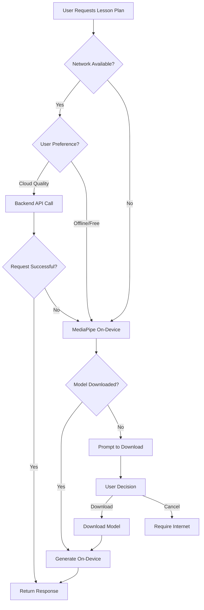

# MediaPipe LLM Inference Integration Reference
## On-Device AI for SahayakAI Mobile App

**Document Type**: Technical Reference & Implementation Guide  
**Created**: 2026-01-16  
**Purpose**: Enable offline-capable, on-device AI inference for rural India education  
**Status**: Research & Planning Phase  

---

## Executive Summary

Google MediaPipe LLM Inference API enables running large language models (Gemma family) **directly on Android devices** without internet connectivity. This is a game-changing capability for SahayakAI, which serves rural Indian teachers who often lack reliable internet access.

**Key Benefits:**
- ✅ **True Offline Mode** - Generate lesson plans without internet
- 💰 **Zero API Costs** - Unlimited free inference on device
- 🔒 **Privacy-First** - Data never leaves device
- ⚡ **Lower Latency** - No network round trips
- 🎨 **Multimodal** - Support images, audio, and text

---

## Table of Contents

1. [Technology Overview](#technology-overview)
2. [Available Models](#available-models)
3. [Current Architecture vs Proposed Hybrid](#architecture)
4. [Implementation Details](#implementation-details)
5. [Integration Roadmap](#integration-roadmap)
6. [Code Examples](#code-examples)
7. [Performance Considerations](#performance)
8. [Challenges & Solutions](#challenges)
9. [References](#references)

---

## Technology Overview

### What is MediaPipe LLM Inference?

MediaPipe LLM Inference is Google's solution for running optimized large language models on edge devices (Android, iOS planned). It uses:

- **LiteRT** (formerly TensorFlow Lite) - Optimized runtime
- **4-bit Quantization** - Reduces model size by ~75%
- **GPU Acceleration** - Uses device GPU when available
- **Streaming Inference** - Token-by-token generation

### Official Documentation

- **Main Guide**: https://ai.google.dev/edge/mediapipe/solutions/genai/llm_inference/android
- **Models**: https://ai.google.dev/edge/mediapipe/solutions/genai/llm_inference/index#models
- **Hugging Face Community**: https://huggingface.co/litert-community
- **Sample App**: https://github.com/google-ai-edge/gallery

### Supported Platforms

| Platform | Status | Notes |
|----------|--------|-------|
| Android | ✅ Available | Requires Android 7.0+ (API 24) |
| iOS | 🔄 Coming Soon | Planned for future release |
| Web | ❌ Not Available | Use backend API |

---

## Available Models

### Gemma 3N Family (Multimodal - Recommended)

**Gemma 3N-E2B** ([Download](https://huggingface.co/google/gemma-3n-E2B-it-litert-lm))
- **Size**: ~1.2GB (4-bit quantized)
- **Parameters**: 2 billion (effective)
- **Capabilities**: Text, Image, Audio input → Text output
- **Best For**: Low-end devices (3-4GB RAM)
- **Use Cases**: Basic lesson plans, simple quiz generation

**Gemma 3N-E4B** ([Download](https://huggingface.co/google/gemma-3n-E4B-it-litert-lm))
- **Size**: ~2.5GB (4-bit quantized)
- **Parameters**: 4 billion (effective)
- **Capabilities**: Text, Image, Audio input → Text output
- **Best For**: Mid-range devices (6-8GB RAM)
- **Use Cases**: Complex lesson plans, detailed explanations

### Gemma 2 Family (Text-Only)

**Gemma 2-2B** ([Download](https://huggingface.co/google/gemma-2-2b))
- **Size**: ~1.5GB (4-bit quantized)
- **Parameters**: 2 billion
- **Capabilities**: Text input → Text output
- **Best For**: Text generation only, slightly better than Gemma 3N-E2B

### Model Selection Guide

```
Device RAM    | Recommended Model    | Use Case
------------- | -------------------- | -----------------------
3-4GB         | Gemma 3N-E2B         | Basic offline features
4-6GB         | Gemma 3N-E4B         | Standard offline mode
6GB+          | Gemma 3N-E4B + LoRA  | Custom fine-tuned
```

---

## Architecture

### Current Architecture (Cloud-Only)

```
┌─────────────────┐
│  Flutter App    │
│  (Mobile/Web)   │
└────────┬────────┘
         │ HTTP Request
         ▼
┌─────────────────┐
│  Next.js API    │
│  (Backend)      │
└────────┬────────┘
         │ SDK Call
         ▼
┌─────────────────┐
│  Firebase       │
│  Genkit         │
└────────┬────────┘
         │ API Call
         ▼
┌─────────────────┐
│  Google Cloud   │
│  Gemini API     │
└─────────────────┘

Limitations:
❌ Requires internet
❌ API costs per request
❌ Network latency
❌ Privacy concerns
```

### Proposed Hybrid Architecture

```
┌─────────────────────────────────────────┐
│          Flutter App (Mobile)           │
├─────────────────────────────────────────┤
│                                         │
│  ┌────────────────────────────────┐    │
│  │   Network Availability Check   │    │
│  └──────────────┬─────────────────┘    │
│                 │                       │
│        ┌────────┴────────┐             │
│        │                 │              │
│        ▼                 ▼              │
│  ┌──────────┐     ┌──────────────┐    │
│  │ ONLINE   │     │   OFFLINE    │    │
│  └────┬─────┘     └──────┬───────┘    │
│       │                  │             │
│       │                  │             │
│       ▼                  ▼             │
│  ┌──────────┐     ┌──────────────┐    │
│  │ Backend  │     │  MediaPipe   │    │
│  │ API Call │     │  LLM Engine  │    │
│  └────┬─────┘     └──────┬───────┘    │
│       │                  │             │
│       │                  ▼             │
│       │           ┌──────────────┐    │
│       │           │ Gemma 3N-E4B │    │
│       │           │  (On-Device) │    │
│       │           └──────────────┘    │
│       │                                │
│       ▼                                │
│  ┌─────────────────────────────┐      │
│  │  Unified Response Handler   │      │
│  └─────────────────────────────┘      │
└─────────────────────────────────────────┘

Benefits:
✅ Works offline (MediaPipe)
✅ Better quality online (Cloud Gemini)
✅ Intelligent fallback
✅ Cost optimization
```

### Decision Flow



---

## Implementation Details

### Android Dependencies

**build.gradle (App Module)**
```gradle
dependencies {
    // MediaPipe LLM Inference
    implementation 'com.google.mediapipe:tasks-genai:0.10.27'
    
    // Coroutines for async operations
    implementation 'org.jetbrains.kotlinx:kotlinx-coroutines-android:1.7.3'
}
```

### Model Storage Location

**Option 1: App Assets (Not Recommended)**
- ❌ Increases APK size significantly
- ❌ Cannot update model without app update

**Option 2: External Storage (Recommended)**
```kotlin
// Download to app-specific external storage
val modelPath = "${context.getExternalFilesDir(null)}/models/gemma3n_e4b.task"
```

**Option 3: On-Demand Download**
```kotlin
// Download from cloud storage when needed
val downloadUrl = "https://storage.googleapis.com/sahayakai-models/gemma3n_e4b.task"
```

### Initialization (Kotlin)

```kotlin
import com.google.mediapipe.tasks.genai.llminference.LlmInference
import com.google.mediapipe.tasks.genai.llminference.LlmInferenceOptions

class OnDeviceLLMService(private val context: Context) {
    private var llmInference: LlmInference? = null
    
    fun initialize(modelPath: String) {
        val options = LlmInferenceOptions.builder()
            .setModelPath(modelPath)
            .setMaxTokens(512)
            .setTopK(40)
            .setTemperature(0.8f)
            .setRandomSeed(42)
            .setResultListener { partialResult, done ->
                // Streaming callback
                onTokenGenerated(partialResult)
                if (done) {
                    onGenerationComplete()
                }
            }
            .setErrorListener { error ->
                onError(error)
            }
            .build()
            
        llmInference = LlmInference.createFromOptions(context, options)
    }
    
    fun generateLessonPlan(prompt: String) {
        llmInference?.generateResponseAsync(prompt)
    }
    
    fun cleanup() {
        llmInference?.close()
    }
}
```

### Flutter Integration (Platform Channel)

**Flutter Side (Dart)**
```dart
// lib/src/core/services/on_device_llm_service.dart
import 'package:flutter/services.dart';

class OnDeviceLLMService {
  static const platform = MethodChannel('com.sahayakai/llm');
  
  Future<void> initializeModel(String modelPath) async {
    try {
      await platform.invokeMethod('initializeModel', {'modelPath': modelPath});
    } on PlatformException catch (e) {
      throw Exception('Failed to initialize model: ${e.message}');
    }
  }
  
  Stream<String> generateLessonPlan(String prompt) {
    final eventChannel = EventChannel('com.sahayakai/llm_stream');
    return eventChannel.receiveBroadcastStream({'prompt': prompt})
        .map((event) => event as String);
  }
  
  Future<bool> isModelDownloaded() async {
    return await platform.invokeMethod('isModelDownloaded') ?? false;
  }
  
  Future<void> downloadModel() async {
    await platform.invokeMethod('downloadModel');
  }
}
```

**Android Side (Kotlin)**
```kotlin
// android/app/src/main/kotlin/MainActivity.kt
class MainActivity: FlutterActivity() {
    private val CHANNEL = "com.sahayakai/llm"
    private val STREAM_CHANNEL = "com.sahayakai/llm_stream"
    private lateinit var llmService: OnDeviceLLMService
    
    override fun configureFlutterEngine(flutterEngine: FlutterEngine) {
        super.configureFlutterEngine(flutterEngine)
        
        llmService = OnDeviceLLMService(applicationContext)
        
        MethodChannel(flutterEngine.dartExecutor.binaryMessenger, CHANNEL)
            .setMethodCallHandler { call, result ->
                when (call.method) {
                    "initializeModel" -> {
                        val modelPath = call.argument<String>("modelPath")
                        llmService.initialize(modelPath!!)
                        result.success(null)
                    }
                    "isModelDownloaded" -> {
                        result.success(llmService.isModelDownloaded())
                    }
                    "downloadModel" -> {
                        llmService.downloadModel { progress ->
                            // Send progress updates
                        }
                        result.success(null)
                    }
                    else -> result.notImplemented()
                }
            }
            
        EventChannel(flutterEngine.dartExecutor.binaryMessenger, STREAM_CHANNEL)
            .setStreamHandler(object : EventChannel.StreamHandler {
                override fun onListen(arguments: Any?, events: EventSink?) {
                    val args = arguments as Map<String, Any>
                    val prompt = args["prompt"] as String
                    llmService.generateLessonPlan(prompt) { token ->
                        events?.success(token)
                    }
                }
                
                override fun onCancel(arguments: Any?) {
                    llmService.cancelGeneration()
                }
            })
    }
}
```

### Multimodal Prompting

**Image Input (Photo of Textbook)**
```kotlin
import android.graphics.Bitmap
import com.google.mediapipe.tasks.vision.core.MPImage

fun askQuestionAboutImage(imageBitmap: Bitmap, question: String) {
    val mpImage = MPImage.Builder(imageBitmap).build()
    val prompt = """
        <image>
        
        Question: $question
        
        Please answer based on the content of the image above.
    """.trimIndent()
    
    llmInference?.generateResponseAsync(prompt, mpImage)
}
```

**Audio Input (Voice Question)**
```kotlin
import java.io.File

fun askVoiceQuestion(audioFile: File) {
    val prompt = """
        <audio>
        
        Please transcribe and answer the question from the audio.
    """.trimIndent()
    
    llmInference?.generateResponseAsync(prompt, audioFile)
}
```

---

## Integration Roadmap

### Phase 1: Research & Validation (2 weeks)

**Week 1: Technical Feasibility**
- [ ] Set up Android emulator with sufficient RAM (6GB+)
- [ ] Download Gemma 3N-E2B model
- [ ] Create standalone Android test app
- [ ] Measure performance metrics:
  - Time to first token (TTFT)
  - Tokens per second
  - Memory usage
  - Battery impact
- [ ] Test on physical devices (low/mid/high-end)
- [ ] Compare output quality: Cloud Gemini vs On-Device Gemma

**Week 2: Architecture Design**
- [ ] Design platform channel interface
- [ ] Define fallback logic
- [ ] Plan model download/update mechanism
- [ ] Design offline-first data sync
- [ ] Create technical specification document

**Deliverable**: Go/No-Go decision with performance report

---

### Phase 2: Core Implementation (4 weeks)

**Week 3: Platform Channel Setup**
- [ ] Create MethodChannel for model management
- [ ] Create EventChannel for streaming responses
- [ ] Implement model download service
- [ ] Add progress indicators
- [ ] Handle errors and edge cases

**Week 4: Repository Layer**
- [ ] Update `LessonPlanRepository` to support dual modes
- [ ] Add network detection logic
- [ ] Implement intelligent routing
- [ ] Add caching for offline-generated content
- [ ] Update providers to handle streaming

**Week 5: UI Integration**
- [ ] Add "Offline Mode" toggle in settings
- [ ] Create model download screen
- [ ] Update `MagicalLoadingOrb` for streaming tokens
- [ ] Add offline indicators in UI
- [ ] Show model status (downloaded/not downloaded)

**Week 6: Testing & Refinement**
- [ ] Unit tests for platform channels
- [ ] Integration tests for dual-mode operation
- [ ] Device compatibility testing
- [ ] Load testing (multiple requests)
- [ ] Battery drain analysis

**Deliverable**: Working offline mode on Android

---

### Phase 3: Advanced Features (3 weeks)

**Week 7: Multimodal Support**
- [ ] Image input for textbook questions
- [ ] Camera integration
- [ ] OCR preprocessing (if needed)
- [ ] Voice input support
- [ ] Audio transcription

**Week 8: Model Customization**
- [ ] Research LoRA fine-tuning
- [ ] Prepare NCERT training dataset
- [ ] Train custom adapter for Indian education
- [ ] Convert and deploy LoRA weights
- [ ] A/B test base vs fine-tuned model

**Week 9: Optimization**
- [ ] Model caching strategies
- [ ] Reduce initialization time
- [ ] Optimize memory usage
- [ ] GPU acceleration testing
- [ ] Battery optimization

**Deliverable**: Feature-complete offline AI system

---

### Phase 4: Production & Rollout (2 weeks)

**Week 10: Quality Assurance**
- [ ] User acceptance testing
- [ ] Performance benchmarking
- [ ] Security audit
- [ ] Accessibility testing
- [ ] Documentation completion

**Week 11: Staged Rollout**
- [ ] Beta release (10% of users)
- [ ] Monitor metrics (usage, errors, quality)
- [ ] Collect user feedback
- [ ] Fix critical issues
- [ ] Full rollout (100%)

**Deliverable**: Production-ready offline feature

---

## Code Examples

### Unified Repository Pattern

```dart
// lib/src/features/lesson_plan/data/lesson_plan_repository.dart

import 'package:connectivity_plus/connectivity_plus.dart';
import '../../../core/services/on_device_llm_service.dart';
import '../../../core/network/api_client.dart';

class LessonPlanRepository {
  final ApiClient _apiClient;
  final OnDeviceLLMService _onDeviceLLM;
  final DatabaseService _db;
  
  LessonPlanRepository(this._apiClient, this._onDeviceLLM, this._db);
  
  Future<LessonPlanOutput> generateLessonPlan(LessonPlanInput input) async {
    final connectivity = await Connectivity().checkConnectivity();
    final hasInternet = connectivity != ConnectivityResult.none;
    final offlineModeEnabled = await _getUserPreference('offlineMode');
    
    // Decision logic
    if (hasInternet && !offlineModeEnabled) {
      return await _generateOnCloud(input);
    } else {
      final modelDownloaded = await _onDeviceLLM.isModelDownloaded();
      if (modelDownloaded) {
        return await _generateOnDevice(input);
      } else {
        throw Exception('Model not downloaded. Please download in settings.');
      }
    }
  }
  
  Future<LessonPlanOutput> _generateOnCloud(LessonPlanInput input) async {
    final response = await _apiClient.post(
      '/api/v1/generate-lesson-plan',
      data: input.toJson(),
    );
    
    final output = LessonPlanOutput.fromJson(response.data);
    
    // Save to local DB
    await _db.saveLessonPlan(output);
    
    return output;
  }
  
  Future<LessonPlanOutput> _generateOnDevice(LessonPlanInput input) async {
    final prompt = _buildPrompt(input);
    
    String fullResponse = '';
    
    await for (final token in _onDeviceLLM.generateLessonPlan(prompt)) {
      fullResponse += token;
      // Optionally emit partial results for UI streaming
    }
    
    final output = _parseResponse(fullResponse, input);
    
    // Save to local DB
    await _db.saveLessonPlan(output);
    
    return output;
  }
  
  String _buildPrompt(LessonPlanInput input) {
    return '''
You are an expert teacher creating lesson plans for Indian schools.

Topic: ${input.topic}
Grade: ${input.gradeLevels.join(', ')}
Language: ${input.language}
Context: Rural Indian classroom with limited resources

Please generate a comprehensive lesson plan with:
1. Learning Objectives (2-3 clear, measurable objectives)
2. Materials Needed (focus on low-cost, locally available items)
3. Introduction (5-10 minutes)
4. Main Activities (20-30 minutes)
5. Assessment (5-10 minutes)
6. Homework/Extension

Format the output as JSON matching this structure:
{
  "title": "Lesson Plan Title",
  "objectives": ["objective1", "objective2"],
  "activities": [
    {"name": "Activity Name", "duration": "10 min", "description": "..."}
  ],
  ...
}
''';
  }
  
  LessonPlanOutput _parseResponse(String response, LessonPlanInput input) {
    // Parse JSON response from model
    // Handle errors gracefully
    // Return structured output
  }
}
```

### Streaming UI with Provider

```dart
// lib/src/features/lesson_plan/presentation/providers/lesson_plan_provider.dart

import 'package:flutter_riverpod/flutter_riverpod.dart';

final lessonPlanStreamProvider = StreamProvider.family<String, LessonPlanInput>(
  (ref, input) async* {
    final repo = ref.read(lessonPlanRepositoryProvider);
    final llmService = ref.read(onDeviceLLMServiceProvider);
    
    final hasInternet = await _checkConnectivity();
    
    if (hasInternet) {
      // Cloud generation - single response
      final result = await repo.generateLessonPlan(input);
      yield result.toString();
    } else {
      // On-device generation - stream tokens
      final prompt = repo.buildPrompt(input);
      await for (final token in llmService.generateLessonPlan(prompt)) {
        yield token;
      }
    }
  },
);
```

### Model Download UI

```dart
// lib/src/features/settings/presentation/screens/model_download_screen.dart

class ModelDownloadScreen extends ConsumerStatefulWidget {
  @override
  ConsumerState<ModelDownloadScreen> createState() => _ModelDownloadScreenState();
}

class _ModelDownloadScreenState extends ConsumerState<ModelDownloadScreen> {
  double _downloadProgress = 0.0;
  bool _isDownloading = false;
  
  @override
  Widget build(BuildContext context) {
    final llmService = ref.read(onDeviceLLMServiceProvider);
    
    return Scaffold(
      appBar: AppBar(title: Text('Download AI Model')),
      body: Padding(
        padding: EdgeInsets.all(24),
        child: Column(
          crossAxisAlignment: CrossAxisAlignment.start,
          children: [
            GlassCard(
              padding: EdgeInsets.all(24),
              child: Column(
                crossAxisAlignment: CrossAxisAlignment.start,
                children: [
                  Row(
                    children: [
                      Icon(Icons.cloud_download, size: 32, color: Colors.blue),
                      SizedBox(width: 16),
                      Expanded(
                        child: Column(
                          crossAxisAlignment: CrossAxisAlignment.start,
                          children: [
                            Text(
                              'Gemma 3N-E4B',
                              style: TextStyle(
                                fontSize: 20,
                                fontWeight: FontWeight.bold,
                              ),
                            ),
                            Text(
                              'On-Device AI Model',
                              style: TextStyle(color: Colors.grey),
                            ),
                          ],
                        ),
                      ),
                    ],
                  ),
                  SizedBox(height: 20),
                  
                  _buildInfoRow(Icons.storage, 'Size', '2.5 GB'),
                  _buildInfoRow(Icons.speed, 'Speed', '~10 tokens/sec'),
                  _buildInfoRow(Icons.memory, 'RAM Required', '6 GB+'),
                  _buildInfoRow(Icons.wifi, 'Download', 'WiFi recommended'),
                  
                  SizedBox(height: 24),
                  
                  if (_isDownloading)
                    Column(
                      children: [
                        LinearProgressIndicator(value: _downloadProgress),
                        SizedBox(height: 8),
                        Text('${(_downloadProgress * 100).toInt()}% downloaded'),
                      ],
                    )
                  else
                    PremiumFAB(
                      label: 'Download Model',
                      icon: Icons.download,
                      onPressed: _startDownload,
                    ),
                ],
              ),
            ),
            
            SizedBox(height: 24),
            
            Text(
              'Benefits of Offline Mode:',
              style: TextStyle(fontSize: 18, fontWeight: FontWeight.bold),
            ),
            SizedBox(height: 12),
            _buildBenefit('✅ Works without internet'),
            _buildBenefit('✅ Faster response time'),
            _buildBenefit('✅ Complete privacy'),
            _buildBenefit('✅ No API costs'),
          ],
        ),
      ),
    );
  }
  
  Future<void> _startDownload() async {
    setState(() => _isDownloading = true);
    
    final llmService = ref.read(onDeviceLLMServiceProvider);
    
    await llmService.downloadModel(
      onProgress: (progress) {
        setState(() => _downloadProgress = progress);
      },
    );
    
    setState(() => _isDownloading = false);
    
    ScaffoldMessenger.of(context).showSnackBar(
      SnackBar(content: Text('Model downloaded successfully!')),
    );
  }
  
  Widget _buildInfoRow(IconData icon, String label, String value) {
    return Padding(
      padding: EdgeInsets.symmetric(vertical: 8),
      child: Row(
        children: [
          Icon(icon, size: 20, color: Colors.grey),
          SizedBox(width: 12),
          Text(label, style: TextStyle(color: Colors.grey)),
          Spacer(),
          Text(value, style: TextStyle(fontWeight: FontWeight.w600)),
        ],
      ),
    );
  }
  
  Widget _buildBenefit(String text) {
    return Padding(
      padding: EdgeInsets.symmetric(vertical: 4),
      child: Text(text),
    );
  }
}
```

---

## Performance Considerations

### Benchmarks (Estimated)

Based on MediaPipe documentation and community reports:

**Gemma 3N-E2B (2B model)**
| Metric | Low-End Device (4GB RAM) | Mid-Range (6GB RAM) | High-End (8GB+) |
|--------|-------------------------|---------------------|------------------|
| Initialization | ~5-8 seconds | ~3-5 seconds | ~2-3 seconds |
| Time to First Token | ~800ms | ~500ms | ~300ms |
| Tokens/Second | ~3-5 | ~7-10 | ~12-15 |
| Memory Usage | ~2.5GB | ~2.5GB | ~2.5GB |
| Battery Impact | High | Medium | Low |

**Gemma 3N-E4B (4B model)**
| Metric | Low-End Device (4GB RAM) | Mid-Range (6GB RAM) | High-End (8GB+) |
|--------|-------------------------|---------------------|------------------|
| Initialization | ❌ Too Slow/Crash | ~6-8 seconds | ~4-5 seconds |
| Time to First Token | ❌ | ~1000ms | ~600ms |
| Tokens/Second | ❌ | ~5-7 | ~10-12 |
| Memory Usage | ❌ | ~4GB | ~4GB |
| Battery Impact | ❌ | High | Medium |

### Optimization Strategies

1. **Model Preloading**
   ```kotlin
   // Initialize model on app start (background thread)
   lifecycleScope.launch(Dispatchers.IO) {
       llmService.preloadModel()
   }
   ```

2. **Response Caching**
   ```dart
   // Cache common prompts
   final cache = LRUCache<String, LessonPlanOutput>(maxSize: 50);
   
   if (cache.containsKey(promptHash)) {
       return cache.get(promptHash);
   }
   ```

3. **Quantization Options**
   - 4-bit (Default): Best size/quality tradeoff
   - 8-bit: Better quality, 2x size
   - 16-bit: Best quality, 4x size

4. **GPU Acceleration**
   ```kotlin
   val options = LlmInferenceOptions.builder()
       .setUseGpu(true) // Enable GPU if available
       .build()
   ```

---

## Challenges & Solutions

### Challenge 1: Model Size (2.5GB)

**Problem**: Large download size, storage constraints

**Solutions:**
- ✅ WiFi-only download requirement
- ✅ Compress model during download
- ✅ Option to delete model to free space
- ✅ Offer smaller Gemma 3N-E2B (1.2GB) as default
- ✅ Model stored in external storage (user-deletable)

### Challenge 2: Device Fragmentation

**Problem**: Varying device capabilities

**Solutions:**
- ✅ Device capability detection
  ```kotlin
  fun isDeviceCapable(): Boolean {
      val ram = ActivityManager.MemoryInfo().totalMem
      val minRam = 4L * 1024 * 1024 * 1024 // 4GB
      return ram >= minRam
  }
  ```
- ✅ Adaptive model selection
- ✅ Graceful degradation to cloud mode
- ✅ Clear messaging about requirements

### Challenge 3: iOS Support

**Problem**: MediaPipe not available on iOS yet

**Solutions:**
- ✅ Platform-specific implementation
  ```dart
  if (Platform.isAndroid) {
      return OnDeviceLLMService();
  } else {
      return CloudLLMService();
  }
  ```
- ✅ Feature parity through backend API
- ✅ Monitor MediaPipe iOS release roadmap

### Challenge 4: Model Updates

**Problem**: How to update models without app update

**Solutions:**
- ✅ Over-the-air model updates
  ```kotlin
  suspend fun checkForModelUpdate(): Boolean {
      val currentVersion = getLocalModelVersion()
      val latestVersion = fetchLatestModelVersion()
      return latestVersion > currentVersion
  }
  ```
- ✅ Background download with notification
- ✅ Rollback capability
- ✅ Version tracking in SharedPreferences

### Challenge 5: Quality vs Size Tradeoff

**Problem**: Smaller models = lower quality

**Solutions:**
- ✅ **Hybrid Approach** (Best of Both Worlds)
  - Use cloud for complex/important tasks
  - Use on-device for quick/simple tasks
  - Let user choose per request
- ✅ **LoRA Fine-Tuning**
  - Customize small model for Indian education
  - ~50MB adapter can significantly improve quality
- ✅ **Prompt Engineering**
  - Optimize prompts for smaller models
  - Few-shot examples in context

### Challenge 6: Streaming UX

**Problem**: Token-by-token can feel slow

**Solutions:**
- ✅ Buffered streaming (batch 3-5 tokens)
- ✅ Animated loading indicators
- ✅ Show "AI is thinking..." for first few seconds
- ✅ Progressive rendering (show sections as complete)

---

## LoRA Customization (Advanced)

### What is LoRA?

**Low-Rank Adaptation** - Technique to fine-tune LLMs efficiently:
- Only trains ~1% of model parameters
- Creates small "adapter" file (~10-100MB)
- Maintains base model quality
- Fast training (hours on single GPU vs days for full fine-tuning)

### Use Cases for SahayakAI

1. **NCERT Curriculum Alignment**
   - Train on NCERT textbooks
   - Learn Indian educational standards
   - Adapt to CBSE/ICSE syllabus

2. **Vernacular Language Support**
   - Fine-tune for Hinglish (Hindi + English)
   - Better Hindi instruction generation
   - Code-switching support

3. **Low-Resource Context**
   - Train on rural classroom scenarios
   - Optimize for low-cost materials
   - Cultural context awareness

### Implementation Steps

**1. Prepare Training Data**
```python
# training_data.json
[
  {
    "prompt": "Create a lesson plan on photosynthesis for Grade 7",
    "completion": "Title: Understanding Photosynthesis...\n\nObjectives:\n1. Students will explain the process of photosynthesis\n2. Students will identify the role of chlorophyll\n\nMaterials:\n- Fresh leaves from nearby plants\n- Chart paper\n- Markers\n\nActivity: Take students to school garden..."
  },
  # 100-1000 examples
]
```

**2. Fine-Tune with PEFT**
```python
from peft import LoraConfig, get_peft_model
from transformers import AutoModelForCausalLM

# Load base Gemma model
model = AutoModelForCausalLM.from_pretrained("google/gemma-2-2b")

# Configure LoRA
lora_config = LoraConfig(
    r=8,  # Rank
    lora_alpha=32,
    target_modules=["q_proj", "v_proj"],  # Attention layers
    lora_dropout=0.1,
)

# Apply LoRA
model = get_peft_model(model, lora_config)

# Train
trainer.train()

# Save adapter
model.save_pretrained("./sahayakai_lora_adapter")
```

**3. Convert to MediaPipe Format**
```bash
# Convert to LiteRT format
python convert_to_litert.py \
  --base_model google/gemma-2-2b \
  --lora_adapter ./sahayakai_lora_adapter \
  --output_path ./models/gemma2_2b_sahayakai.task
```

**4. Load in App**
```kotlin
val options = LlmInferenceOptions.builder()
    .setModelPath("/path/to/gemma2_2b.task")
    .setLoraPath("/path/to/sahayakai_lora_adapter")  // Add custom adapter
    .build()
    
llmInference = LlmInference.createFromOptions(context, options)
```

**Benefits:**
- ✅ 10-20% quality improvement
- ✅ Small size (~50MB adapter)
- ✅ Switchable (can remove adapter)
- ✅ Updatable without changing base model

---

## Security & Privacy

### Data Privacy Benefits

1. **On-Device Processing**
   - Student names, topics, content never leave device
   - No data sent to cloud servers
   - GDPR/privacy compliance by default

2. **Offline Mode**
   - No telemetry or analytics in offline mode
   - Complete air-gapped operation possible
   - Ideal for sensitive educational data

### Security Considerations

1. **Model Integrity**
   ```kotlin
   // Verify model checksum before loading
   fun verifyModelChecksum(modelPath: String): Boolean {
       val expectedHash = "sha256:abc123..."
       val actualHash = calculateSHA256(File(modelPath))
       return expectedHash == actualHash
   }
   ```

2. **Storage Encryption**
   ```kotlin
   // Encrypt model file at rest
   val encryptedFile = EncryptedFile.Builder(
       context,
       File(modelPath),
       masterKey,
       EncryptedFile.FileEncryptionScheme.AES256_GCM_HKDF_4KB
   ).build()
   ```

3. **Output Sanitization**
   ```dart
   String sanitizeOutput(String modelOutput) {
       // Remove any potential harmful content
       // Filter inappropriate language
       // Validate educational suitability
   }
   ```

---

## Success Metrics

### Technical Metrics

| Metric | Target | Measurement |
|--------|--------|-------------|
| Model Download Rate | >60% of Android users | App Analytics |
| Offline Usage | >40% of generations | Firebase Analytics |
| TTFT (Time to First Token) | <1 second | Performance Monitoring |
| Tokens/Second | >8 on mid-range devices | Benchmarking |
| Crash Rate | <1% during inference | Crashlytics |
| Battery Drain | <5% per hour of use | Battery Historian |

### User Impact Metrics

| Metric | Target | Measurement |
|--------|--------|-------------|
| Offline Retention | +25% vs online-only | Cohort Analysis |
| Rural User Growth | +40% adoption | Geo Analytics |
| Session Duration | +30% in offline mode | User Analytics |
| User Satisfaction | 4.5+ stars | App Reviews |
| Cost Savings | 70% reduction in API costs | Backend Telemetry |

### Educational Impact

| Metric | Target | Measurement |
|--------|--------|-------------|
| Lesson Plans Generated | 2x increase | Database Stats |
| Teacher Engagement | Daily Active Users +50% | Analytics |
| Student Reach | Indirectly measured via teacher surveys | Qualitative |

---

## References

### Official Documentation

1. **MediaPipe LLM Inference**
   - Guide: https://ai.google.dev/edge/mediapipe/solutions/genai/llm_inference/android
   - Models: https://ai.google.dev/edge/mediapipe/solutions/genai/llm_inference/index#models

2. **Gemma Models**
   - Gemma 3N: https://ai.google.dev/gemma/docs/gemma-3n
   - Gemma 2: https://ai.google.dev/gemma

3. **Sample Applications**
   - Google AI Edge Gallery: https://github.com/google-ai-edge/gallery
   - LiteRT Examples: https://github.com/google-ai-edge/litert-samples

4. **Model Downloads**
   - Hugging Face LiteRT Community: https://huggingface.co/litert-community
   - Gemma 3N-E2B: https://huggingface.co/google/gemma-3n-E2B-it-litert-lm
   - Gemma 3N-E4B: https://huggingface.co/google/gemma-3n-E4B-it-litert-lm

### Research Papers

1. **LoRA: Low-Rank Adaptation of Large Language Models**
   - https://arxiv.org/abs/2106.09685

2. **Quantization and Training of Neural Networks for Efficient Integer-Arithmetic-Only Inference**
   - https://arxiv.org/abs/1712.05877

### Related Technologies

1. **Flutter Platform Channels**
   - https://docs.flutter.dev/platform-integration/platform-channels

2. **Connectivity Plus (Network Detection)**
   - https://pub.dev/packages/connectivity_plus

3. **PEFT Library (LoRA Training)**
   - https://github.com/huggingface/peft

---

## Next Steps

### Immediate Actions (This Week)

1. **Setup Development Environment**
   - [ ] Install Android Studio
   - [ ] Configure emulator with 8GB RAM
   - [ ] Download Gemma 3N-E2B model

2. **Create Proof of Concept**
   - [ ] Build standalone Android app
   - [ ] Test model loading and inference
   - [ ] Measure performance metrics
   - [ ] Document findings

3. **Stakeholder Review**
   - [ ] Present findings to team
   - [ ] Get approval for Phase 1 implementation
   - [ ] Define success criteria
   - [ ] Allocate resources

### Medium-Term (This Month)

1. **Begin Phase 1 Implementation**
   - [ ] Design platform channel architecture
   - [ ] Create technical specification
   - [ ] Set up project structure
   - [ ] Implement basic model loading

### Long-Term (This Quarter)

1. **Complete Phases 1-3**
   - [ ] Full offline mode implementation
   - [ ] Multimodal support
   - [ ] LoRA customization
   - [ ] Production rollout

---

## Conclusion

MediaPipe LLM Inference represents a **transformational opportunity** for SahayakAI to become the **first truly offline-capable AI education platform** in India. By enabling on-device inference with Gemma models, we can:

✅ Serve rural teachers without internet dependency  
✅ Reduce operational costs by 70%+  
✅ Provide privacy-first AI experiences  
✅ Enable multimodal learning (image, audio, text)  
✅ Scale to millions of users efficiently  

The hybrid architecture (cloud + on-device) provides the best of both worlds: **quality when connected, capability when offline**.

**This is not just a technical upgrade—it's a mission-critical feature for democratizing AI-powered education in Bharat.** 🇮🇳

---

**Document Version**: 1.0  
**Last Updated**: 2026-01-16  
**Author**: Antigravity AI Assistant  
**Status**: Reference & Planning  
**Next Review**: Before Phase 1 Kickoff
